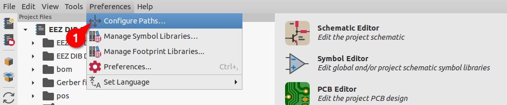
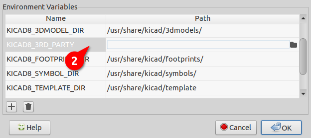
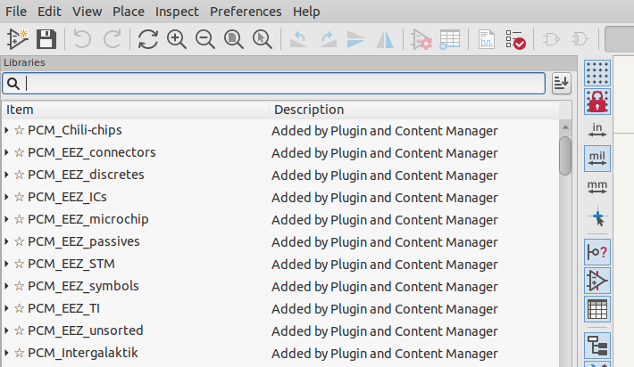

This repository contains the Symbols, Footprint, and 3D Models for the Chili.CHIPS projects.
The libraries in this repository are intended to be used with KiCad version 10.

### Self-contained use (no installation needed)

Every symbol, footprint and 3D model used by the PCB projects in `1.pcb/` is vendored here:

| Folder | Content |
|---|---|
| `chili-chips-lib/` | Chili.CHIPS symbols, footprints, 3D models |
| `av_lib/` | B4B-XH-A and BWSMA-KWE-Z001 connectors |
| `EEZ-Kicad-libraries/` | Copy of the [EEZ KiCad library](https://github.com/eez-open/eez-kicad-libraries) |
| `kicad-stock-lib/` | The few KiCad stock symbols, footprints and 3D models the projects use |

Each project's `sym-lib-table` and `fp-lib-table` point here via `${KIPRJMOD}/../KiCad-library/...`,
and all 3D model paths use the same prefix. Clone the repo, open the `.kicad_pro`, and everything resolves
without installing anything through the Plugin and Content Manager.

### Optional: install via Plugin and Content Manager

To use these libraries in other projects, download the zip file and install it from the `Plugin and Content Manager` located in KiCad main menu (shortcut `Ctrl+M`).

Additionally, it is recommended that you install the EEZ KiCad library available at https://github.com/eez-open/eez-kicad-libraries/releases

### Configuration

The installed libraries will be available in the `KICAD10_3RD_PARTY` folder, which you can define under `Preferences -> Configure Paths...` from the KiCad main menu:

All libraries are prefixed with `PCM_` and you can pin them to appear at the top of the library list, for example:

### About KiCad

KiCad is a Cross-Platform and Open Source Electronics Design Automation Suite. See [KiCad EDA](https://kicad.org/) for more information.
