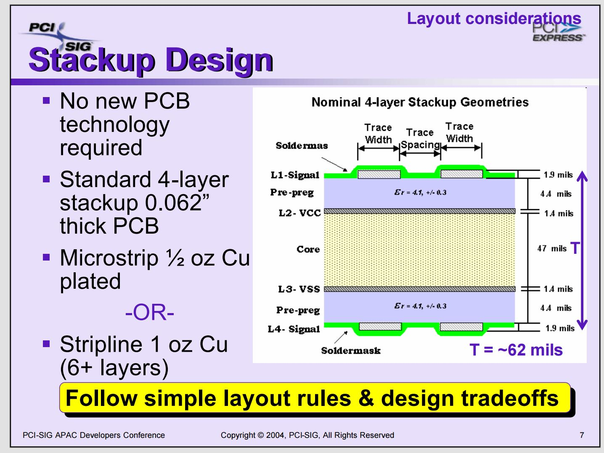
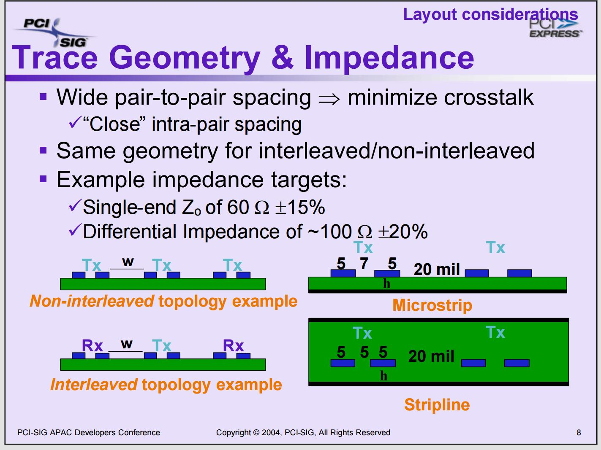
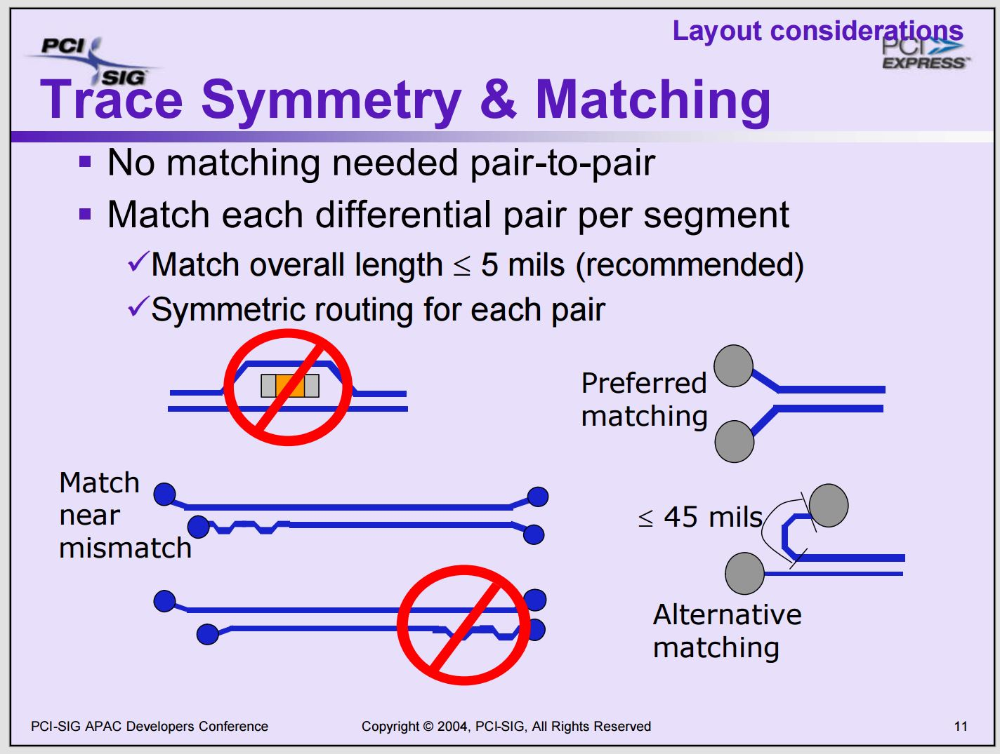
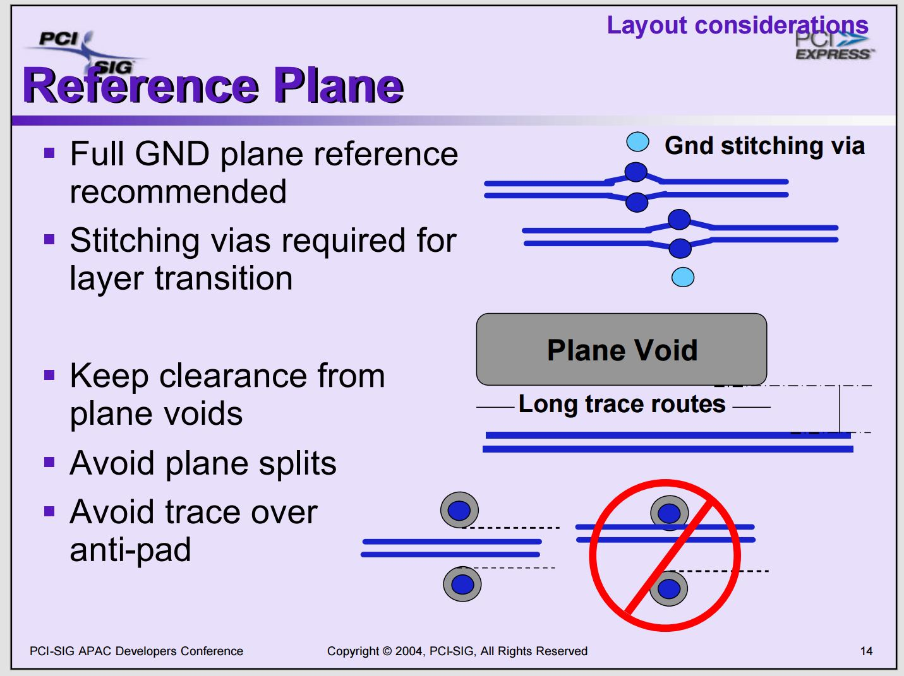
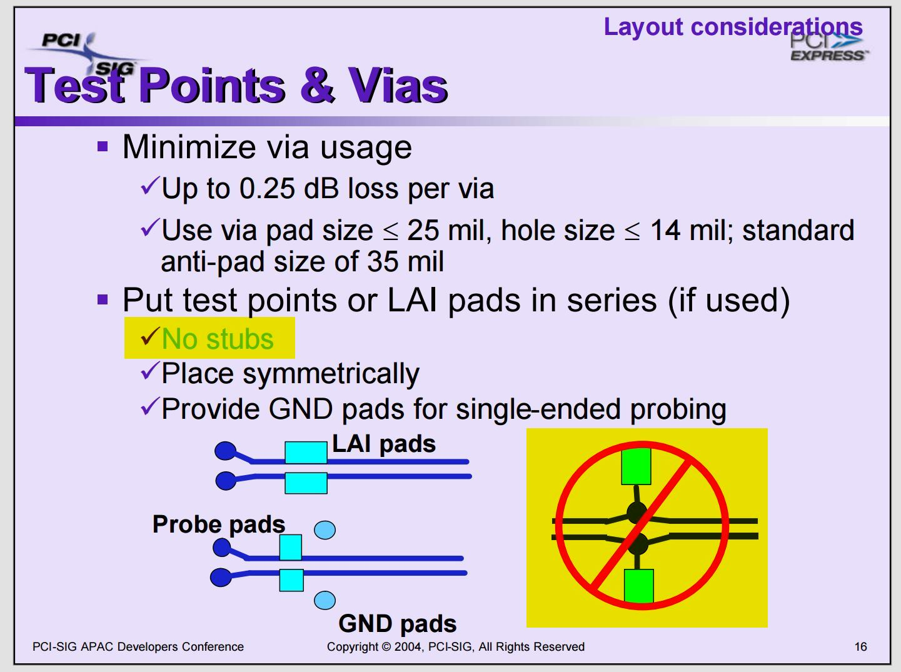
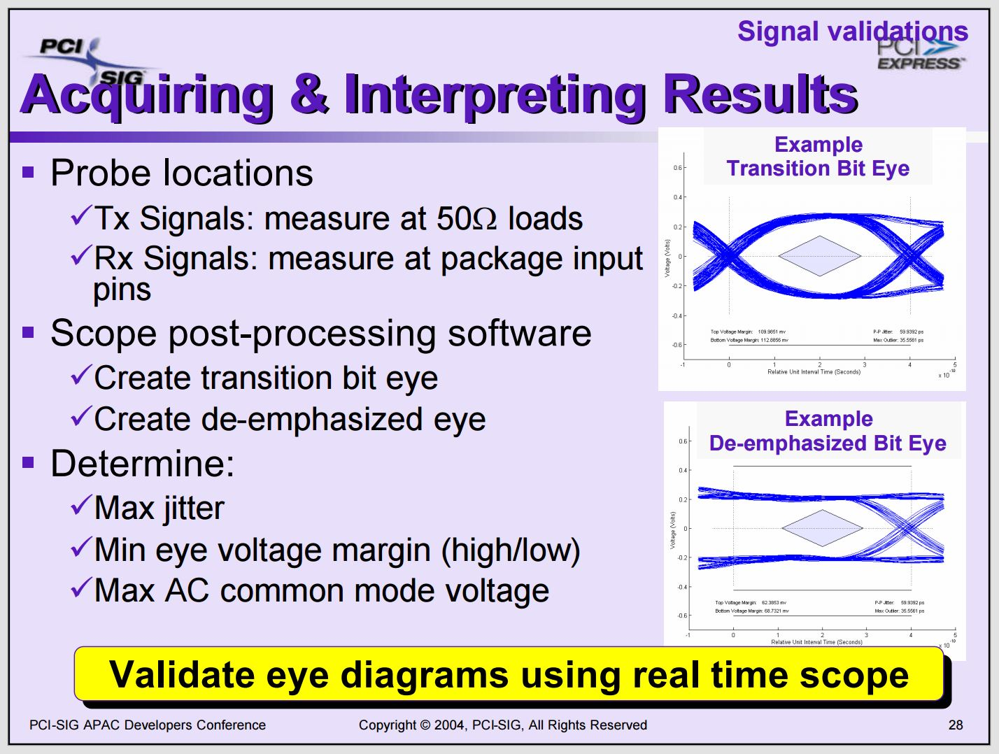

# openBackplane PCB

The board is designed for flexible PCIe system development and testing, featuring two distinct logical *islands*:  
- **(1-to-1) 4-lane Direct connection**
- **(1-to-4) 1-lane Switched connection**.

    

####  Key Features

- Modular Design:
  - Two independent “islands” for different PCIe topologies.  
- Flexible Connectivity:
  - Supports standard PCIe Slots and M.2 (M-key, PCIe) connectors.  
- Power, Clock and Reser generation:
  - Single 6-pin PCIe power connector supplies the entire board (up to 70 W total).  
  - Integrated 100 MHz REFCLK generator and reset (PERST#) distribution circuits.  
- Innovative RC Connector Design:
  - Allows natively EndPoint cards to function as a RootComplex without hardware modification.

Designed with **KiCad 9.0.5**, from schematic entry to layout. For the full schematic PDF, click [here](openpci2-backplane/openpci2-backplane.pdf).

### Common Resources

#### Power Delivery
- Powered by a standard **6-pin PCIe power connector** (3 × **+12V**, 3 × **GND**).  
- On-board **DC-DC** and **LDO** converters provide the required **+3.3V** and **+12V** rails for all slots.  
- Total power budget: **~70W**, with a guideline of **10W per slot**.

#### Clock Distribution
- On-board **100MHz PCIe-approved REFCLK Generator** provides the reference clock.
- The clock is distributed to all slots via differential buffers (**REFCLK+ / REFCLK-**).
- The **REFCLK** is only distributed to a slot (both RC and EP) after a device has been inserted and asserts the **CLKREQ#** signal (by driving it to logic low). This feature ensures that clocks are only active when and where needed, thus reducing the power and EMI.
- The clock for the PCIe switch, and therefore for its downstream x1 Endpoint slots, is **always active**, as the presence of a RPi cannot be reliably detected.
- **Raspberry Pi** functions as a Root Complex and provides its own reference clock. Our backplane does not need this clock, as all downstream PCIe devices receive their reference clock from the onboard generator. This means that the End-Points will in the RPi5 RC case have to be configured for `Async RefClock`.

#### Reset Logic
The system-wide PERST# reset signal is distributed to all slots and can be triggered by three sources:

- **Automatic**: Triggers a reset whenever a supply voltage is outside its specified range.
- **Manual**: A push-button for user-initiated resets.
- **External**: An active-low reset signal from the Raspberry Pi. To handle its unspecified output type, the signal is converted to open-drain before being wired-OR'd with the other reset sources. 

##  Functional Blocks

### 4-lane “Direct” Island (RC4 ⇔ EP4)

Provides a direct, point-to-point, 4-lane PCIe link between two connectors.

**RC4 (Root Complex)**  
- 4-lane connector intended for a card acting as the Root Complex.  
- Mechanical option: Standard PCIe slot.

**EP4 (Endpoint)**  
- 4-lane connector for a standard Endpoint card.  
- Mechanical option: Standard PCIe slot.

---
### 1-lane “Switched” Island (RC1 ⇔ SW ⇔ SW_EP0/1/2/3)

Uses a PCIe switch to branch a single upstream lane into four downstream lanes.

**RC1 (Root Complex)**  
- 1-lane connector for the upstream Root Complex card.  
- Mechanical options: *Standard PCIe Slot*, *M.2 (M-key, PCIe)*, or *1-lane RPi connector (FPC 16-pin, 0.5 mm, 100 Ω)*.

**PCIe Switch**  
- Device: **Asmedia ASM1184e** (PCIe 2.0 switch).  
- Configuration: **1 × Upstream → 4 × Downstream** (1-to-4).

**SW_EP0 – SW_EP3 (Endpoints)**  
- Four 1-lane connectors for downstream Endpoint cards.  
- Mechanical options: *Standard PCIe Slot* or *M.2 (M-key, PCIe)*.

#### Note on “RC Connectors”

A key design feature of this backplane is the implementation of the **RC (Root Complex)** connectors.

Most FPGA development boards or other plug-in cards are natively designed with an **Endpoint (EP) pinout**.  
The backplane swaps the connector pins on the RC slots so that:

- The **Transmit (Tx)** differential pairs from the plug-in card connect to the **Receive (Rx)** pairs on the opposite side, and  
- The **Receive (Rx)** pairs connect to the **Transmit (Tx)** pairs on the other side.

This pin-swapping allows the same physical FPGA plug-in card—always pinned as an Endpoint—to operate in either **EP** or **RC** role.

---
## Usage scenarios

### Usecase 1: Direct FPGA_RC to FPGA_EP (Gen1 x1)

    

This scenario is the bread-and-butter, the meat of this project. That's what it is about. We intend to test our Artix-7 RootComplex in the Standard PCIe slot. The backplane design leaves the path open for future exploration of **x4** and **Gen2** implementations.

This same scenario is also envisioned for testing the interoperability of our [openCologne-PCIE](https://github.com/chili-chips-ba/openCologne-PCIE) EndPoint with Xilinx Artix-7 RootComplex.

### Usecase 2: Switched FPGA_RC to FPGA_EP (Gen1 x1)
@AnesVrce to add illustration. 

We intend to try testing the RootComplex interactions with EndPoints through a PCIE Switch. This is "best effort", i.e. a  bonus if we manage to make it work. The backplane also leaves the door open for the **Gen2** testing.

### Usecase 3: Switched RPi5_RC to FPGA_EP (Gen1 x1)
This scenario is for our [openCologne-PCIE](https://github.com/chili-chips-ba/openCologne-PCIE) EndPoint design, to test its interoperability with RPi5. The backplane design allows trying both "Slot" and M.2 form-factor of GateMate PCIE cards.

    

Our backplane is designed for `RPi5 Standard FFC`, which is when contacts are on the `opposite sides`.

    

Such cable is also known as `"B Type"`, see [this](https://www.amazon.com/iUniker-Contacts-Opposite-Raspberry-Peripheral/dp/B0F7HJL2QG/ref=pd_ci_mcx_di_int_sccai_cn_d_sccl_2_2/143-7699313-0639204?pd_rd_w=UVwz6&content-id=amzn1.sym.751acc83-5c05-42d0-a15e-303622651e1e&pf_rd_p=751acc83-5c05-42d0-a15e-303622651e1e&pf_rd_r=SSMC3DSGA2A09FFQH4YH&pd_rd_wg=RZodX&pd_rd_r=fb584b31-62bd-44e0-af8e-5133406dd983&pd_rd_i=B0F7HJL2QG&psc=1).

Interestingly, many RPi5 HATs use the same-side contacts, that is the "A Type" cables, despite RaspberryPi explicit requirement not to do so. It is important to ensure that you are using the correct orientation FFC before connecting up and powering up the system. [Here](https://www.jeffgeerling.com/blog/2023/testing-pcie-on-raspberry-pi-5) is another interesting read on the RPi5 PCIE connectivity.

### Usecase 4: PCIE Expansion or Extension
By using our _"PCIE Jumper Cable"_, the backplane can be connected to a standard PC serving as a RootComplex, such as for the expansion of its I/O Slot capacity, or for the extension of its physical reach. We also intend to use it for [openCologne-PCIE](https://github.com/chili-chips-ba/openCologne-PCIE) EndPoint validation, specificaly to assess and compare the strength of GateMate SerDes to others, Xilinx Artix-7 and off-the-shelf ASICs in particular.

    

## PCIE Layout Consideration

The _characteristic impedance_ of the differential pairs on our backplane is `100ohm+/-10% for both data and clock signals`. They are all routed as `microstrips`, i.e. with reference to Ground/Power plane from only one side. The P-to-N skew is matched to no more than **5 mils**.

The number of vias or other impedance discontinuities on the path of `5Gbps signal wires` and `100MHz reference clocks` is minimized. We use Through-Hole (TH) slot connectors for mechanical stability and better routability. The M.2 and RPi connectors are Surface-Mount Devices (SMD). All components are on the top side of the board. We did not use the _'striplines'_, which is when the high-speed traces are sandwiched between two reference planes (ground or power), as they require vias and are typically used in setups with 6 or more layers. We used the _'microstrips'_, as they allowed getting away without any vias. 

The size of our vias is the standard **0.3mm**. The blind, burried, partial or any other advanced via technologies are not used. That makes for a less expensive PCB and final product, but it also stresses the need to be cautious about placing vias on the diff pairs. Such vias go through all layers, they are longer. They are also not with the smallest possible diameter, therefore overall bulkier and more of a disturbance.

    

Our stackup is **4-layer**:

- `Top` - Microstrip for diff pairs and ordinary lines 
- `L2` - Ground plane
- `L3` - 3.3V Power plane
- `Bottom` - Microstrip for diff pairs and ordinary lines 

    
    
    
    
    

Check [this](0.doc/PCIE-Layout-Guidelines.SIG.pdf) link for additional physical and routing considerations.

Since we have a unique feature with multiple connectors on the same line, special care is given to minimize the "stubs" at both the start and end of the transmission line. Here is an example of what not to do.

    

## PCIe Connection Model: Generators → Transport → Consumers

All signal generators should be placed as close as possible to each other. Likewise, all signal consumers should be grouped very close together. The goal is to minimize the stubs, both at the beginning of the transmission path (on the generator side) and at the end (on the consumer side).

In the example above, when the M.2 connector acts as the signal generator and the Slot is the consumer, very long stubs appear on both ends. Since the active signal also propagates into these unterminated stubs, part of it gets reflected back with a noticeable delay proportional to the stub length. This reflected wave interferes with the original signal at the Slot receiver when that signal should be stable. Similarly, the reflection from the M.2 stub disturbs the transmitter at the M.2 side, which then shows up again at the Slot and superimposes with the first and second waves.

The key is to eliminate or minimize the second, third, and subsequent `reflected waves`, keeping only the primary, `incident wave` that carries the valid data.

## Signal Integrity (SI) Sims
@AnesVrce TODO.

The following five wiring topologies are examined in Electro-Magnetic Simulations (EMS):
- `Bad` **Long stubs**. For understanding of _Incident_ and _Reflected_ waves
- `One-2-One` **Point-to-Point**. This is the standard and simplest, i.e. the baseline case
- `One-2-Two` **Point-to-Multipoint**. Unique for high-speed
- `Three-2-One` **Multipoint-to-Point**. Unique for high-speed

Since we feature multiple mechanical connectors ("Slot", M.2, RPi5 FPC) on the same diff lines, we have very unusal, probably **unique topologies** to deal with. All representative combinations are analyzed and presented.

### EMS topology 0: Bad (just for learning, not for using)
- long stubs on both sides. @AnesVrce, use the analysis of the Rx and Tx SMA connectors for this case. Also show why it is better to place them at the end of their line, close to the Rx input termination.
  
### EMS topology 1: One-2-One (standard)
- SWRC3_CLK_P/N 100MHz clock diff pair
  
### EMS topology 2: One-2-Two (unique)
- Pick the longest 5Gbps diff pairs from the SW => SW_EP0/1/2/3 set
    
### EMS topology 3: Three-2-One (unique)
- Pick one of the RC1 => SW 5Gbps diff pairs. We have RPi5 FFC, Slot and M.2 here.

  
## SI Lab Measurements
TODO

    

-----

### References:
**[1] [PCIE Card Electro-Mechanical Specification, Rev4.0](0.doc/PCIE-card-ElectroMech-Spec.Rev4-0.pdf)**

**[2] RPi5 PCIE Connector Enigma**
- [Reverse Engineering RPi5 PCIE](https://github.com/m1geo/Pi5_PCIe)
- [4-port PCIE/Gen3 Hub for RPi5. Based on ASM2806. FPC must be rotated](https://github.com/will127534/PCIe3_Hub)

**[3] PCIE Extenders**
- [PCIE "Slot" to 4-port "Slot" with ASM1184e, by Waveshare](https://www.waveshare.com/pcie-packet-switch-4p.htm)
- [RPi5 PCIe FPC to "Slot", by 52Pi](https://52pi.com/collections/all-products/products/p02-pcie-slot-for-rpi5)
- [RPi5 4-port FPC HAT with ASM1184e, by 52Pi](https://wiki.52pi.com/index.php?title=EP-0233)
- [RPi5 4-port FPC HAT with ASM1184e, by Waveshare](https://www.waveshare.com/pcie-to-4-ch-pcie-hat.htm)

**[4] ASMedia ASM1184e 1-to-4 single-lane PCIE/Gen2 Switch**
- [Product Brief](https://www.asmedia.com.tw/product/556yQ9dSX7gP9Tuf/b7FyQBCxz2URbzg0)
- [Technical Notes](https://crimier.github.io/posts/ASM118x)
- [Design Example: CM4 M2 (NVME) NAS](https://github.com/will127534/CM4-Nvme-NAS)

**[5] [Component datasheets](1.datasheets)**

**[6] [PCB Layout Guidelines](0.doc/PCIE-Layout-Guidelines.SIG.pdf)**

**[7] Open-source SI Sim tools**
- [openEMS](https://docs.openems.de)
- [AntMicro EMS Sim](https://antmicro.com/blog/2025/07/recent-improvements-to-antmicros-signal-integrity-simulation-flow)

-------
#### End of Document
