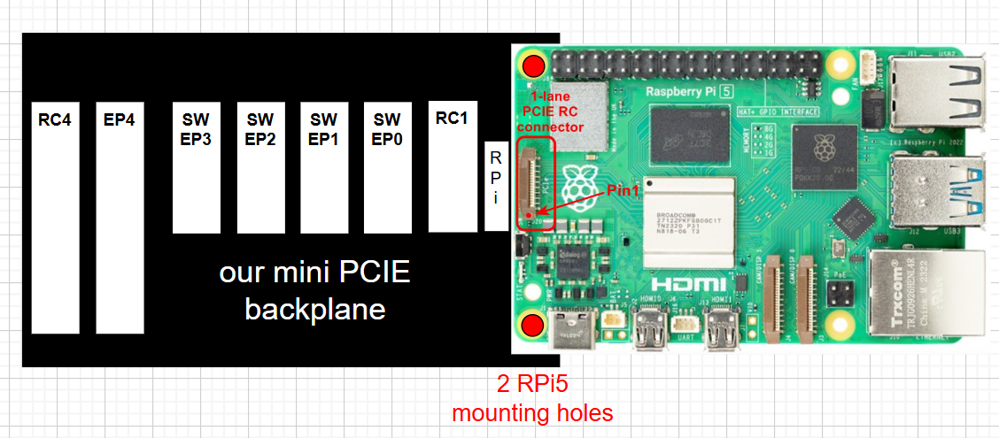
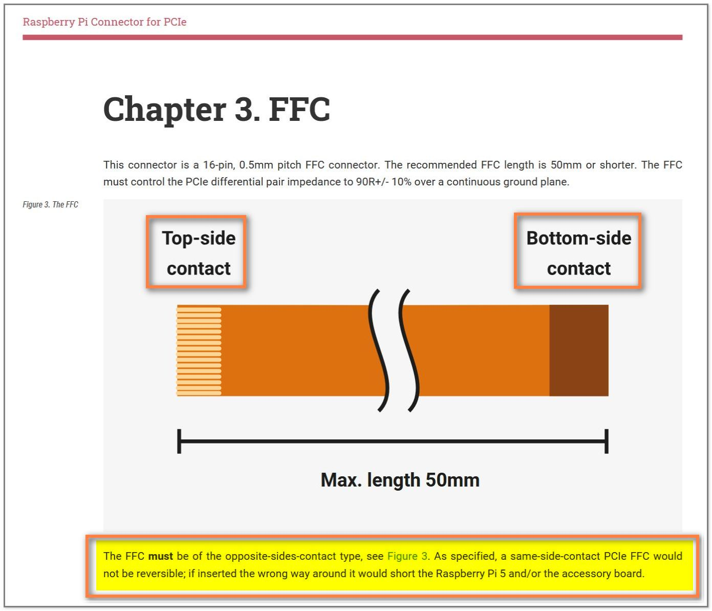
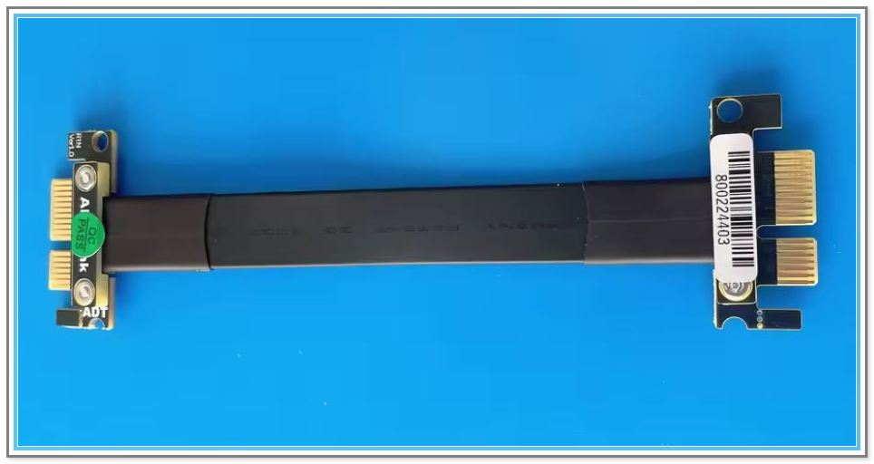
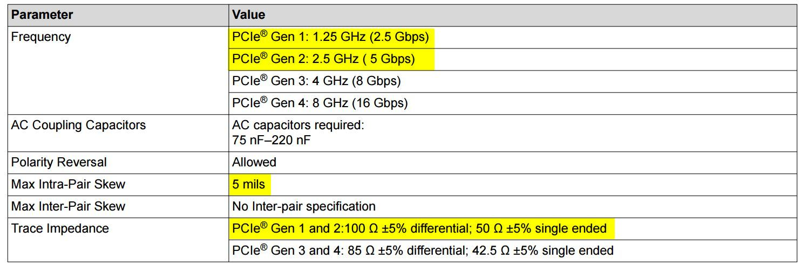
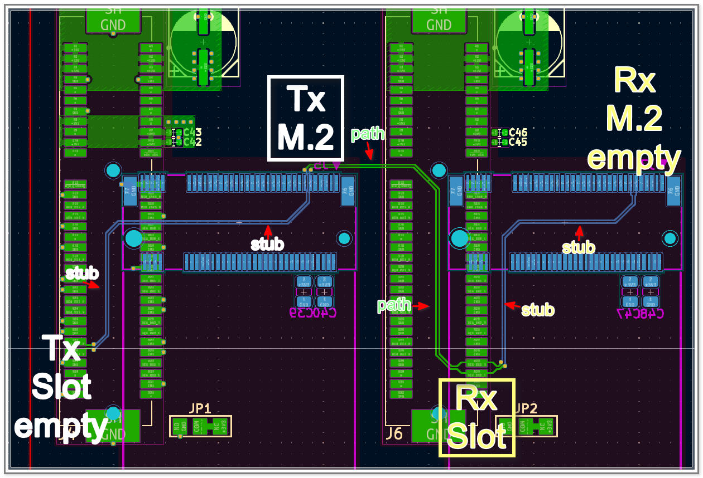

# openBackplane PCB

## Design Outline
**WIP:**
@AnesVrce to elaborate

    

Designed with **KiCad 9.0.5**, from schematic entry to layout. For the full schematic PDF, click [here](openpci2-backplane/openpci2-backplane.pdf).

## Usage scenarios

### Usecase 1: Direct FPGA_RC to FPGA_EP (Gen1 x1)
@AnesVrce to add illustration.

This scenario is the bread-and-butter, the meat of this project. That's what it is about. We intend to test our Artix-7 RootComplex in both "Slot" and M.2 form-factors. The backplane design leaves the path open for future exploration of **x4** and **Gen2** implementations.

This same scenario is also envisioned for testing the interoperability of our [openCologne-PCIE](https://github.com/chili-chips-ba/openCologne-PCIE) EndPoint with Xilinx Artix-7 RootComplex.

### Usecase 2: Switched FPGA_RC to FPGA_EP (Gen1 x1)
@AnesVrce to add illustration. 

We intend to try testing the RootComplex interactions with EndPoints through a PCIE Switch. This is "best effort", i.e. a  bonus if we manage to make it work. The backplane also leaves the door open for the **Gen2** testing.

### Usecase 3: Switched RPi5_RC to FPGA_EP (Gen1 x1)
This scenario is for our [openCologne-PCIE](https://github.com/chili-chips-ba/openCologne-PCIE) EndPoint design, to test its interoperability with RPi5. The backplane design allows trying both "Slot" and M.2 form-factor of GateMate PCIE cards.

    

Our backplane is designed for `RPi5 Standard FFC`, which is when contacts are on the `opposite sides`.

    

Such cable is also known as `"B Type"`, see [this](https://www.amazon.com/iUniker-Contacts-Opposite-Raspberry-Peripheral/dp/B0F7HJL2QG/ref=pd_ci_mcx_di_int_sccai_cn_d_sccl_2_2/143-7699313-0639204?pd_rd_w=UVwz6&content-id=amzn1.sym.751acc83-5c05-42d0-a15e-303622651e1e&pf_rd_p=751acc83-5c05-42d0-a15e-303622651e1e&pf_rd_r=SSMC3DSGA2A09FFQH4YH&pd_rd_wg=RZodX&pd_rd_r=fb584b31-62bd-44e0-af8e-5133406dd983&pd_rd_i=B0F7HJL2QG&psc=1).

Interestingly, many RPi5 HATs use the same-side contacts, that is the "A Type" cables, despite RaspberryPi explicit requirement not to do so. It is important to ensure that you are using the correct orientation FFC before connecting up and powering up the system. [Here](https://www.jeffgeerling.com/blog/2023/testing-pcie-on-raspberry-pi-5) is another interesting read on the RPi5 PCIE connectivity.

### Usecase 4: PCIE Expansion or Extension
By using our _"PCIE Jumper Cable"_, the backplane can be connected to a standard PC serving as a RootComplex, such as for the expansion of its I/O Slot capacity, or for the extension of its physical reach. We also intend to use it for [openCologne-PCIE](https://github.com/chili-chips-ba/openCologne-PCIE) EndPoint validation, specificaly to assess and compare the strength of GateMate SerDes to others, Xilinx Artix-7 and off-the-shelf ASICs in particular.

    

## PCIE Layout Consideration

The _characteristic impedance_ of the differential pairs on our backplane is `100ohm+/-10% for both data and clock signals`. They are all routed as `microstrips`, i.e. with reference to Ground/Power plane from only one side. The P-to-N skew is matched to no more than **5 mils**.

The number of vias or other impedance discontinuities on the path of `5Gbps signal wires` and `100MHz reference clocks` is minimized. As a matter of face, we have `only two vias per diff pair`, one at the start, another at the end of the signal path. The need for them comes from of our very unique feature with multiple connectors for the same line, placed on the opposite sides of the board. Since we must have at least two vias, We could have also used the _'striplines'_, which is when the high-speed traces are sandwiched between two reference planes (ground or power). In a normal situation, the _'microstrips'_ are better as they allow getting away without any vias. 

The size of our vias is the standard **0.3mm**. The blind, burried, partial or any other advanced via technologies are not used. That makes for a less expensive PCB and final product, but it also stresses the need to be super cautious about the vias on the diff pairs. Since they go through all layers, they are longer, and also not with the smallest possible diameter, therefore overall bulkier and more of a disturbance.

    

Our stackup is **4-layer**:

- `Top` - Microstrip for diff pairs and ordinary lines 
- `L2` - Ground plane
- `L3` - 3.3V Power plane
- `Bottom` - Microstrip for diff pairs and ordinary lines 

Check [this](0.doc/PCIE-Layout-Guidelines.TI-slaae45.pdf) link for additional routing considerations.

Since we have a unique feature with multiple connectors on the same line, special care is given to minimize the "stubs" at both the start and end of the transmission line. Here is an example of what not to do.

    

> [@AnesVrce, please translate this to English] Svi generatori signala trebaju biti postavljeni ekstremno blizu. Slicno tome, svi potrosaci signala trebaju biti vrlo blizu. Cilj je minimizirati "stub" na pocetku putanje (generatori) kao i "stub" na kraju putanje (potrosaci).
>
> A na gornjem primjeru, u slucaju kada je M.2 generator, a "Slot" potrosac, imamo vrlo dug "stub" na obje strane. Kako u taj "stub" takodje ide korisni signal, a "stub" nije terminiran, iz njega se signal reflektuje, tj. vrati nazad, i to sa znatnim kasnjenjem zbog duzine "stub"-a.
Taj reflektovani val onda poremeti originalni signal na "Slot" poziciji, gdje ga primamo, i to u momentu kada se od njega ocekuje da bude stabilan. Slicno, reflektovani signal iz M.2 stub-a poremeti generator na M.2 poziciji, sto se nesto poslije toga odslika i na "Slot" lokaciji, gdje nam treba da je cist, a taj treci val se pocne mijesati sa prvim i drugim. Fora je sto je moguce vise eliminisati drugi, treci i ostale povratne valove (Reflected Waves), i u igri ostaviti samo prvi val (Incident Wave).
>
> Anese, bila bi prava stvar prvo simularati ovaj gore slucaj, ako ilustraciji efekta "stub-a" i refleksije valova.

## Signal Integrity (SI) Sims
@AnesVrce TODO.

The following five wiring topologies are examined in Electro-Magnetic Simulations (EMS):
- `Bad` **Long stubs**. For understanding of _Incident_ and _Reflected_ waves
- `One-2-One` **Point-to-Point**. This is the standard and simplest, i.e. the baseline case
- `Two-2-Two` **Multipoint-to-Multipoint**. Unique for high-speed
- `Three-2-One` **Multipoint-to-Point**. Unique for high-speed
- `One-2-Two` **Point-to-Multipoint**. Unique for high-speed

Since we feature multiple mechanical connectors ("Slot", M.2, RPi5 FPC) on the same diff lines, we have very unusal, probably **unique topologies** to deal with. All three representative combinations are analyzed and presented.

### EMS topology 0: Bad (just for learning, not for using)
- long stubs on both sides
  
### EMS topology 1: One-2-One (standard)
- SWRC3_CLK_P/N 100MHz clock diff pair
  
### EMS topology 2: Two-2-Two (unique)
- Pick one of the RC4 => EP4 5Gbps diff pairs
  
### EMS topology 3: Three-2-One (unique)
- Pick one of the RC1 => SW 5Gbps diff pairs
  
### EMS topology 4: One-2-Two (unique)
- Pick the longest 5Gbps diff pairs from the SW => SW_EP0/1/2/3 set
  
## SI Lab Measurements
TODO

-----

### References:
**[1] [PCIE Card Electro-Mechanical Specification, Rev4.0](0.doc/PCIE-card-ElectroMech-Spec.Rev4-0.pdf)**

**[2] RPi5 PCIE Connector Enigma**
- [Reverse Engineering RPi5 PCIE](https://github.com/m1geo/Pi5_PCIe)
- [4-port PCIE/Gen3 Hub for RPi5. Based on ASM2806. FPC must be rotated](https://github.com/will127534/PCIe3_Hub)

**[3] PCIE Extenders**
- [PCIE "Slot" to 4-port "Slot" with ASM1184e, by Waveshare](https://www.waveshare.com/pcie-packet-switch-4p.htm)
- [RPi5 PCIe FPC to "Slot", by 52Pi](https://52pi.com/collections/all-products/products/p02-pcie-slot-for-rpi5)
- [RPi5 4-port FPC HAT with ASM1184e, by 52Pi](https://wiki.52pi.com/index.php?title=EP-0233)
- [RPi5 4-port FPC HAT with ASM1184e, by Waveshare](https://www.waveshare.com/pcie-to-4-ch-pcie-hat.htm)

**[4] ASMedia ASM1184e 1-to-4 single-lane PCIE/Gen2 Switch**
- [Product Brief](https://www.asmedia.com.tw/product/556yQ9dSX7gP9Tuf/b7FyQBCxz2URbzg0)
- [Technical Notes](https://crimier.github.io/posts/ASM118x)
- [Design Example: CM4 M2 (NVME) NAS](https://github.com/will127534/CM4-Nvme-NAS)

**[5] [Component datasheets](1.datasheets)**

**[6] [PCB Layout Guidelines](0.doc/PCIE-Layout-Guidelines.TI-slaae45.pdf)**

**[7] Open-source SI Sim tools**
- [openEMS](https://docs.openems.de)
- [AntMicro EMS Sim](https://antmicro.com/blog/2025/07/recent-improvements-to-antmicros-signal-integrity-simulation-flow)

-------
#### End of Document
