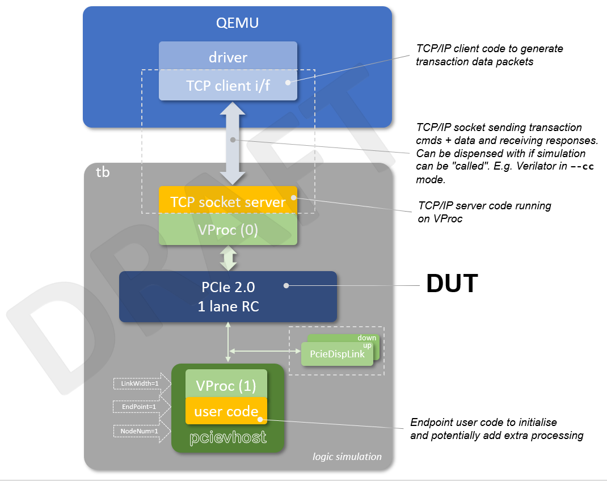
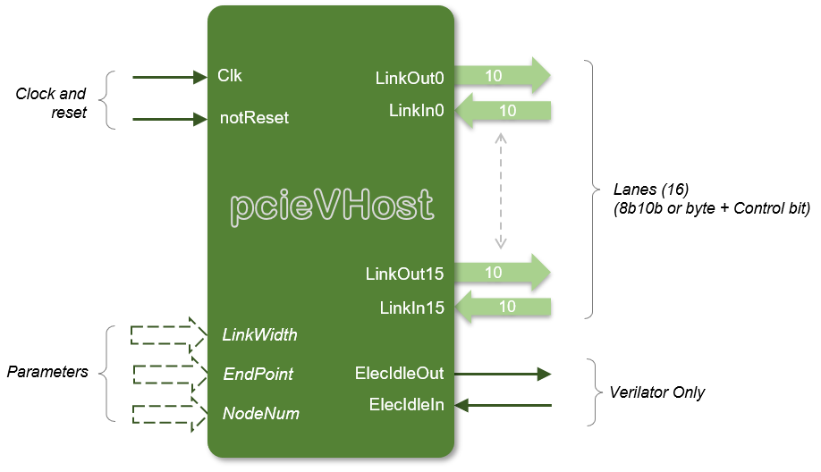
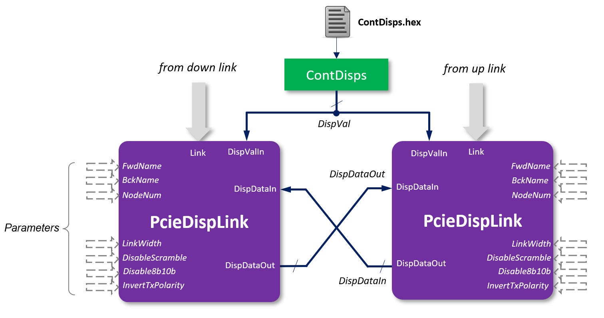
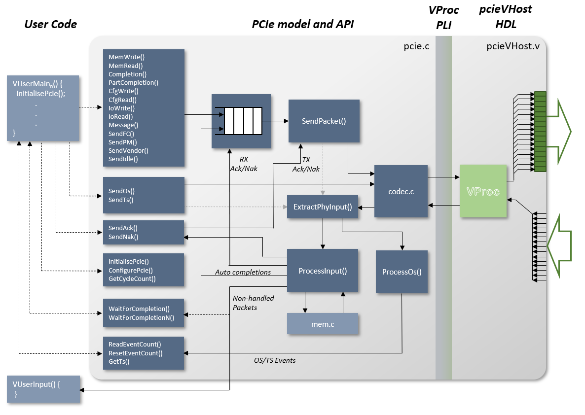

# openpcie2-rc Simulation Top Level Test Bench

# Table of Contents

* [Introduction](#introduction)
* [The pcievhost Verification IP](#the-pcievhost-verification-ip)
  * [The HDL Component](#the-hdl-component)
  * [PcieDispLink](#pciedisplink)
  * [The Pcie C Model](#the-pcie-c-model)
    * [Internal Architecture](#internal-architecture)
  * [User API Summary](#user-api-summary)
    * [Model Initialisation and Configuration](#model-initialisation-and-configuration)
    * [Transaction Layer Packet Generation](#transaction-layer-packet-generation)
    * [Data LinkLayer Packet Generation](#data-link-layer-packet-generation)
    * [Ordered Set Generation](#ordered-set-generation)
    * [Internal Memory Access](#internal-memory-access)
    * [Internal Configuration Space Access](#internal-configuration-space-access)
      * [Constructing a Configuration Space](#constructing-a-configuration-space)
  * [Additionally Provide Functionality](#additionally-provided-functionality)
    * [Endpoint Features](#endpoint-features)
    * [Model Limitations](#model-limitations)
      * [Endpoint Feature Limitations](#endpoint-feature-limitations)
      * [LTSSM Limitations](#ltssm-limitations)
      * [Model Verification](#model-verification)
* [The VProc Virtual Processor](#the-vproc-virtual-processor)] 

# Introduction

The *openpcie2-rc* top level test bench is based around the [*pcievhost*](https://github.com/wyvernSemi/pcievhost) PCIe 2.0 verification co-simulation IP in order to drive the DUT's PCIe link. This is a C model for generating PCIe 1.1 and 2.0 traffic data connected to the logic simulation using the [*VProc*](https://github.com/wyvernSemi/vproc) virtual processor co-simulation element. _VProc_ allows a user program to be compiled natively on the host machine and 'run' on an instantiated HDL component in a logic simulation, including running the PCIe C model. _VProc_ has a generic memory mapped master bus for generating read and write transactions and a Bus Functional Model (BFM) wrapper encapsulates the _VProc_ component and effectively memory maps the PCIe ports into the address space, allowing software to drive and read these ports and interface with the PCIe C model. Although originally designed as a root complex model, the _pcievhost_ components has <ins>some</ins> endpoint features, enabled by setting a parameter. The endpoint features are [limited](#endpoint-feature-limitations) and were originally designed just as a target for the main root complex model to be tested.

The diagram below is a *draft* block diagram of the top level test bench showing the main features.

<p align=center>

</p>

The DUT PCIe link is connected to the _pcievhost_, configured as an endpoint, and running some user code to do link training and do any transaction generation required, though it will automatically respond to transactions requiring a completion. A pair of _PcieDispLink_ HDL components (supplied as part of _pcievhost_) are optionally cnnected to the up and down links that can display the traffic on the PCIe link. It also does _some_ on-the-fly compliance testing. To drive the DUT's memory mapped slave bus, a _VProc_ component is used with a BFM wrapper for the specific bus protocol used for the device. A user program can then be run on the virtal processor to access the device's registers etc.

The software to run on the virtual processor is proposed to be a means to connect to an external QEMU process via a TCP/IP socket with a (TBD) protocol to instigate read and write transactions and return data (where applicable). It is envisaged that the client software is driven via the DUT's device driver to communicate with server software on _VProc_. This is currently TBD.

# The _pcievhost_ Verification IP

The [_pcievhost_](https://github.com/wyvernSemi/pcievhost) VIP is a co-simulation element that runs a PCIe C model on a [_VProc_](https://github.com/wyvernSemi/vproc) virtual processor to drive lanes within a PCIe 1.1 or 2.0 link, with support for up to 16 lanes. The PCIe C model provides an API for generating PCIe traffic over the link with some additional helper functionality for modelling _some_ of the link training LTSSM features. It also provides an internal sparse memory model as a target for MemRd and MemWr transactions and, when configured as an endpoint, a configuration space as a target for CfgRd and CfgWr transactions. Feature of the API allow for the configuratins space to be pre-programmed with valid configurations and a read-only mask overlay, though there is no support for 'special' functions like write one to clear etc.

More details of the model can be found in the [_Pcievhost_ manual](https://github.com/wyvernSemi/pcievhost/blob/master/doc/pcieVHost.pdf).

## The HDL component

A Verilog module for the _pcievhost_ model is provided in a `pcieVHost.v` file in the `5.sim/models/pcievhost/verilog/pcieVHost` directory. The diagram below shows the module's ports and parameters.

<p align=center>

</p>

The module's clock and reset must be synchronous (i.e. the reset originate from the  same clock domain) and the clock run at the PCIe raw bit rate $\div$ 5. So for GEN1 this is 500MHz (2000ps period) and GEN2 this is 1000MHz (1000ps period).

The module has 16 lane input and output ports, numberd 0 to 15, each 10 bits wide. This, by default, transfer 8b10b encoded data but the model can be configured to generate unencoded and unscrambled data, where bits 7:0 are a byte value, and bit 8 is a 'K' symbol flag when set. Bit 9 is unused in this configuration.

Two additional signals are present (`ElecIdleOut` and `ElecIdleIn`) when using the model with Verilator (and `VERILATOR` is defined) to resolve electrical idle due to Verilator's limitation in resolving signal strengths. This is not an issue for other supported simulators and the ports will not be present.

The components has three Parameters to configure the model. The first, `LinkWidth`, configures which lanes will be active, and always starts from lane 0. Note that the ports for the unused lanes are still present but can be left unconnected. It defaults to all 16 lanes. The second parameter is `EndPoint`. This is used to enable endpoint features in the model and does so if set to a non-zero value, with 0 being the default setting. Finally the `NodeNum` parameter sets the node number of the internal _VProc_ component. Each instantiated _VProc_, whether part of a _pcievhost_ model, or not, must have a unique node number to associate itself with a particular user program. The default value for `NodeNum` is 8.

More details of the `PcieVhost` HDL component can be found in the [_pcievhost_ manual](https://github.com/wyvernSemi/pcievhost/blob/master/doc/pcieVHost.pdf).

## PcieDispLink

Supplied along with the _pcievhost_ model is a pure Verilog _PcieDispLink_ module that is used to configurably display the traffic on a PCIe link as well as do _some_ on-the-fly compliance checking. The use of this component is optional, and the _pcievhost_ model does not rely on its presence.

The module is usually used as an instantiated pair with one connectd to the down link lanes (i.e. those towards the endpoint) and one connected to the up link lanes (i.e. towards the root complex). The diagram belos shows a typicl connection:

<p align=center>

</p>

Here the `link` inputs are connected to the link's lane signals as appropriate. The `PcieDispLink` components share data via `DispDataIn` and `DispDataOut` ports which are connected across from out to in, as shown. A `DispValIn` input port is used to control what the `PcieDispLink` displays. A `ContDisps` module can generate these inputs via a `ContDisps.hex` file that it will read from the local run directory. This allows control of displaying various PCIe layer data, from PHY, through DLL and TL, bit-mapped onto an 8 bit value. Each value is associated with a time stamp (in cycles) as to when the display value is enabled or not. A typical file looks like the following:

```
// Example ContDisps.hex file
// Copy to the appropriate test directory, and edit as necessary.
// See pciedispheader.v for more details

//                     +8              +4              +2              +1
// ,-->  7 - 4:    DispRawSym         DispPL         DispDL          DispTL
// |,->  3 - 0:    unused             DispStop       DispFinish      DispAll
// || ,-> Time (clock cycles, decimal)
// || |                          
   70 000000000000
   02 009999999999
```
Three further inout signals are used to set labbels within the output to identify the source and direction of the data. The `FwdName` is an 8 bit value that can be set to a character constant (e.g. `"D"`) that is put in the output lines for transactions originating from the link (such as MemRd or MemWr), and the `BckName` input is for completion data from the link. Normally, the `PcieDispLink` connected to the down link would have a `FwdName` of "D" and a `BckName` of "U", whist the `PcieDispLink` connected to the up link would have the opposite. This would mean reads and their completions would have the same label for easier association. The `NodeNum` input is a value that would normally be set for the node number of the associated `PcieVHost` (though needn't be). In the case where a DUT is one end of the link, the other `PcieDispLink` node number just needs to be set as a different number. Typically values of 0 and 1 are used.

A set of four configuration inputs are also present on `PcieDispLink`. The `LinkWidth` input must match that of the `LinkWidth` parameter setting of the `PcieVHost`. the `DisableScramble` and `Disable8b10b` inputs, when set, disable these features and are used when the link is a PIPE style interface (where encoding and scrambling are down downstream of the interface in the PCS). The `PcieVHost` would then also be configured for this mode. Lastly, the `InvertTxPolarity` is a 16 bit wide signal to invert the outputs on the link individually for each lane.

The clock and reset (`ExtClk` and `notReset`) signals would normally be connected to the same clock and reset concted to the `PcieVhost` component.

A fragment of some `PcieDispLink` output is shown below:

```
PCIEU1: {STP
PCIEU1: 00 39 4a 00 80 21 00 00 00 80 00 01 42 03 33 7e 5c 73 4a dd 90 27
PCIEU1: 7f 8d d3 9d 9b fe 69 5c 17 9b a3 c3 ea 4d 52 a9 9f 40 81 40 aa e9
PCIEU1: 64 3f fc 48 8b 40 d5 6a 5b 66 da 33 bf 44 67 5a 1b fa 26 b5 82 a1
PCIEU1: e1 b7 28 ea 94 37 1a 01 c7 72 2c b8 1a 54 33 e1 22 f3 75 fb 73 5d
PCIEU1: 5e 12 fe 93 75 e0 9e d5 8e 38 ed 20 40 a5 5c f6 99 4e 83 5d 11 1c
PCIEU1: b5 2a bd 1f d8 7f c5 2e 73 93 18 ce 09 b1 5e 56 a6 84 2f 50 b7 91
PCIEU1: 82 21 1e 05 68 ed 86 b1 fa b5 f4 00 00 00 cb 5c 1b e7 3f 8f f0 5d
PCIEU1: END}
PCIEU1: ...DL Sequence number=57
PCIEU1: ......TL Completion with Data Successful CID=0000 BCM=0 Byte Count=080 RID=0001 TAG=42 Lower Addr=03
PCIEU1: ......Traffic Class=0, TLP Digest, Payload Length=0x021 DW
PCIEU1: ......337e5c73 4add9027 7f8dd39d 9bfe695c 179ba3c3 ea4d52a9 9f408140 aae9643f
PCIEU1: ......fc488b40 d56a5b66 da33bf44 675a1bfa 26b582a1 e1b728ea 94371a01 c7722cb8
PCIEU1: ......1a5433e1 22f375fb 735d5e12 fe9375e0 9ed58e38 ed2040a5 5cf6994e 835d111c
PCIEU1: ......b52abd1f d87fc52e 739318ce 09b15e56 a6842f50 b7918221 1e0568ed 86b1fab5
PCIEU1: ......f4000000
PCIEU1: ......TL Good ECRC (cb5c1be7)
PCIEU1: ...DL Good LCRC (3f8ff05d)
PCIEU1: {STP
PCIEU1: 00 3a 0a 00 80 00 00 00 00 04 00 01 43 00 f1 bc ee 5d ba 49 eb 4e
PCIEU1: END}
PCIEU1: ...DL Sequence number=58
PCIEU1: ......TL Completion Successful CID=0000 BCM=0 Byte Count=004 RID=0001 TAG=43 Lower Addr=00
PCIEU1: ......Traffic Class=0, TLP Digest
PCIEU1: ......TL Good ECRC (f1bcee5d)
PCIEU1: ...DL Good LCRC (ba49eb4e)
PCIEU1: {SDP
PCIEU1: 90 16 80 16 cd 0d
PCIEU1: END}
PCIEU1: ...DL UpdateFC-NP  VC0  HdrFC=90 DataFC=22
PCIEU1: ...DL Good DLLP CRC (cd0d)
PCIED0: {SDP
PCIED0: 00 00 00 39 19 8a
PCIED0: END}
PCIED0: ...DL Ack seq 57
PCIED0: ...DL Good DLLP CRC (198a)
```

More details on the `PcieDisplLink` can be found in the [_pcievhost_ manual](https://github.com/wyvernSemi/pcievhost/blob/master/doc/pcieVHost.pdf).

## The PCIe C Model

### Internal Architecture

The diagram below summarises the core PCIe model functionality, along with the connection to a logic simulation via the _VProc_ co-simulation component.

<p align=center>

</p>

On the left of the diagram are the two user supplied functions. The `VUserMain`<i>n</i> function is the main entry point for user code and this has access to the [model's API](#user-api-summary). Optionally, a user callback function can be registered (`VUserInput` in the diagram) that gets called to with non-handled packets (e.g. read completions) that are received over the link.

The Left column of boxes are the various API functions available, categorised by function. The first group generate TLP or DLLP packets that get queued, before being sent to `SendPacket`. The non-automatic sending of ACKs and NAKs bypass the queue and are sent straight to the `SendPacket` function. The `SendPacket` function itself sends its TLP or DLLP packets to the `codec` which scrambles and encodes the data and drives the output on the link.

The `codec` code also process input data, decoding and descrambling, passing on to `ExtractPhyInput`. Training sequences and other ordered set data is sent to `ProcessOs` whilst TLPs and DLLPs are sent to `ProcessInput`. The API can read received OS event counts from the `ProcessOs` function. `ProcessInput` has access to the internal memory for MemRd and MemWr TLPs and (not shown) the config space for CfgRd and CfgWr TLPs. It will automatically generate (valid) completions for reads and add to the queue. All other TLPs are sent to any registed user callback.

## User API Summary

The _pcievhost_ model is a highly complex mode and the API is quite large to match this. This document can only summarise the main features and usage and reference to the [_Pcievhost_ manual](https://github.com/wyvernSemi/pcievhost/blob/master/doc/pcieVHost.pdf) _must_ be made for the finer details of argumets and usage. The information below refers to the low level C model's API but a C++ class (`pcieModelClass`) is also provided which wraps the functions up into class methods which are slightly easier to use.

### Model Initialisation and Configuration

| **API Function** | **Description** |
|------------------|-------------|
| `InitialisePcie` | Initialise the model |
| `ConfigurePcie`  | Configure the model |
| `PcieSeed`       | Seed internal random number generator |

The `InitailsePcie` is called before any other function to initialise the model. The user can supply a pointer to a callback function which will be called with data for all unhandeled received packets. Optionally a user supplied pointer may also be gived which is returned when the callback is called, allowing a user to store away key information for cross checking, verification or any other purpose. The model does not process this pointer itself.

The model is highly configurable with 30 different parameters which may be set, one at a time, using the `ConfigurePcie` function that takes a type and value arguments. The details of this are to be found in the [_pcievhost_ manual](https://github.com/wyvernSemi/pcievhost/blob/master/doc/pcieVHost.pdf).

Internally, the model can generate random data and the generator can be seeded with `PcieSeed`. The internal code uses `PcieRand` to generate randome data, but this is also available as part of the API. Finally, the model keeps a count of cycles internally, and the value may be retrieved with `GetCycleCount`.

### Transaction Layer Packet Generation

| **API Function**   | **Description** |
|--------------------|-----------------|
| `MemWrite`         | Generate a memory write transaction |
| `MemRead`          | Generate a memory read transaction  |
| `Completion`       | Generate a Completion transaction  |
| `PartCompletion`   | Generate a partial completion transaction |
| `CfgWrite`         | Generate a configuration space write transaction |
| `CfgRead`          | Generate a configuration space read transaction |
| `IoWrite`          | Generate an IO write transaction |
| `IoRead`           | Generate an IO read transaction |
| `Message`          | Generation a message transaction |

The above functions are called with varying arguments (see the [_pcievhost_ manual](https://github.com/wyvernSemi/pcievhost/blob/master/doc/pcieVHost.pdf) for details) and all have a 'digest' version (e.g. `MemWriteDigest`) which have an additional argument to select whether a digest (i.e. an ECRC) is generated or not, with the above functions defaulting to generating a digest. There are also 'delay' versions of the `Completion` and `PartCompletion` function which will not send out the packets immediately but after some delay as configured during the model initialisation.

A user program can also wait for a completion to arrive, or a number of completions, with the `WaitForCompletion` and `WaitForCompletionN` functions.

### Data Link Layer Packet Generation

| **API Function** | **Description** |
|------------------|-------------|
| `SendAck`          | Send an acknowledgement packet |
| `SendNak`          | Send an not-acknowledgement packet |
| `SendFC`           | Send a flow control packet |
| `SendPM`           | Send a power manegement packet |
| `SendVendor`       | Send a vendor specific packet |

### Ordered Set Generation

| **API Function** | **Description** |
|------------------|-------------|
| `SendIdle`         | Send idle symbols on all active lanes |
| `SendOs`           | Send an ordered set down all active lanes |
| `SendTs`           | Send a training sequence ordered set on all active lanes| 

These functions generate ordered sets on the link lanes, with `SendTs` automatically generating lane numbers if not called to generate PAD. Internally the model keeps counts of the reception of training sequences on each lane and these can be read using the `ReadEventCount` function and, if required, the counts may be reset with `ResetEventCount`. To fetch the last training sequence processed on a given lane, the `GetTS` function can be used.

### Internal Memory Access

| **API Function** | **Description** |
|------------------|-------------|
| `WriteRamByte`   | Write a byte to internal memory |
| `WriteRamWord`   | Write a 16-bit word to internal memory |
| `WriteRamDWord`  | Write a 32-bit word to internal memory |
| `ReadRamByte`    | Read a byte from internal memory |
| `ReadRamWord`    | Read a 16-bit word from internal memory |
| `ReadRamDWord`   | Read a 32-bit word from internal memory |
| `WriteRamByteBlock` | Write a block of bytes to internal memory |
| `ReadRamByteBlock` | Read a block of bytes from internal memory |

The _pcievhost_ model has an internal sparse memory model which can support a full 64-bit address space. This is used as a target for received MemWr and MemRd transactions. As well as accessing this space via PCIe transactions, the memory model has its own API functions to do reads and writes of bytes, 16-bit words, and 32-bit words, as well as reading and writing of multiple byte blocks.

### Internal Configuration Space Access

| **API Function** | **Description** |
|------------------|-------------|
| `WriteConfigSpace` | Write a 32-bit value to the configuration space |
| `ReadConfigSpace`  | Write a 32-bit value from the configuration space |
| `WriteConfigSpaceMask` | Write a 32-bit mask value to the configuration space mask (bits set to 1 become read only over PCIe) |
| `ReadConfigSpaceMask`  | Read a 32-bit value from the configuration space mask |

If a _pcievhost_ is configured as an endpoint it then has an internal 4096 by 32-bit configuration memory. By default this is blank, but CfgWr and CfgRd transactions can access this space. To configure this space the `WriteConfigSpace` (and its `ReadConfigSpace` counterpart) can be used to set up an valid configuration space settings. A shadow mask memory is also available, which defaults to all 0s, to set any number of bits to be read only. There is a one-to-one correspondence to the main configuration memory, but if a mask bit is set, then the corresponding config space bit becomes read only when accessed over the link with CfgWr transactions. The mask memory is set using the `WriteConfigSpaceMask` and can be inspected with `ReadConfigSpaceMask`.

#### Constructing a Configuration Space

The _pcievhost_ model provides some basic helper structures to allow the building up of a valid endpoint Type 0 configuration space, in the `pcie_express.h` header. These are limited to the PCI compatible region and comprise the minimal capability structures. For each type of capability a structure is defined with each of the fields, and a matching uinion is also defined with the structure and an array of 32-bit words to metch the size of the capability.

| **Structure** | **Union** | **Description** |
|---------------|-----------|-----------------|
| `cfg_spc_type0_struct_t`          | `cfg_spc_type0_t` |Type 0 configuration space |
| `cfg_spc_pcie_caps_struct_t`      | `cfg_spc_pcie_caps_t` | PCIe capabilities |
| `cfg_spc_msi_caps_struct_t`       | `cfg_spc_msi_caps_t` | Message Signalled Interrupt cpabilities | 
| `cfg_spc_pwr_mgmnt_caps_struct_t` | `cfg_spc_pwr_mgmnt_caps_t` | Power Management capabilities |

The individual fields of the structure can be filled in and then the word buffer used with `WriteConfigSpace` to update the model. In the [_pcievhost_ repository](https://github.com/wyvernSemi/pcievhost/tree/master/verilog/test/usercode) the `VUserMain.c` test file has a function `ConfigureType0PcieCfg` which gives an example of configuring an endpoint configuration space using the structures and the API function.

## Additionally Provided Functionality

The _pcievhost_ model was originally designed as a Root Complex PCIe 1.1 and 2.0 traffic generator, with the API features as described above. In that sense it did not have higher level features. In particular it did not have link training and status state machine (LTSSM) features or data link layer initialistion code. <i><b>Partial</b></i> implementations now form part of the model for demonstration and education purposes. These use the API from above to go through an abbreviated link training and a DLL initialisation using the following API functions:

| **API Function** | **Description** |
|------------------|-------------|
| `InitLink`       | Go through an LTSSM link training sequence |
| `InitFC`         | Initialise DLL flow control credits |

These functions only provide enough functionality to go through an initialisation that has no exception conditions. The LTSSM also only goes through one training sequence and can't, as yet, go through the Recovery state, and retrain at a higher generation (i.e. from GEN1 to GEN2). The LTSSM has various states that are long to execute due to various TS event counts and cycle times. The model's demonstration `ltssm.c` code can be complied for an 'abbreviated' power up by defining `LTSSM_ABBREVIATED` when compiling the code. This reduces the `Polling.Active` TX count from 1024 to 16 and the `Detect.Quite` timeout count from 12ms to 1500 cycles.

All the hooks are in place for the other paths through the LTSSM, but these are not implemented and the LTSSM was never meant to be part of the _pcievhost_ model but provided as a guide to coding one and as a reference example. The DLL initialisation is simpler and there are no outstanding features for the implementation at this time. Again,this is demonstration and example code only.

### Endpoint Features

The _pcievhost_ VIP was originally designed to generate PCIe traffic as a root complex. The addition of endpoint features was to allow a target for the main root complex model to be tested. This mainly consisted of the addition of a configuration space memory and for out generation of completions fr bot the internal memeory model and  the configuratiion space. As such, the user program on the end point does not need to do very much if it does not need to instigate transactions but only respond. The code fragment below shows an abbreviated program running on a _pcievhost_ model.

```C
#include <stdio.h>
#include <stdlib.h>
#include "pcie.h"

static int node = 1;

static void VUserInput_1(pPkt_t pkt, int status, void* usrptr)
{
  /* Do stuff here with input */
}

void ConfigureType0PcieCfg (void)
{
  /* Initialise the configuration space and mask here */
}

void VUserMain1()
{

    // Initialise PCIe VHost, with input callback function and no user pointer.
    InitialisePcie(VUserInput_1, NULL, node);

    // Make sure the link is out of electrical idle
    VWrite(LINK_STATE, 0, 0, node);

    // Use node number as seed
    PcieSeed(node, node);

    // Construct an endpoint PCIe configuration space
    ConfigureType0PcieCfg();

    // Initialise the link for 16 lanes
    InitLink(16, node);

    // Initialise flow control
    InitFc(node);

    // Send out idles forever
    while (true)
    {
        SendIdle(100, node);
    }
}
```

Here the model is initialised, registering a user callback function (`VUserInput_1`) for receiving data. A low level _VProc_ API call is made to get the link out of electrical idle state before configuring the model. HerAfter this a seed is set for random data generation before calling a local function to configure the endpoint configuration space. The link training is then invoked before initialising the DLL flow control. From this point on, a loop continuously calls `SendIdle` for sending idles over the link. The model will respond to received transactions, overriding the idles with, for example, completions for MemRd transactions, and all the DLL ACKs and flow control DLLP packets etc. In this sense, unless transactions are to be instigated from the endpoint, no further programming is required.

### Model Limitations

The _pcievhost_ model was originally conceived as a PCIe traffic pattern generator for driving an endpoint design to bridge the gap in development before a commercial sign-off VIP was made available to compliance check the implementation. The API reflects this functionality, allowing any combination of PHY, DLL and TLP patterns to be generated in order to drive an endpoint DUT. It is not a model of a root complex or an endpoint implementation, and user code must be written to drive sequences of patterns for meaningful and valid communication. Beyond this various additional functions are provided _in a limited capacity_.

#### Endpoint Feature Limitations

Endpoint features have been added to provide a target for the original _pcievhost_ model to be tested. These include an internal memory model as a target for MemRd and MemWr transactions and a configurations space as a target for CfgRd and CfgWr transactions. The configuration space can be programed, using the API, with valid config space patterns and a mask programmed to make various bits read-only. More sophisticaled register bit operatoins, such as write one to clear, are not supported.

The configurations space, by default, has no programmed pattern and must be configured in the user program running on the model using the API functions. The [_pcievhost_ repository](https://github.com/wyvernSemi/pcievhost) has an example of programming the configuration space for a particular endpoint in its `verilog/test/usercode/VUserMain1.c` file, encapsulated in a `ConfigureType0PcieCfg` function, which may be used as a reference.

#### LTSSM Limitations

The link training and status state machine (LTSSM) does not form part of the _pcievhost_ model proper. A _limited_ implementation is provide, as an example, in the `ltssm.c` file, and this provides enough functionality to go from electrical idle to the L0 powered up state for a given generation speed. What it does not currently do is:

  * Support any expection, error or timeout roots through the LTSSM
  * Support switching speeds through Recovery and retrain automatically
  * Switch to lower power states
  * Switch to directed states such as Disabled, Loopback or Hot Reset
  * Auto reverse lanes
  * Auto invert lane polarity
  * Auto limit link width

Hooks for all of these states are present in the code, but would need development for a full implementation. Lane width is controlled through a parameter and fixed for simulation. For GEN1 to GEN2 switching a means would also be needed to switch clock speeds at the appropriate sub-state in the LTSSM.

#### Model Verification

The _pcievhost_ model's original deployment was to drive an endpoint implementation which operated as a 16 lane GEN1 device, or an 8 lane GEN2 device. Almost all testing has been done at these widths and speeds. Support for different widths are fully implemented but not as fully tested.

# The VProc virtual processor

Details of usage (outside of _pcievhost_) TBD