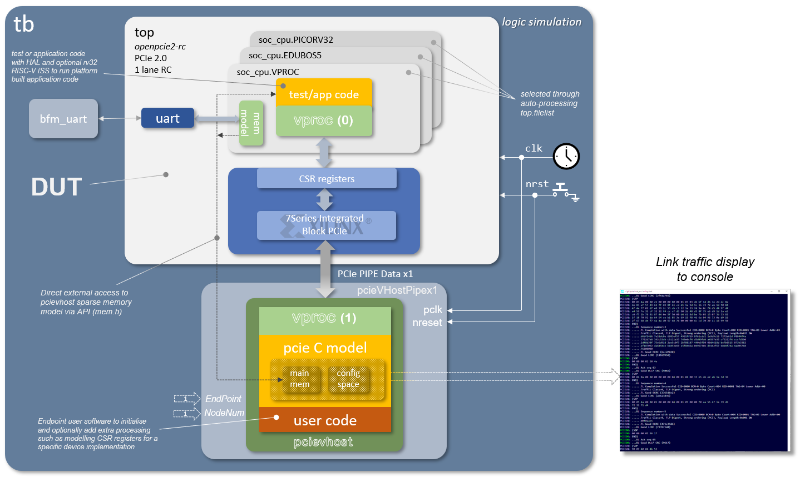
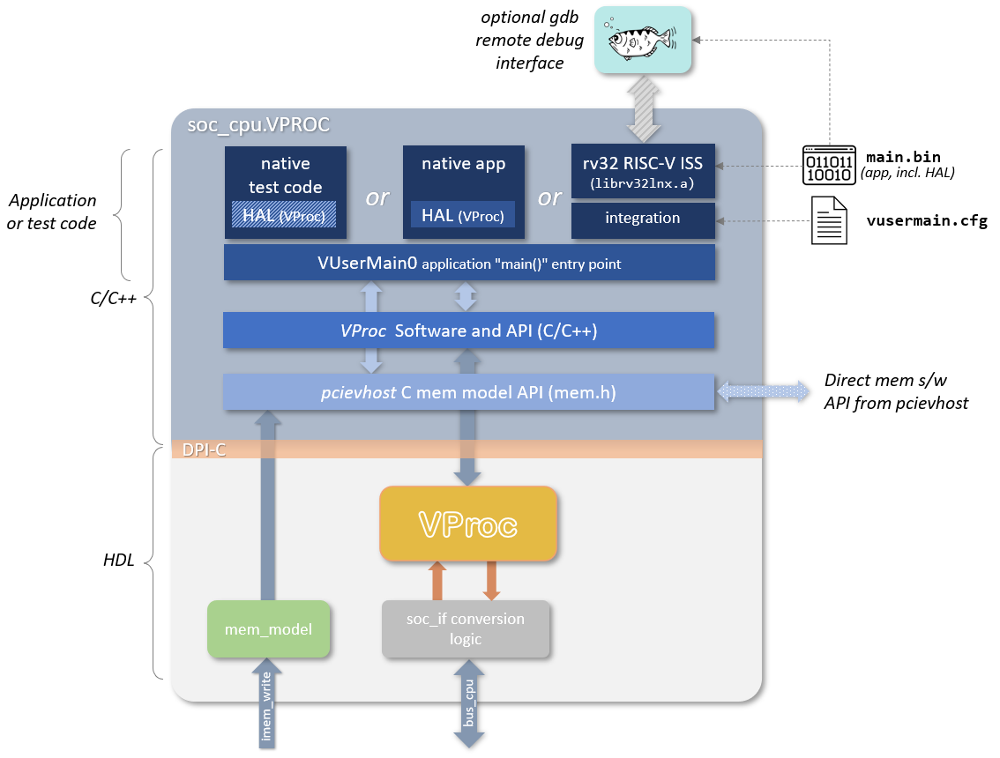
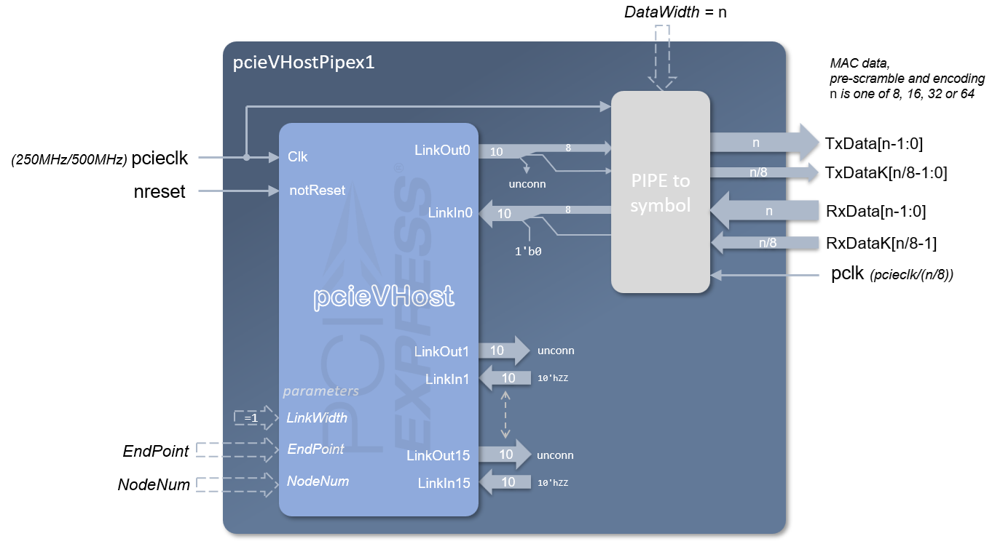

# openpcie2-rc Simulation Top Level Test Bench

## Table of Contents

* [Introduction](#introduction)
* [Test Bench Structure](#test-bench-structure)
  * [The PIPE PHY model](#the-pipe-phy-model)
  * [Endpoint feature limitations](#endpoint-feature-limitations)
  * [Prerequisites on Windows](#prerequisites-on-windows)
  * [What the simulation does](#what-the-simulation-does)
  * [Building and running](#building-and-running)
* [The three CPU options](#the-three-cpu-options)
  * [What they cost](#what-they-cost)
* [Auto-selection of soc_cpu Component](#auto-selection-of-soc_cpu-component)
* [_VProc_ Software](#vproc-software)
  * [Other Software Use Cases](#other-software-use-cases)
    [Natively Compiled Application](#natively-compiled-application)
    [RISC-V Compiled Application](#risc-v-compiled-application)
* [Building and Running Code](#building-and-running-code)
  * [Configuring ISS timing model](#configuring-iss-timing-model)
  * [Running ISS code](#running-iss-code)
* [PicoRV32 RTL-Only Simulation](#picorv32-rtl-only-simulation)
* [Debugging Code](#debugging-code)
  * [Natively Compiled Code](#natively-compiled-code)
  * [ISS Software](#iss-software)
* [The mem_model Co-Simulation Sparse Memory Model](#the-mem_model-co-simulation-sparse-memory-model)
* [Driving the PCie Link](#driving-the-pcie-link)
* [Co-simulation HAL](#co-simulation-hal)
* [References](#references)


## Introduction

The *openpcie2-rc* top level test bench is based around the [*pcievhost*](https://github.com/wyvernSemi/pcievhost) PCIe 2.0 verification co-simulation IP in order to drive the DUT's PCIe link. This is a C model for generating PCIe 1.1 and 2.0 traffic data connected to the logic simulation using the [*VProc*](https://github.com/wyvernSemi/vproc) virtual processor co-simulation element. _VProc_ allows a user program to be compiled natively on the host machine and 'run' on an instantiated HDL component in a logic simulation, including running the PCIe C model. _VProc_ has a generic memory mapped master bus for generating read and write transactions and a Bus Functional Model (BFM) wrapper encapsulates the _VProc_ component and effectively memory maps the PCIe ports into the address space, allowing software to drive and read these ports and interface with the PCIe C model. Although originally designed as a root complex model, the _pcievhost_ components has <ins>some</ins> endpoint features, enabled by setting a parameter. The endpoint features are [limited](#endpoint-feature-limitations) and were originally designed just as a target for the main root complex model to be tested.

The diagram below is a block diagram of the top level test bench showing the main features.

<p align=center>

</p>

The DUT PCIe link is connected to the _pcievhost_, instantiated in a wrapper x1 PIPE link (`pcieVHostPipex1.v`) configured as an endpoint, and running some user code  to generate PCIe traffic as required, though it will automatically respond to transactions requiring a completion. The model is capable of displaying link traffic on both the up- and downstream links to the console, configurable via a `ContDisps.hex` file. To drive the DUT's memory mapped slave bus, a _VProc_ component is used with a BFM wrapper for the specific bus protocol used for the device&mdash;in this case PCIe. A program can then be run on the virtual processor to access the device's memory mapped registers etc. and update the TX link signals and read from the RX link signals.

The user software to run on the virtual processor is the means to configure the model, such as setting the config space register settings, doing the required link initialisation, and any further modelling of a specific Endpoint implementation. That software is [`usercode/VUserMain1.cpp`](usercode/VUserMain1.cpp): it builds a Type 0 configuration space with PCIe, MSI and Power Management capabilities, and calls `initFc()` to bring up flow control. What it does not model is device behaviour behind the BARs - see [Endpoint feature limitations](#endpoint-feature-limitations).

## Test Bench Structure

The test bench drives the **real** Root Complex RTL. `tb.sv` instantiates
`RC_direct_opensource` out of `2.rtl/2.RC-direct.opensource` -- the same top
level that goes into the bitstream -- and the whole design comes along with it:

```
tb.sv
 |
 +- RC_direct_opensource                            2.rtl/.../src/
      |
      +- host_bridge                                real RTL
      |    +- clk_synth       MMCM                  real RTL
      |    +- txn_engine                            real RTL
      |    |    `- silicon_core -> PCIE_2_1         Xilinx hard macro (secureip)
      |    `- serdes_front    <-- REPLACED -->      5.sim/models/serdes_front.PIPE.sv
      |                                                +- PIPE PHY model
      |                                                `- pcieVHostPipex1 (endpoint,
      |                                                   VProc node 1, VUserMain1.cpp)
      `- riscv_pcie_soc                             real RTL
           +- picorv32                              real RTL, runs firmware.hex
           `- soc_csr -> csr                        PeakRDL-generated CSR
```

Exactly **one** RTL file is swapped for the simulation, and one file is copied in:

| Item | Why |
|---|---|
| `serdes_front.sv` becomes `models/serdes_front.PIPE.sv` | the 7-series GTP transceiver turns PIPE symbols into a 5 GT/s serial stream; _pcievhost_ models the link at PIPE symbol level, so the transceiver has to come out |
| `firmware.hex` copied into `5.sim/` | `riscv_pcie_soc.sv` reads it with `$readmemh` and a bare file name |

Everything else -- the hard macro, the transaction layer, the CPU, the CSR and
the firmware -- is what goes into the FPGA. The swap needs no `ifdef` in the
design: the module name and port list match, so the simulation file list
(`tb.prj`) simply picks the other file. It is the same mechanism the test bench
already used for the CPU with `soc_cpu.VPROC.sv`.

Two simulation-only parameters ARE selected with defines, both set only in
`5.sim/Makefile` and never by either synthesis flow:

| Define | Effect | Why |
|---|---|---|
| `SIM_FAST_TRAIN` | `PL_FAST_TRAIN = "TRUE"` on the hard macro (`silicon_core.sv`) | shortens the LTSSM training timers. This is a simulation feature of the macro -- with the real 12/24 ms timers link training is longer than any practical run |
| `SIM_GEN1_ONLY` | `PCIE_GEN = 1` (`link_pkg.sv`) | the endpoint VIP advertises Gen1 and its LTSSM helper cannot follow a Gen1 to Gen2 retrain |
| `SIM_PIPE_CODING` | line coding of the hard macro (`silicon_core.sv`) | matches how the endpoint VIP is configured over PIPE |

### The PIPE PHY model

`models/serdes_front.PIPE.sv` stands in for the transceiver and carries the link
partner on its far side. It provides the three things the `PCIE_2_1` LTSSM needs
from a PHY:

* **PHYSTATUS pulses** on exit from PIPE reset, on every power-state change and
  on every rate change
* **Receiver detection** -- a PHYSTATUS pulse together with `RXSTATUS = 3'b011`
  in response to `TXDETECTRX`, which is what lets the LTSSM leave Detect
* **RXVALID / RXELECIDLE**, asserted from the first K character the partner
  sends, standing in for a squelch detector

It also generates the clocks. `TXOUTCLK` is a behavioural 100 MHz oscillator and
everything downstream is the real `clk_synth` MMCM, so the design sees its normal
clock topology: PCLK at 125 MHz (Gen1) or 250 MHz (Gen2), USERCLK1/2 at 62.5 MHz.
**The 100 MHz matters**: `clk_synth` is parameterised with `CLKIN1_PERIOD = 10 ns`
and `CLKFBOUT_MULT_F = 10`, so any other input frequency scales every clock in
the design, and the PIPE then over- or under-samples the link partner. Feeding it
125 MHz, for instance, makes PCLK 156.25 MHz and duplicates one symbol in five.

Two trace facilities are built in, both behind defines:

```
make USRSIMOPTS="--define PIPE_OS_TRACE"    # ordered sets, both directions, with link/lane numbers
make USRSIMOPTS="--define PIPE_RAW_DUMP"    # raw PIPE symbols
```

The LTSSM state is printed on every transition without any define, and `tb.sv`
reports `phy_lnk_up`, `trn_lnk_up`, `user_lnk_up` and `user_reset` as they change.

### Endpoint feature limitations

_pcievhost_ was written as a root complex model, and its endpoint side is a
parameter on top of that -- `EndPoint = 1`, set where the model is instantiated
in `models/serdes_front.PIPE.sv`. It is enough to train a link and answer
Configuration and Memory requests, which is exactly what testing a root complex
needs, but it is not a device model. What it does and does not give you:

**What it provides**

* A configuration space, built by [`usercode/VUserMain1.cpp`](usercode/VUserMain1.cpp)
  through `writeConfigSpace()` / `writeConfigSpaceMask()`: a Type 0 header
  (vendor `0x14fc`, device `0x0002`), and PCIe, MSI and Power Management
  capability structures. The mask calls are what make the read-only bits behave
  as read-only.
* Automatic completions for Configuration and Memory requests, with Memory
  traffic landing in the
  [sparse memory model](#the-mem_model-co-simulation-sparse-memory-model).
* A full LTSSM, flow control initialisation and DLLP handling.

**What it does not**

* **No device behaviour behind the BARs.** A memory write is stored and a read
  returns it; nothing interprets the data, so there is no DMA, no interrupt
  generation and no application logic to test against.
* **No error injection.** Malformed TLPs, completion timeouts, retries and CRS
  storms have to be provoked by editing the model, not by configuration.
* **One lane.** The wrapper used here is `pcieVHostPipex1`, x1 with a 16-bit
  PIPE datapath. Wider links need a different wrapper.
* **The endpoint LTSSM paths were the least exercised part of the model**, since
  its usual job is to be the root complex. Three of them turned out to be wrong
  when driven by real silicon rather than by another copy of the same VIP. The
  fixes are in `models/pcievhost/ltssm/ltssm.c`, with the original kept beside
  it as `ltssm.c.orig`.

For a link partner with real device behaviour the alternative is an RTL
endpoint, which the project points at in
[`2.rtl/1.EP.opensource`](../2.rtl/1.EP.opensource). That costs the decoded
protocol logging and the controllability this model gives, so the two are
complementary rather than interchangeable.

### Prerequisites on Windows

Do this once, before anything below will work. The commands to actually build
and run are further down, in [Building and running](#building-and-running).

**1. Use the right shell.** The C/C++ side needs a MinGW toolchain and the HDL
side needs Vivado's `xsim`. Both work, but **only from a properly launched MSYS2
MinGW64 shell** -- `C:\msys64\mingw64.exe`, or `msys2_shell.cmd -mingw64`.

> `cmd.exe` and PowerShell have no `make` and no `gcc`. Git Bash has neither
> either. And Vivado's `xvlog`, `xelab` and `xsim` launchers go through
> `/usr/bin/cmd`, which needs the environment that shell sets up -- started from
> a foreign shell they fail **silently**, with a non-zero exit and no output at
> all. If a build seems to do nothing, this is why.

Paths in that shell are POSIX: `C:\Users\you\openPCIE` is `/c/Users/you/openPCIE`.

**2. Add one MSYS2 package:**

```bash
pacman -S mingw-w64-x86_64-dlfcn        # VProc.h includes <dlfcn.h>
```

**3. Put the tools on PATH.** A stock MinGW64 shell has `gcc`, `make` and
`python3`, but **not** Vivado, the RISC-V compiler or `peakrdl` -- those are
installed outside MSYS2 and have to be added. Adjust the paths to your install:

```bash
export PATH=$PATH:/c/Xilinx/Vivado/2024.2/bin
export PATH=$PATH:/c/rv/xpack-riscv-none-elf-gcc-15.2.0-1/bin
export PATH=$PATH:/c/Users/you/AppData/Local/Programs/Python/Python312/Scripts
```

Append those three lines to `~/.bashrc` and they are set for every new shell.
Check with:

```bash
command -v make gcc riscv-none-elf-gcc xvlog
```

All four must print a path. (`peakrdl` is only needed if you edit `csr.rdl` --
see [4.build/README.md](../4.build/README.md#csr-hal-compilation).)

The make file separately puts `TMP`, `TEMP` and `TMPDIR` back, because GNU make
on MSYS2 hands its recipes a shell with all three unset and gcc then tries to
write its temporaries into `C:\WINDOWS\`.

### What the simulation does

A full run takes the design from power-up to a verified memory transaction, with
no hardware involved:

```
                   0  TB     run length 3000 us
              353000  LTSSM  0xxx -> 0x00 DETECT_QUIET
             1000000  TB     PERST# released
             3113000  LTSSM  0x00 -> 0x02 POLLING_ACTIVE
             3353000  LTSSM  0x02 -> 0x04 POLLING_CONFIGURATION
             4585000  LTSSM  0x04 -> 0x05 CONFIG_LINKWIDTH_START
            70217000  LTSSM  0x05 -> 0x26      <- link number assigned
            71161000  LTSSM  0x2a -> 0x2b      <- lane number assigned
            72065000  LTSSM  0x2c -> 0x11      <- Configuration complete
            73609001  TB     phy_lnk_up   = 1  <- physical layer up
            73689000  TB     user_reset   = 0
            74033000  LTSSM  0x15 -> 0x16 L0  (linkup)
            74825001  TB     trn_lnk_up   = 1  <- data link layer up, flow control done
            74841000  TB     ===> PCIe LINK UP -- SOC released from reset
           302441000  TB     ===> FIRMWARE RESULT 0x0000face  (PASS)

 openpcie2-rc co-simulation summary
  PCIe link up ............ YES
  LTSSM final state ....... 0x16
  cfg_status .............. 0x0000
  TLPs sent by firmware ... 9
  Payload written to EP ... 0x00000006  (Memory Write TLP)
  Payload read back ....... 0x00000006  (match)
  FIRMWARE RESULT ......... PASS (0x0000face)
```

The last three lines are the actual result. `0x0000FACE` is only the verdict the
firmware reports; the two above it are the dword that really crossed the link --
written to the endpoint at `0x8000_0000` by a Memory Write TLP, then fetched
back by a Memory Read and its completion.

In between, the real firmware enumerates the endpoint model exactly as it does
on the board. The endpoint's own decode of the traffic:

```
RC -> EP   TL Config read type 0   RID=10ee TAG=00 Bus=01 Dev=00 Func=0 Reg=00
EP -> RC   TL Completion with data Successful  TAG=00 Byte Count=004
RC -> EP   TL Config write type 0  TAG=01 Reg=04        BAR0 sizing
RC -> EP   TL Config write type 0  TAG=02 Reg=05        BAR1 sizing
RC -> EP   TL Config write type 0  TAG=03 Reg=04        BAR0 assign
RC -> EP   TL Config write type 0  TAG=04 Reg=05        BAR1 assign
RC -> EP   TL Config write type 0  TAG=05 Reg=01        Command: mem space + bus master
RC -> EP   TL Mem write req  Addr=80000000 (32) TAG=06
RC -> EP   TL Mem read  req  Addr=80000000 (32) TAG=07 Len=001
EP -> RC   TL Completion with data Successful  TAG=07
```

and the CSR side of the same sequence, as the firmware sees it:

```
CSR RD [0x20] = 0000001e     status.phy -- Tx FSM idle, 30 buffers free
CSR WR [0x00] = 04000001     tx.header0 -- CfgRd0, length 1
CSR WR [0x04] = 10ee000f     tx.header1 -- requester 0x10EE, tag 0, BE 0xF
CSR WR [0x08] = 01000000     tx.header2 -- bus 1, device 0, function 0, register 0
CSR WR [0x0c] = 00000000     tx.data    -- the write strobe starts the transfer
CSR RD [0x18] = ...          rx.header_info -- polled until the completion lands
...
CSR WR [0x0c] = 0000face     the pass marker
```

### Building and running

On Windows, work through [Prerequisites](#prerequisites-on-windows) first -- the
right shell and the `PATH` settings. Everything below assumes an MSYS2 MinGW64
shell with the tools on `PATH`; from `cmd.exe` the first line fails with
`'make' is not recognized`.

```
cd 4.build/sw_build && make SIM=1   # firmware with the short start-up delay
cd ../../5.sim
make                                # VProc.so + xvlog + xelab
make run                            # -> the summary above
make gui                            # same, with waveforms
```

`SIM=1` matters: `main()` opens with `wait_cycles(100000)`, which waits for the
link to train. On hardware that costs nothing; in simulation, compiled without
optimisation, it is about 80 ms of simulated time before the firmware does
anything at all. `SIM=1` shortens it to 200 iterations and the whole run fits in
3 ms. Without it the simulation still works, it just needs `make run RUN_US=100000`
and a great deal of patience.

Useful switches:

```
make run RUN_US=10000                        # longer run; read at time 0 from run_us.cfg
make USRSIMOPTS="--define CPU_TRACE"         # CPU bus activity and every CSR access
make USRSIMOPTS="--define PIPE_OS_TRACE"     # ordered sets both ways, with link/lane numbers
make USRSIMOPTS="--define PIPE_RAW_DUMP"     # raw PIPE symbols
```

The LTSSM state, the link status bits and the firmware's result marker are
always printed, with no define needed.


## The three CPU options

The SOC's CPU socket takes three different occupants, selected with `CPU=` on
the make command line. The DUT is otherwise identical in all three -- the same
CSR, the same PCIe stack, the same top level -- so the same test is being run
each time, only the thing issuing the bus accesses changes.

| `CPU=` | What sits on VProc node 0 | Executes |
|---|---|---|
| `rtl` (default) | nothing -- the real `picorv32` core | `firmware.hex`, the same image that goes into the bitstream |
| `vproc` | VProc | [`usercode/VUserMain0.cpp`](usercode/VUserMain0.cpp), compiled for the host |
| `iss` | VProc + the [rv32](models/rv32) instruction set simulator | `firmware.elf`, interpreted -- real RISC-V instructions, no RTL core |

```sh
cd ../4.build/sw_build && make SIM=1   # firmware.hex AND firmware.elf
cd ../../5.sim
make run                  # CPU=rtl, the default
make run CPU=vproc
make run CPU=iss
```

The swap happens in [`riscv_pcie_soc.sv`](../2.rtl/2.RC-direct.opensource/src/riscv_pcie_soc.sv)
behind `` `ifdef SOC_CPU_VPROC ``, which the makefile passes to `xvlog` for the
two VProc builds. The replacement module is
[`models/soc_cpu.VPROC.picorv32.sv`](models/soc_cpu.VPROC.picorv32.sv): VProc
dressed up as a picorv32, driving the core's *native* memory interface.

> Note the difference from the inherited `models/soc_cpu.VPROC.sv`, which is
> kept for reference. That one speaks the `soc_if` bus interface of the sibling
> Chili.CHIPS SOC infrastructure. This design has no `soc_if` -- it instantiates
> picorv32 directly -- so it needed its own wrapper.

The native C++ model reaches the CSR through `csr_cosim.h`, which PeakRDL
generates from the same [`csr.rdl`](../4.build/csr_build/csr.rdl) that produces
the register RTL and the firmware's `csr.h`. Hardware, firmware and the
co-simulation CPU model therefore cannot drift apart. The ISS is configured in
[`vusermain.cfg`](vusermain.cfg), where `-x`/`-X` place the CSR window on the
simulated bus and leave code and data in the ISS's own memory, and `-V PICORV32`
selects the matching instruction timing model.

### What they cost

Measured on a Ryzen 7 5800H (8 cores / 16 threads) **on mains power**, Vivado
xsim 2024.2, all three producing the identical result -- link up, LTSSM `0x16`,
9 TLPs, `PASS (0x0000face)`:

| | `CPU=rtl` | `CPU=vproc` | `CPU=iss` |
|---|---|---|---|
| Build from clean | 51 s | 49 s | 55 s |
| Result appears at | 302.4 µs | 99.0 µs | 311.7 µs |
| Run to that result | 28 s | **13 s** | 28 s |
| Run a fixed 400 µs | 33 s | 33 s | 33 s |

Each figure is the median of three clean repetitions; the spread is under 2 s.
Mains power is not a footnote: on battery, with the CPU clocked down from
3.2 GHz to 1.9 GHz, the same 400 µs run takes 83 s instead of 33 s. Measure with
the charger in, or the numbers are meaningless.

Two things fall out of that last row. The wall-clock cost of a given amount of
*simulated* time is the same whichever CPU is used, because the CPU is not what
the simulator spends its time on -- the `PCIE_2_1` hard macro model and the PCIe
stack around it are. Swapping the core out buys nothing by itself.

What `CPU=vproc` does buy is *less simulated time to cover*: 99 µs instead of
302 µs, because the native program does not pay the firmware's start-up delay
and polls the CSR without burning instructions between reads. That is where its
2x comes from, and it is why it is the one to reach for when iterating on the
PCIe logic rather than on the firmware.

`CPU=iss` lands within 3% of the RTL core's timing (311.7 µs against 302.4 µs),
which is the `-V PICORV32` timing model doing its job. It is the useful middle
ground: the real firmware binary, real RISC-V instructions, and a debuggable
native process -- `-g` in `vusermain.cfg` opens a gdb port -- without the RTL
core in the way.

## Auto-selection of soc_cpu Component

> Historical note. This describes the arrangement in the sibling _openpcie2-rc_
> project, where the CPU was selected by filtering a file list. Here the choice
> is the `CPU=` switch above, and the file list is [`tb.prj`](tb.prj).

The _openpcie2-rc_ top level component has the required RTL files listed in <tt>2.rtl/top.filelist</tt>. This includes files for the `soc_cpu`, under the directory <tt>ip.cpu</tt>. The simulation build make file ([see below](#building-and-running-code)) will process the <tt>top.filelist</tt> file to generate a new local copy, having removed all references to the files under the <tt>ip.cpu</tt> directory. Since the VProc <tt>soc_cpu</tt> component is a verification model, the <tt>soc_cpu.VPROC.sv</tt> HDL file is placed in <tt>5.sim/models</tt> whilst the the HDL files for _VProc_ and _mem_model_ are in `5.sim/models/cosim`. These are referenced within the make file, along with the other test models that are used in the test bench. Thus the VProc device is selected for the simulation as the CPU component.

## VProc Software

The VProc software consists of DPI-C code for communication and sychronisation with the simulation, for _VProc_. On top of this are the APIs for _VProc_ for use by the running code. In the case of _VProc_ there is a low level C API) or, if preferred, a C++ API. In _openpcie2-rc_, the _VProc_ <tt>soc_cpu</tt> is node 0, and so the entry point for user software is <tt>VUserMain0</tt>, in place of a normal C or C++ <tt>main</tt>.

The _VProc_ software is compiled into libraries located in `5.sim/models/cosim/lib`, with the headers in `5.sim/models/cosim/include` (see [here](models/cosim/README.md) for more details). The C++ API is defined in a class <tt>VProc</tt> (defined in <tt>VProcClass.h</tt>), and a constructor creates an API object, defining the node for which it is connected:

```c++
VProc (const uint32_t node);
```

For the C++ VProc API there are two basic word access methods:

```c++
    int  write (const unsigned   addr, const unsigned    data, const int delta=0);
    int  read  (const unsigned   addr,       unsigned   *data, const int delta=0);
```

For these methods, the address argument is agnostic to being a byte address or a word address, but for the _openpcie2-rc_ implementation these are **byte addresses**. The `delta` argument is unused in _openpcie2-rc_, and should be left at its default value, with just the `address` and `data` arguments used in the call to these methods. Along with these basic methods is a method to advance simulation time without doing a read or write transaction.

```c++
int  tick (const unsigned ticks);
```
This method's units of the <tt>ticks</tt> argument are in clock cycles, as per the clock that the _VProc_ HDL is connected to. A basic _VProc_ program, then, is shown below:

```c++
#include "VProcClass.h"
extern "C" {
#include "mem.h"
}

static const int node    = 0;

extern "C" void VUserMain0(void)
{
    // Create VProc access object for this node
    VProc* vp0 = new VProc(node);

    // Wait a bit
    vp0->tick(100);

    uint32_t addr  = 0x10001000;
    uint32_t wdata = 0x900dc0de;

    vp0->write(addr, wdata);
    VPrint("Written   0x%08x  to  addr 0x%08x\n", wdata, addr);

    vp0->tick(3);

    uint32_t rdata;
    vp0->read(addr, &rdata);

    if (rdata == wdata)
    {
        VPrint("Read back 0x%08x from addr 0x%08x\n", rdata, addr);
    }
    else
    {   VPrint("***ERROR: data mis-match at addr = 0x%08x. Got 0x%08x, expected 0x%08x\n", addr, rdata, wdata);
    }

    // Sleep forever
    while(true)
        vp0->tick(GO_TO_SLEEP);
}
```
The above code is a slightly abbreviated version of the code in <tt>5.sim/usercode</tt>. Note that the <tt>VUserMain0</tt> function must have C linkage as the _VProc_ software that calls it is in C (as all the programming logic interfaces, including DPI-C, are C). The API also has a set of other methods for finer access control which are listed below, and more details can be found in the [_VProc_ manual](https://github.com/wyvernSemi/vproc/blob/master/doc/VProc.pdf).

```c++
    int  writeByte    (const unsigned   byteaddr, const unsigned    data, const int delta=0);
    int  writeHword   (const unsigned   byteaddr, const unsigned    data, const int delta=0);
    int  writeWord    (const unsigned   byteaddr, const unsigned    data, const int delta=0);
    int  readByte     (const unsigned   byteaddr,       unsigned   *data, const int delta=0);
    int  readHword    (const unsigned   byteaddr,       unsigned   *data, const int delta=0);
    int  readWord     (const unsigned   byteaddr,       unsigned   *data, const int delta=0);

```
The other methods in this class are not, at this point, used by _openpcie2-rc_. These methods can now be used to write test code to drive the <tt>soc_if</tt> bus of the <tt>soc_cpu</tt> component, and is the basic method to write test code software.

As well as the _VProc_ API, the user software can have direct access to the sparse memory model API (which is part of the _pcievhost_ model) by including <tt>mem.h</tt>, which are a set of C methods (and <tt>mem.h</tt> must be included as <tt>extern "C"</tt> in C++ code). The functions relevant to _openpcie2-rc_ are shown below:

```c++
void     WriteRamByte  (const uint64_t addr, const uint32_t data, const uint32_t node);
void     WriteRamHWord (const uint64_t addr, const uint32_t data, const int little_endian, const uint32_t node);
void     WriteRamWord  (const uint64_t addr, const uint32_t data, const int little_endian, const uint32_t node);
uint32_t ReadRamByte   (const uint64_t addr, const uint32_t node);
uint32_t ReadRamHWord  (const uint64_t addr, const int little_endian, const uint32_t node);
uint32_t ReadRamWord   (const uint64_t addr, const int little_endian, const uint32_t node);
```

Note that, as C functions, there are no default parameters and the <tt>little_endian</tt> and <tt>node</tt> arguments must be passed in, even though they are constant. The <tt>little_endian</tt> argument is non-zero for little endian and zero for big endian. The <tt>node</tt> argument is **not** the same as for _VProc_, but allows multiple separate memory spaces to be modelled, just as for _VProc_ multiple virtual processor instantiations. For _openpcie2-rc_, this is always 0. All instantiated <tt>mem_model</tt> components in the HDL have (through the DPI) access to the same memory space model as the API, and so data can be exchanged from the simulation and the running code, such as the RISC-V programs.

Compiling co-designed application code, either compiled for the native host machine, or to run on the <tt>rv32</tt> RISC-V ISS will need further layers on top of these APIs, which will be virtualised away by that point ([see the sections below](#co-simulation-hal)). The diagram below summarises the software layers that make up a program running on the _VProc_ HDL component. The "native test code" use case, shown at the top left, is for the case just described above  that use the APIs directly, though they optional can use the HAL.

<p align="center">

</p>

### Other Software Use Cases

#### Natively Compiled Application

As well as the native test code case seen in the previous section, the _openpcie2-rc_ application can be compiled natively for the host machine, including the hardware access layer (HAL), generated from SystemRDL. The HAL software output from this is processed to generate a version that makes accesses to the _VProc_ and PCIe memory model APIs in place of accesses with pointers to and from memory (see the [Co-simulation HAL](#co-simulation-hal) section below). The rest of the application software has these details hidden away in the HAL and sees the same API as presented by the auto-generated code. The <tt>main</tt> entry point is also swapped for <tt>VUserMain0</tt>.

This is exactly the `CPU=vproc` build. In _openPCIE_ the transactions leave the CPU model on picorv32's native memory interface rather than on an <tt>soc_if</tt> port, since that is what this SOC instantiates -- see [The three CPU options](#the-three-cpu-options). The generated co-simulation HAL is `csr_cosim.h`, and [`usercode/VUserMain0.cpp`](usercode/VUserMain0.cpp) is the application on top of it.

#### RISC-V Compiled Application

To execute RISC-V compiled application code, the <tt>rv32</tt> instruction set simulator is used as the code running on the virtual processor. The <tt>VUserMain0</tt> program now becomes software to creates an ISS object and integrate with _VProc_. This uses the ISS's external memory access callback function to direct loads and stores either towards the PCIe memory model, the _VProc_ API for simulation transactions, or back to the ISS itself to handle. This ISS integration <tt>VUserMain0</tt> program is located in <tt>5.sim/models/rv32/usercode</tt>. When built the code here is compiled and uses the pre-built library in <tt>5.sim/models/rv32/lib/librv32lnx.a</tt> containing the ISS, with the headers for it in <tt>5.sim/models/rv32/include</tt>. More details of the integration code and methods can be found [here](models/rv32/README.md).

The ISS supports interrupts, but these are not currently used on _openpcie2-rc_. The integration software can read a configuration file, if present in the <tt>5.sim/</tt> directory, called <tt>vusermain.cfg</tt>. This allows the ISS and other features to be configured at run-time. The configuration file is in lieu of command line options and the entries in the file are formatted as if they were such, with a command matching the `VUserMain` program:

```
vusermain0 [options]
```
One of the options is <tt>-h</tt> for a help message, which is as shown below:
```
Usage:vusermain0 -t <test executable> [-hHebdrgxXRcI][-n <num instructions>]
      [-S <start addr>][-A <brk addr>][-D <debug o/p filename>][-p <port num>]
      [-l <line bytes>][-w <ways>][-s <sets>][-j <imem base addr>][-J <imem top addr>]
      [-P <cycles>][-x <base addr>][-X <top addr>][-V <core>]
   -t specify test executable/binary file (default test.exe)
   -B specify to load a raw binary file (default load ELF executable)
   -L specify address to load binary, if -B specified (default 0x00000000)
   -n specify number of instructions to run (default 0, i.e. run until unimp)
   -d Enable disassemble mode (default off)
   -r Enable run-time disassemble mode (default off. Overridden by -d)
   -C Use cycle count for internal mtime timer (default real-time)
   -a display ABI register names when disassembling (default x names)
   -T Use external memory mapped timer model (default internal)
   -H Halt on unimplemented instructions (default trap)
   -e Halt on ecall instruction (default trap)
   -E Halt on ebreak instruction (default trap)
   -b Halt at a specific address (default off)
   -A Specify halt address if -b active (default 0x00000040)
   -D Specify file for debug output (default stdout)
   -R Dump x0 to x31 on exit (default no dump)
   -c Dump CSR registers on exit (default no dump)
   -g Enable remote gdb mode (default disabled)
   -p Specify remote GDB port number (default 49152)
   -S Specify start address (default 0)
   -I Enable instruction cache timing model (default disabled)
   -l Specify number of bytes in icache line (default 8)
   -w Specify number of ways in icache (default 2)
   -s Specify number of sets in icache (default 256)
   -j Specify cached IMEM base address (default 0x00000000)
   -J Specify cached IMEM top address (default 0x7fffffff)
   -P Specify penalty, in cycles, of one slow mem access (default 4)
   -x Specify base address of external access region (default 0xFFFFFFFF)
   -X Specify top address of external access region (default 0xFFFFFFFF)
   -V Specify RISC-V core timing model to use (default "DEFAULT")
   -h display this help message
```
With these options the model can load an elf executable or raw binary file to memory directly and be set up with some execution termination conditions. Disassembly output can also be switched on and registers dumped on exit. More details of all these features can be found in the <tt>rv32</tt> [ISS manual](https://github.com/wyvernSemi/riscV/blob/main/iss/doc/iss_manual.pdf).

Specific to the _openpcie2-rc_ project is the ability to specify the region where memory loads and stores will make external simulation transactions rather than use internal memory modelling or peripherals, using the <tt>-x</tt> and <tt>-X</tt> options. This is useful to allow access to the CSR registers in the HDL whilst mapping all of the memory internally using the sparse C PCIe memory model. The cache model can be enabled with the <tt>-I</tt> option and the cache configured. The <tt>-l</tt> option specifies the number of bytes in a cache line, which can be 4, 8 or 16. The number of ways is set with <tt>-w</tt> and can be either 1 or 2, and the number of sets is specified with the <tt>-s</tt> options and can be 128, 256, 512 or 1024. The _openpcie2-rc_ project also has the option to load a raw binary file to memory in place of reading an ELF file. The <tt>-B</tt> selects this mode (with the <tt>-t</tt> still specifying the file name), and the load address can be changed from 0 with the <tt>-L</tt> option. A set of pre-configured timing models can be specified with the <tt>-V</tt> option. The argument must be one of the following:

* DEFAULT
* PICORV32
* EDUBOS5STG2
* EDUBOS5STG3
* IBEXMULSGL
* IBEXMULFAST
* IBEXMULSLOW

This reflects the available models as detailed in the _Configuring ISS timing model_ section below.

## Building and Running Code

A <tt>Makefile</tt> file is provided in the <tt>5.sim/</tt> directory to compile the user *VProc* software, for both the `soc_cpu` and _pcieVHost_ components, and to build and run the test bench HDL. The make file will compile all the user code or, where an ISS build is selected (see make file variables below) the provided `soc_cpu` user code that's the _rv32_ ISS integration software.

In _openPCIE_ the node-1 (_pcieVHost_) entry point is <tt>VUserMain1.cpp</tt> in <tt>5.sim/usercode</tt>, named in the `PCIE_C` variable, and it is always compiled. What gets compiled for node 0 depends on the `CPU` variable: nothing for `CPU=rtl`, <tt>usercode/VUserMain0.cpp</tt> for `CPU=vproc`, and the ISS integration code in <tt>models/rv32/usercode</tt> for `CPU=iss`. To alter which files to compile, the make file `USER_C` variable can be updated to list a set of C++ files for the `soc_cpu`. Similarly, the `PCIE_C` variable can be updated with a list of files for the PCie component. The location of the source files is in the variable `USRCODEDIR`, which may also be altered. Any modifications can be done to the make file itself, or on the command line. E.g., to add additional files to the `soc_cpu` build:

```
make USER_C="VUserMain0.cpp MyTest1Class.cpp"
```

If many variants of software build are required then either scripts can be constructed with the various command line variable modification calls to `make` or other make files which set these variables and call the common make file. This is useful in managing source code for multiple tests located in different directories, compiling for ISS (perhaps also calling the RISC-V application build), or for compiling application code natively which will have a different set of source files.

The user software is compiled into a local static library, <tt>libuser.a</tt>, which is linked into the <tt>VProc.so</tt> shared object that the simulator loads (<tt>xelab -sv_lib</tt>), along with the precompiled <tt>libcosimlnx.a</tt> (or <tt>libcosimwin.a</tt> for MSYS2/mingw64 on Windows) located in <tt>5.sim/models/cosim/lib</tt> and containing the precompiled code for *VProc*. The headers for the *VProc* API software are in <tt>5.sim/models/cosim/include</tt>. The HDL required for these models' use in the _openpcie2-rc_ test bench can be found in <tt>5.sim/models/cosim</tt>, and the make file picks these up from there to compile with the rest of the test bench HDL.

The <tt>Makefile</tt> make file has a target <tt>help</tt>, which produces the following output:

```
make help          Display this message
make               Build C/C++ and HDL code without running simulation
make run           Build and run batch simulation
make rungui/gui    Build and run GUI simulation
make clean         clean previous build artefacts

Command line configurable variables:
  USER_C:       list of user source code files for soc_cpu (default VUserMain0.cpp)
  PCIE_C:       list of user source code files for pcievhost modules (default VUserMain1.cpp)
  USRCODEDIR:   directory containing user source code (default $(CURDIR)/usercode)
  OPTFLAG:      Optimisation flag for user VProc code (default -g)
  SOCCPUMATCH:  string to match for soc_cpu filtering in h/w file list (default ip.cpu)
  USRSIMOPTS:   additional simulator analysis flags, such as setting defines (default blank)
  BUILD:        Select build type from DEFAULT or ISS (default DEFAULT)
  CPU:          CPU model on VProc node 0 (default rtl)
                  rtl    the real picorv32, executing firmware.hex
                  vproc  native C++ in usercode/VUserMain0.cpp
                  iss    the rv32 ISS, executing firmware.elf
  RUN_US:       simulated run length in microseconds (default 2000)
```

By default, without a named target, the simulation executable will be built but not run. With a <tt>run</tt> target, the simulation executable is built and then executed in batch mode. To fire up waveforms after the run, a target of <tt>rungui</tt> or <tt>gui</tt> can be used. A target of <tt>clean</tt> removes all intermediate files of previous compilations.

The make file has a set of variables (with default settings) that can be overridden on running <tt>make</tt>. E.g. <tt>make VAR=NewVal</tt>. The help output shows these variables with brief decriptions. Entries with multiple values should be enclosed in double quotes.

The variable to reach for is <tt>CPU</tt>, which picks what occupies node 0 and sets everything else to match -- <tt>CPU=iss</tt> is what selects the ISS build, overriding <tt>USER_C</tt> and <tt>USRCODEDIR</tt> with the supplied ISS integration source. (The underlying <tt>BUILD=ISS</tt> switch is still there and still works, but it only changes the C side; without <tt>CPU=iss</tt> the HDL is still built with the RTL core, and the ISS would have no processor socket to occupy.)

The <tt>USER_C</tt> and <tt>USERCODEDIR</tt> make file variable allows different (and multiple) user source file names to override the defaults, and to change the location of where the user code is located (if not the ISS build). This allows different programs to be run by simply changing these variable, and to organise the different source code in different directories etc. By default, the _VProc_ code is compiled for debugging (<tt>-g</tt>), but this can be overridden by changing <tt>OPTFLAG</tt>. The trace and timing options can also be overridden to allow a faster executable. The _openpcie2-rc_ <tt>top.filelist</tt> filename can be overridden to allow multiple configurations to be selected from, if required. The processing of this file to remove the listed <tt>soc_cpu</tt> HDL files is selected on a pattern (<tt>ip.cpu</tt>) but this can be changed using <tt>SOCCPUMATCH</tt>. If any additional options for the simulator are required, then these can be added to <tt>USRSIMOPTS</tt>.

```
make run                                                   # Build and run with the RTL picorv32 (the default)
make                                                       # Build but don't run
make run CPU=vproc                                         # Native C++ CPU model, usercode/VUserMain0.cpp
make run CPU=iss                                           # rv32 ISS on the real firmware.elf
make CPU=iss gui                                           # Build and run ISS simulation and show waves
make run RUN_US=3000                                       # Longer simulated run
make USER_C="test1.cpp subfuncs.cpp" USRCODEDIR=test1 CPU=vproc run
make clean                                                 # Clean all intermediate files
```

### Configuring ISS timing model

Configuration of the timing model can done from the supplied integration code in <tt>VUserMain0.cpp</tt>. The main <tt>pre_run_setup()</tt> function, in <tt>VUserMain0.cpp</tt>, creates an <tt>rv32_timing_config</tt> object (<tt>rv32_time_cfg</tt>) which has an <tt>update_timing</tt> method that takes a pointer to the iss object and an enumerated type to select the model to use for the particular core timings required. This second argument is selected from one of the following:

* <tt>rv32_timing_config::risc_v_core_e::DEFAULT&nbsp;&nbsp;&nbsp;&nbsp;&nbsp;</tt> : Default timing values
* <tt>rv32_timing_config::risc_v_core_e::PICORV32&nbsp;&nbsp;&nbsp;&nbsp;</tt> : picoRV32 timings
* <tt>rv32_timing_config::risc_v_core_e::EDUBOS5STG2&nbsp;</tt> : 2 stage eduBOS5
* <tt>rv32_timing_config::risc_v_core_e::EDUBOS5STG3&nbsp;</tt> : 3 stage eduBOS5
* <tt>rv32_timing_config::risc_v_core_e::IBEXMULSGL&nbsp;&nbsp;</tt> : IBEX single cycle multipler
* <tt>rv32_timing_config::risc_v_core_e::IBEXMULFAST&nbsp;</tt> : IBEX fast multi-cycle multiplier
* <tt>rv32_timing_config::risc_v_core_e::IBEXMULSLOW&nbsp;</tt> : IBEX slow multi-cycle multiplier

As detailed in the _RISC-V Compiled Application_ section above, the ISS can be configured via the <tt>vusermain.cfg</tt> file using the <tt>-V</tt> option.

### Running ISS code

When the test bench is built for the rv32 ISS, the actual 'user' application code is run on the RISC-V ISS model itself, and is compiled using the normal RISC-V GNU toochain to produce a binary file that the ISS can load and run. As described above, the code that is run is selected with the <tt>vusermain.cfg</tt> file and the <tt>-t</tt> option. The various flags configure the ISS and determines when the ISS is halted (if at all). An example assembly file is provided in <tt>5.sim/models/rv32/riscvtest/main.s</tt> (as well as a recompiled <tt>main.bin</tt>). This assembly code reproduces the functionality of the example <tt>VUserMain0.cpp</tt> program discussed previously, writing to memory, reading back and comparing for a mismatch. The example assembly code is compiled with:

```
$riscv64-unknown-elf-as.exe -fpic -march=rv32imafdc -aghlms=main.list -o main.o main.s
$riscv64-unknown-elf-ld.exe main.o -Ttext 0 -Tdata 1000 -melf32lriscv -o main.bin
```
In this instance, the code is set to compile to use the MAFDC extensions (maths, atomic, float, double and compressed). To run this code the <tt>vusermain.cfg</tt> is set to:

```
vusermain0 -x 0x10000000 -X 0x20000000 -rEHRca -t ./models/rv32/riscvtest/main.bin
```
This sets the address region that will be sent to the HDL <tt>soc_cpu</tt> bus to be between byte addresses 0x10000000 and 0x1FFFFFFF. All other accesses will use the direct memory model's API, with no simulation transactions. The next set of options turn on run-time disassembly (<tt>-r</tt>), exit on <tt>ebreak</tt> (<tt>-E</tt>) or unimplemented instruction (<tt>-H</tt>), dump registers (<tt>-R</tt>) and CSR register (<tt>-c</tt>) and display the registers in ABI format (<tt>-a</tt>). The pre-compiled example program binary is then selected with the <tt>-t</tt> option. Of course, many of these options are not necessary and, for example, the output flags (<tt>-rRca</tt>) can be removed and the program will still run correctly. In the <tt>5.sim/</tt> directory, using <tt>make</tt> to build and run the code gives something like the following output (with other output removed):

```
$make CPU=iss run

   .
   .
   .
ECHO is off.
ECHO is off.

****** xsim v2023.2 (64-bit)
  **** SW Build 4029153 on Fri Oct 13 20:14:34 MDT 2023
  **** IP Build 4028589 on Sat Oct 14 00:45:43 MDT 2023
  **** SharedData Build 4025554 on Tue Oct 10 17:18:54 MDT 2023
    ** Copyright 1986-2022 Xilinx, Inc. All Rights Reserved.
    ** Copyright 2022-2023 Advanced Micro Devices, Inc. All Rights Reserved.

source xsim.dir/work.tb/xsim_script.tcl
# xsim {work.tb} -autoloadwcfg -runall
Time resolution is 1 ps
run -all
VInit(0): initialising DPI-C interface
  VProc version 1.13.2. Copyright (c) 2004-2025 Simon Southwell.


  ******************************
  *   Wyvern Semiconductors    *
  * rv32 RISC-V ISS (on VProc) *
  *     Copyright (c) 2025     *
  ******************************

00000000: 0x00001197    auipc     gp, 0x00000001
00000004: 0x0101a183    lw        gp, 16(gp)
00000008: 0x0001a103    lw        sp, 0(gp)
0000000c: 0x10001237    lui       tp, 0x00010001
00000010: 0x00222023    sw        sp, 0(tp)
00000014: 0x00022283    lw        t0, 0(tp)
00000018: 0x00229663    bne       t0, sp, 12
0000001c: 0x00004505'   addi      a0, zero, 1
0000001e: 0x00004501'   addi      a0, zero, 0
00000020: 0x05d00893    addi      a7, zero, 93
00000024: 0x00009002'   ebreak
    *

Register state:

  zero = 0x00000000   ra = 0x00000000   sp = 0x900dc0de   gp = 0x00001000
    tp = 0x10001000   t0 = 0x900dc0de   t1 = 0x00000000   t2 = 0x00000000
    s0 = 0x00000000   s1 = 0x00000000   a0 = 0x00000000   a1 = 0x00000000
    a2 = 0x00000000   a3 = 0x00000000   a4 = 0x00000000   a5 = 0x00000000
    a6 = 0x00000000   a7 = 0x0000005d   s2 = 0x00000000   s3 = 0x00000000
    s4 = 0x00000000   s5 = 0x00000000   s6 = 0x00000000   s7 = 0x00000000
    s8 = 0x00000000   s9 = 0x00000000  s10 = 0x00000000  s11 = 0x00000000
    t3 = 0x00000000   t4 = 0x00000000   t5 = 0x00000000   t6 = 0x00000000

CSR state:

  mstatus    = 0x00003800
  mie        = 0x00000000
  mvtec      = 0x00000000
  mscratch   = 0x00000000
  mepc       = 0x00000000
  mcause     = 0x00000000
  mtval      = 0x00000000
  mip        = 0x00000000
  mcycle     = 0x0000000000000037
  minstret   = 0x000000000000000b
  mtime      = 0x0006263f2bfc6bcf
  mtimecmp   = 0xffffffffffffffff

$finish called at time : 39217 ns : File "C:/git/openpcie/5.sim/models/pcievhost/verilog/pcieVHost/pcieVHost.v" Line 209
exit
INFO: [Common 17-206] Exiting xsim at Tue Aug 19 16:03:05 2025...

```

Note that the disassembled output is a mixture of 32-bit and compressed 16-bit instructions, with the compressed instruction hexadecimal values shown followed by a <tt>'</tt> character and the instruction heximadecimal value in the lower 16-bits. Unlike for the native compiled code use cases, unless the HDL has changed, the test bench does not need to be re-built when the RISC-V source code is changed or a different binary is to be run, just the RISC-V code is re-compiled or the <tt>vusermain.cfg</tt> updated to point to a different binary file.

#### The openPCIE configuration

The walk-through above is Simon's stand-alone assembler example, and its
<tt>vusermain.cfg</tt> line is kept commented out in the file for checking the
ISS on its own. What [`vusermain.cfg`](vusermain.cfg) actually selects is the
real firmware:

```
vusermain0 -V PICORV32 -H -x 0x30000000 -X 0x3FFFFFFF -t ../4.build/sw_build/firmware.elf
```

`-x`/`-X` put **only** the CSR window on the simulated bus. Code and data at
`0x0000_0000` are served from the ISS's own memory, which is why instruction
fetch costs no simulation time at all. `-V PICORV32` makes the ISS reckon cycles
the way the real core does -- and it works: the result lands at 311.7 µs against
the RTL core's 302.4 µs, within 3%. Build the ELF first, with the short
co-simulation start-up delay:

```sh
cd ../4.build/sw_build && make SIM=1
```

### PicoRV32 RTL-Only Simulation

This is now simply the default build -- `make run`, with no variables set --
and it uses the same `xsim` flow as everything else, driving the PCIe BFM on
node 1 from [`usercode/VUserMain1.cpp`](usercode/VUserMain1.cpp). See
[The three CPU options](#the-three-cpu-options).

> Historical note. There was once a separate Verilator-based makefile here for
> this case, producing `output/Vtb` and an FST trace for GTKWave. It is gone:
> the DUT instantiates `PCIE_2_1`, a Xilinx `secureip` model that only the
> Vivado simulator can elaborate, so the RTL core case had to move to `xsim`
> along with the rest.

## Debugging Code

In each of the three usage cases of software, each can be debugged using <tt>gdb</tt>, either for the host computer or the gnu RISC-V toolchain's gdb.

### Natively Compiled code

For natively compiled code, whether test code or natively compiled application code, so long as each was compiled with the `-g` flag set ([see above](#building-and-running-code) for make file options) then the code can be debugged as part of the running simuation process. If `xsim` is run for the simulation, but halted at time 0, then the simulation kernel process, xsim, will be running and its process ID is required. Under Linux this can be found by running:
```
    ps -e | grep xsim
```

This will give an output something like that shown below:
```
    3200 pts/0 00:00:00 xsim
```

Thus the process ID is 3200. Once the PID for the simulation kernel process is known, from the directory where VProc.so resides, we can attach a `gdb` session to it using:
```
    gdb -p <PID>
```
It may be required to be root user on Linux for this to work. There might also be a load of warnings that there are no debugging symbols for the system libraries being used, but this is not an issue so long as there are none regarding `VProc.so`. Once the `gdb` session starts, you can list code (e.g. list `VUserMain0`) and set breakpoints (e.g. `b 66`). At his point the simulation is paused by `gdb`, so a `continue` command is needed to start
the simulation process once more. On the simulator command line, then the simulation can be run (e.g. `run all`) and will continue until a break point in the C/C++ code is hit, or the simulation ends. If at a breakpoint, `gdb` will have a command prompt once again and state can be inspected and any other `gdb` debug command used as normal. And so debugging of user code can proceed. When at a `gdb` prompt, the simulation process will be paused and simulator command lines and window buttons etc. will not respond to inputs.

Of course, the simulation may stop if, say, run for a set time (e.g. run 100 us) or any other criteria, and then waveforms and state can be inspected. At this point, `gdb` will still be ‘running’ waiting for a breakpoint, and so cannot take new command inputs.

### ISS Software
The ISS has a remote <tt>gdb</tt> interface (enable with the <tt>-g</tt> option in the <tt>vusermain.cfg</tt> file) allowing the loading of programs via this connection, and of doing all the normal debugging steps of the RISC-V code. The [ISS manual](https://github.com/wyvernSemi/riscV/blob/main/iss/doc/iss_manual.pdf) details how to use the <tt>gdb</tt> remote debug interface but, to summarise, when the ISS is run in GDB mode, it will create a TCP socket and advertise the port number to the screen (e.g. <tt>RV32GDB: Using TCP port number: 49152</tt>). The RISC-V <tt>gdb</tt> is then run and a remote connection is made with a command:

 ```
 (gdb) target remote :49152
 ```

A blank before the colon character in the port number indicates the connection is on the local host, but a remote host name can be used to do remote debugging from another machine on the network, or even over the internet, if sufficient access permissions. The program (if not done so by other means) can be loaded over this connection and then debugging commence as normal.

The [ISS manual](https://github.com/wyvernSemi/riscV/blob/main/iss/doc/iss_manual.pdf) has more details on this and also has an appendix showing how to setup an Eclipse IDE project to debug the code via <tt>gdb</tt>.

## The mem_model Co-Simulation Sparse Memory Model

The _openpcie2-rc_ test bench makes use of the [mem_model](https://github.com/wyvernSemi/mem_model) co-simulation HDL component. This makes use of the sparse memory model, written in C with a software API for read and write transactions that is part of the _pcieVHost_ model's software. It can map a 64-bit address space, with pages allocated on demand to restrict the actual memory required. The API can be accessed from any _VProc_ running code to share this memory space. This model can also be accessed from the HDL using the `mem_model` HDL component, which may be instantiated any number of times, but always accesses the same memory. This allows multiple _VProc_ virtual processors and the simulated test bench logic to access a common memory space.

Currently, the `soc_cpu.VPROC` component has a `mem_model` instantiated for program writes via a UART, and the software running on the _VProc_ virtual processor can access the memory directly via the API. The software running on the  _VProc_ used on the [_pcievhost_](#driving-the-pcie-link) in the `pcieVHostPipex1` driver also has access to the same API and memory space.

Details of the memory model HDL can be found in the [README.md](models/cosim/README.md) in `5.sim/models/cosim`.

## Driving the PCIe Link

The _openpcie2-rc_ logic has interfaces for a single PCIe PIPE x1 downstream data port, transferring PCIe packets for GEN1 and GEN2 standards. In order to drive this interfaces, the test bench has a `pcieVHostPipex1` module based on the _pcieVHost_ VIP to generate the PCIe traffic.

<p align=center>

</p>

More details on the PCIe driver and _pcieVHost_ can be found in the [README.md](models/pcievhost/README.md) file in `5.sim/models/pcievhost`, along with details of configuring and driving the model.

## Co-simulation HAL

### Using the HAL

The HAL provides a hierarchical access to the registers via a set of pointer dereferencing and a final access method (for reads and writes of registers and their bit fields) that reflects the hierarchy of the RDL specification. The following are real accesses out of [`usercode/VUserMain0.cpp`](usercode/VUserMain0.cpp), the `CPU=vproc` application, based on `4.build/csr_build/csr.rdl`:

```c++
#include "csr_cosim.h"

// The root object, at the CSR base address in the SOC memory map
csr_vp_t* csr = new csr_vp_t((uint32_t*)0x30000000);

// Whole-register write. Writing tx.data is what launches the TLP,
// because the field is marked swmod in the RDL.
csr->tx->header0->full(h0);
csr->tx->header1->full(h1);
csr->tx->header2->full(h2);
csr->tx->data->full(data);

// Whole-register read, then fields picked out with the generated
// masks and positions from csr.h -- one bus access, not two
uint32_t phy = csr->status->phy->full();
uint32_t state = (phy & CSR__STATUS__PHY__TX_STATE_bm)  >> CSR__STATUS__PHY__TX_STATE_bp;
uint32_t avail = (phy & CSR__STATUS__PHY__TX_BUF_AV_bm) >> CSR__STATUS__PHY__TX_BUF_AV_bp;

// Single-field read -- one bus access, field extracted for you
uint32_t status = csr->rx->status->cpl_status();
```

Each access becomes a real transaction on the CPU bus in the simulation, so the
waveform and the `CPU_TRACE` output show them exactly as they show the RTL
core's accesses.
The above code will compile either natively for *VProc* or for the RISC-V hardware, with the appropriate header, as decribed above. Write accesses use a method with the final register bit field name with an appropriate argument (this is either a `uint64_t` or `uint32_t` as appropriate to the register's definition). A read access is done in the same manner but without an argument and returns a value (either a `uint64_t` or `uint32_t` as appropriate).

A convention has been used where to access a whole register the 'bit field' access method is named `full`, with bit field accesses using their declared names, as normal. Some assumptions have been made with the script as it stands based on the current `csr.rdl` (but new features can be added). The main one currently is that arrays can't be multi-dimensional (hierarchy can be used to achieve the same thing) and an error is thrown if detected.

### Other Co-simulation considerations

The HAL software abstracts away the details of hardware and co-simulation register accesses but a couple of other consideration are needed to allow code to compile both for hardware and simulation. The first of these is the `main` entry point.

A normal application compiled for the target has a `main()` entry point function. In *VProc* co-simulation, this is not the case as the logic simulation itself has a `main()` function already defined and there can be multiple *VProc* node instantiations, each with their own entry point. These are named `VUserMain<n>`, where `<n>` is the node number. So, node 0 has an entry point function `VUserMain0`. The auto-generated HAL co-simulation headers include a `PCIEMAIN` definition that is either `main` for the hardware code or `VUserMain0` for *VProc* code (assuming node 0 for `soc_cpu`). This is then used in place of `main` at the top level application code.

```
#include "openpcie_regs.h"

// Application top level
void PCIEMAIN (void)
{
  // Top level source code here
}
```

The second consideration is the use of delay functions. This can be in the form of standard C functions, such as `usleep`, or application specific functions using instruction loops. In either case, these should be wrapped in a commonly named function&mdash;e.g., `pcie_usleep(int time)`. The wrapper delay library function will then need to have `VPROC` selected code to either call the application specific target delay function, or to convert the specified time to clock cycles and call the *VProc* API function `VTick` (or its C++ API equivalent) to advance simulation time the appropriate amount. The co-simulation auto-generated HAL header has `SOC_CPU_CLK_PERIOD_PS` defined that can be configured on the `4.build/sysrdl_cosim.py` command line with `-C` or `--clk_period`, but defaults to 16000, i.e. the 62.5MHz `user_clk` that the PCIe hard macro hands to `riscv_pcie_soc` on an x1 Gen2 link with a 64-bit datapath. A `SOC_CPU_VPNODE` is also defined, defaulting to 0, for use when calling the *VProc* C API functions directly. The definition is affected by the `-v` or `--vp_node` command line options of `4.build/sysrdl_cosim.py`.

## References:
- [VProc](https://github.com/wyvernSemi/vproc)
- [mem_model](https://github.com/wyvernSemi/mem_model)
- [PCIe VHost Model](https://github.com/wyvernSemi/pcievhost)
- [Logic sim using pcieVHost and 3rd Party PCIe](https://www.linkedin.com/pulse/case-study-logic-simulation-environment-using-third-party-southwell-tyere)
- [rv32 RISC-V ISS](https://github.com/wyvernSemi/riscV/tree/main/iss)
- [SystemRDL](https://www.accellera.org/downloads/standards/systemrdl)
- [PeakRDL and SystemRDLcompiler](https://github.com/SystemRDL)


-------
#### End-of-Document