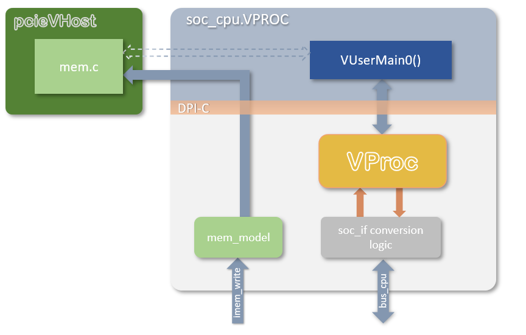

# Simulation Models

This directory contains the following bus functional models

* `soc_cpu.VPROC.picorv32.sv` : _VProc_ presented as a **picorv32**, and the one
  this project actually uses. Selected with `make CPU=vproc` or `make CPU=iss`
  -- see [The three CPU options](../README.md#the-three-cpu-options).
* `soc_cpu.VPROC.sv` : the inherited _VProc_ based `soc_cpu`, which speaks the
  `soc_if` bus. Kept for reference; not instantiated here (see below).
* `serdes_front.PIPE.sv` : behavioural PIPE PHY that stands in for
  `src/pcie/serdes_front.sv` and carries the _pcieVHost_ endpoint. Described
  [here](../README.md#the-pipe-phy-model).
* `bfm_uart.sv` : UART bus functional model.

In addition, sub-directories contain the following models

* [`cosim`](cosim/README.md) : Contains the _VProc_ and _mem_model_ co-simulation VIP.
* [`rv32`](rv32/README.md) : Contains the _rv32_ RISC-V RV32GCC_Zbb instruction set simulator C++ model
* [`pcievhost`](pcievhost/README.md) : Contains the PCIe traffic generator with PIPE TX and RX adta interface for a single lane.

## soc_cpu.VPROC.picorv32

This is the CPU model in use. `riscv_pcie_soc.sv` instantiates a `picorv32`
directly, driving the core's **native** memory interface -- `mem_valid`,
`mem_ready`, `mem_addr`, `mem_wdata`, `mem_wstrb`, `mem_rdata` -- and this
module presents exactly those ports, with a _VProc_ behind them. It is
therefore a drop-in replacement for the core, reached through
`` `ifdef SOC_CPU_VPROC `` in the SOC, and nothing else in the design changes.

Two details are worth knowing:

* _VProc_ holds `WE`/`RD` asserted until it samples `WRAck`/`RDAck` at a rising
  edge, which is the same shape as picorv32's `mem_valid`/`mem_ready`. What
  picorv32 gives for free and _VProc_ does not is a guaranteed idle cycle
  between accesses, so a small state machine inserts one. Without it a
  back-to-back pair of accesses can catch the trailing edge of the previous
  ready.
* There is no instruction memory in this wrapper. The program lives on the host
  -- either as native code, or inside the _rv32_ ISS -- so the SOC's own
  instruction RAM simply goes unused.

## soc_cpu.VPROC

Inherited from the sibling _openpcie2-rc_ SOC infrastructure and kept for
reference. **It is not used here**, because this design has no `soc_if` bus: the
SOC instantiates picorv32 directly, which is why the wrapper above exists.

The `soc_cpu.VPROC` module is pin compatible with the other `soc_cpu` components with RTL softcore implementations of 32-bit RISC-V processors, such as that based on PicoRV32 or EDUBOS5. In place of the softcore is a [_VProc_](https://github.com/wyvernSemi/vproc) virtual processor which can run natively compiled code and drive its memory mapped bus in the logic simulation (see [here](../README.md#vproc-software)). The HDL has only two interfaces. The main memory mapped bus is of type `soc_if`, and this is the external bus to the rest of the logic, just as for the softcores. The other interface is a three wire write-only port (`imem_we`, `imem_waddr[31:2]` and `imem_wdat[31:0]`) for updating the processor program via an external UART. In the `soc_cpu.VPROC` component this is connected to an instantiation of the [_mem_model_](https://github.com/wyvernSemi/mem_model) memory HDL, used by _VProc_ for its [main memory](../README.md#the-mem_model-co-simulation-sparse-memory-model), which accesses the sparse C memory model of [_pcieVHost_](https://github.com/wyvernSemi/pcievhost), allowing this upload to go to the same memory as accessible by the virtual processor.

## Others

`serdes_front.PIPE.sv` and the PIPE-level endpoint it carries are described in
the [test bench README](../README.md#the-pipe-phy-model). `bfm_uart.sv` is not
instantiated by the current test bench.