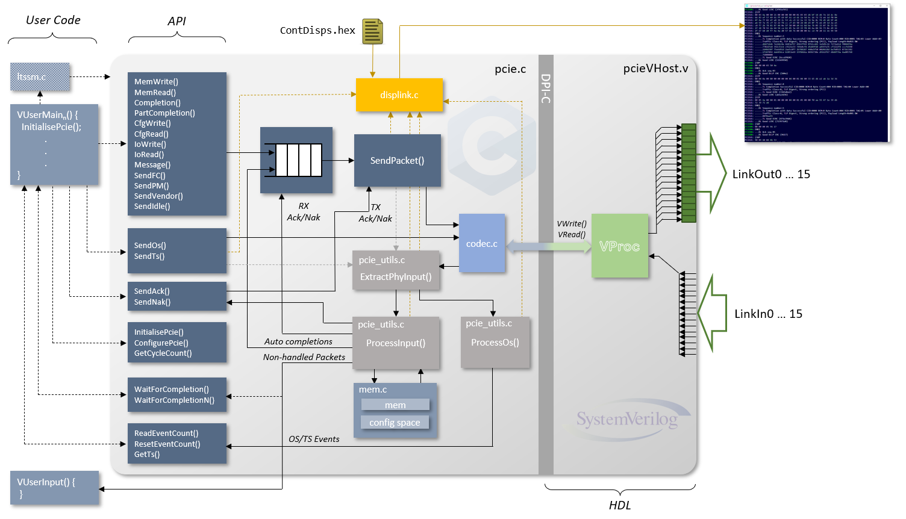

# The _pcievhost_ Verification IP

## Table of Contents

* [Introduction](#introduction)
* [The HDL Component](#the-hdl-component)
* [Link Traffic Display](#link-traffic-display)
* [The Pcie C Model](#the-pcie-c-model)
  * [Internal Architecture](#internal-architecture)
  * [Model Initialisation and Configuration](#model-initialisation-and-configuration)
  * [Transaction Layer Packet Generation](#transaction-layer-packet-generation)
  * [Data Link Layer Packet Generation](#data-link-layer-packet-generation)
  * [Ordered Set Generation](#ordered-set-generation)
  * [Internal Memory Access](#internal-memory-access)
  * [Internal Configuration Space Access](#internal-configuration-space-access)
    * [Constructing a Configuration Space](#constructing-a-configuration-space)
* [User API Summary](#user-api-summary)
* [Additionally Provided Functionality](#addittionally-provided-functionality)
  * [Endpoint Features](#endpoint-features)
  * [Model Limitations](#model-limitations)
    * [Endpoint Feature Limitations](#endpoint-feature-limitations)
    * [LTSSM Limitations](#ltssm-limitations)
    * [Model Verification](#model-verification)

## Introduction

The [_pcievhost_](https://github.com/wyvernSemi/pcievhost) VIP is a co-simulation element that runs a PCIe C model on a [_VProc_](https://github.com/wyvernSemi/vproc) virtual processor to drive lanes within a PCIe 1.1 or 2.0 link, with support for up to 16 lanes. The PCIe C model provides an API for generating PCIe traffic over the link with some additional helper functionality for modelling _some_ of the link training LTSSM features (not strictly part of the model). It also provides an internal sparse memory model as a target for MemRd and MemWr transactions and, when configured as an endpoint, a configuration space as a target for CfgRd and CfgWr transactions. Features of the API allow for the configuratins space to be pre-programmed with valid configurations and a read-only mask overlay, though there is no support for 'special' functions like write one to clear etc.

More details of the model can be found in the [_Pcievhost_ manual](https://github.com/wyvernSemi/pcievhost/blob/master/doc/pcieVHost.pdf).

## The HDL component

A Verilog module for the _pcievhost_ model is provided in a `pcieVHost.v` file in the `5.sim/models/pcievhost/verilog/pcieVHost` directory. This is wrapped in some BFM Verilog, `pcieVHostPipex1.v`, in the same directory, which presents a single Link port, as PIPE TX and RX data signals. The diagram below shows the module's ports and parameters.

<p align=center>

</p>

The module's clock and reset must be synchronous (i.e. the reset originate from the  same clock domain) and the clock run at the PCIe raw bit rate $\div$ 5. So for GEN1 this is 500MHz (2000ps period) and GEN2 this is 1000MHz (1000ps period).

The model, by default, transfers 8b10b encoded data but the model can be configured in the software to generate unencoded and unscrambled data, where bits 7:0 are a byte value, and bit 8 is a 'K' symbol flag when set, and this must be done for the _openpcie2-rc_ project.

The _pcieVHost_ component has three Parameters to configure the model. The first, `LinkWidth`, configures which lanes will be active and always starts from lane 0, defaulting to all 16 lanes. For _openpcie2-rc_, this is hardwired to 1 inside `pcieVHostPipex1`.  Note that the ports for the unused lanes are still present but can be left unconnected. The second parameter is `EndPoint`. This is used to enable endpoint features in the model and does so if set to a non-zero value, with 0 being the default setting. For _openpcie2-rc_, this shoild be set to 1. Finally the `NodeNum` parameter sets the node number of the internal _VProc_ component. Each instantiated _VProc_, whether part of a _pcievhost_ model, or not, must have a unique node number to associate itself with a particular user program. The default value for `NodeNum` is 8.

More details of the `PcieVhost` HDL component can be found in the [_pcievhost_ manual](https://github.com/wyvernSemi/pcievhost/blob/master/doc/pcieVHost.pdf).

## Link Traffic Display

The _pcievhost_ model has the capability to display link traffic to the console that the simulation is runing in, with control over the level of detail available, including disbaling completely, and in which cycles it is turned on and off. It, by default, adds colour to distinguish between traffic flowing downstream from traffic flowing upstream.

 A `ContDisps.hex` configuration file will be read by the software from the local run directory. This allows control of displaying various PCIe layer data, from PHY, through DLL and TL, bit-mapped onto an 8 bit value. Each value is associated with a time stamp (in cycles) as to when the display value is enabled or not. A typical file looks like the following:

```
// Example ContDisps.hex file
// Copy to the appropriate test/hex directory, and edit as necessary.
//                      +8              +4              +2              +1
//  ,---> 11 - 8:    Unused             DispSwEnIfEp   DispSwEnIfRc    DispSwTx
//  |,-->  7 - 4:    DispRawSym         DispPL         DispDL          DispTL
//  ||,->  3 - 0:    Unused             Unused         Unused          DispAll
//  ||| ,-> Time (clock cycles, decimal)
//  ||| |                          
    570 000000000000
    002 009999999999
```
The file has two numbers on each active line, with the first hex number being the control values and the second a <u>decimal</u> value timestamp (in clock cycles) when the control should become active. For the controls, the top nibble controls enabling output for Endpoint and Root Complex links separately to allow for co-existence with other extenal link displays. So, bits 10 and 9 enable display if an endpoint end or root-complex end model. By default, only received traffic is displayed but, if no other external traffic display is available, then transmitted data can be display if bit 8 is set.

The level of detail to display is controlled by bits 4 to 7. The bit 7 can enable display of raw data link data, without any processing, though generates a lot of output and is hard to interpret. Bits 6 dow to 4 control formatted output for the threee main levels of PCIe traffic; namely physical, data link and transactions layers, bits 6 down to 4 controlling these respectively. The display will automatically indent higher layers if lower layers are enabled to allow easy distinguishing of the output.

A fragment of some link display output, using the `ContDisps.hex` file example above, is shown in the diagram below:

<p align=center>

</p>

More details on the link display can be found in the [_pcievhost_ manual](https://github.com/wyvernSemi/pcievhost/blob/master/doc/pcieVHost.pdf).

## The PCIe C Model

### Internal Architecture

The diagram below summarises the core PCIe model functionality, along with the connection to a logic simulation via the _VProc_ co-simulation component.

<p align=center>

</p>

On the left of the diagram are the two user supplied functions. The `VUserMain`<i>n</i> function is the main entry point for user code and this has access to the [model's API](#user-api-summary). Optionally, a user callback function can be registered (`VUserInput` in the diagram) that gets called to with non-handled packets (e.g. read completions) that are received over the link.

The Left column of boxes are the various API functions available, categorised by function. The first group generate TLP or DLLP packets that get queued, before being sent to `SendPacket`. The non-automatic sending of ACKs and NAKs bypass the queue and are sent straight to the `SendPacket` function. The `SendPacket` function itself sends its TLP or DLLP packets to the `codec` which scrambles and encodes the data and drives the output on the link.

The `codec` code also process input data, decoding and descrambling, passing on to `ExtractPhyInput`. Training sequences and other ordered set data is sent to `ProcessOs` whilst TLPs and DLLPs are sent to `ProcessInput`. The API can read received OS event counts from the `ProcessOs` function. `ProcessInput` has access to the internal memory for MemRd and MemWr TLPs and (not shown) the config space for CfgRd and CfgWr TLPs. It will automatically generate (valid) completions for reads and add to the queue. All other TLPs are sent to any registed user callback.

## User API Summary

The _pcievhost_ model is a highly complex mode and the API is quite large to match this. This document can only summarise the main features and usage and reference to the [_Pcievhost_ manual](https://github.com/wyvernSemi/pcievhost/blob/master/doc/pcieVHost.pdf) _must_ be made for the finer details of argumets and usage. The information below refers to the low level C model's API but a C++ class (`pcieModelClass`) is also provided which wraps the functions up into class methods which are slightly easier to use.

### Model Initialisation and Configuration

| **API Function**      | **Description** |
|-----------------------|-------------|
| `InitialisePcie`      | Initialise the model |
| `ConfigurePcie`       | Configure the model |
| `ConfigurePcieLtssm`  | Configure the model's LTSSM |
| `PcieSeed`            | Seed internal random number generator |

The `InitailsePcie` is called before any other function to initialise the model. The user can supply a pointer to a callback function which will be called with data for all unhandled received packets. Optionally a user supplied pointer may also be gived which is returned when the callback is called, allowing a user to store away key information for cross checking, verification or any other purpose. The model does not process this pointer itself.

The model is highly configurable with many different parameters which may be set, one at a time, using the `ConfigurePcie` and `ConfigurePcieLtssm` functions that take a type and, where applicable, value argument. .

#### Configuration via ConfigurePcie

The following table shows the valid configuration `type` settings and expected `value` for the use with the `ConfigurePcie(type, value)` function.

| **TYPE**                       |**VALUE**|**UNITS**| **Description**                                                              |
|--------------------------------|---------|---------|------------------------------------------------------------------------------|
| CONFIG_FC_HDR_RATE             |   yes   | cycles  | Rx Header consumption rate (default 4)                                       |
| CONFIG_FC_DATA_RATE            |   yes   | cycles  | Rx Data consumption rate (default 4)                                         |
| CONFIG_ENABLE_FC               |   no    |         | Enable auto flow control (default)                                           |
| CONFIG_DISABLE_FC              |   no    |         | Disable auto flow control                                                    |
| CONFIG_ENABLE_ACK              |   yes   | cycles  | Enable auto acknowledges with processing rate (default rate 1)               |
| CONFIG_DISABLE_ACK             |   no    |         | Disable auto acknowledges                                                    |
| CONFIG_ENABLE_MEM              |   no    |         | Enable internal memory (default)                                             |
| CONFIG_DISABLE_MEM             |   no    |         | Disable internal memory                                                      |
| CONFIG_ENABLE_SKIPS            |   yes   | cycles  | Enable regular Skip ordered sets, with interval (default interval 1180)      |
| CONFIG_DISABLE_SKIPS           |   no    |         | Disable regular Skip ordered sets                                            |
| CONFIG_DISABLE_SCRAMBLING      |   no    |         | Disable data scrambling                                                      |
| CONFIG_ENABLE_SCRAMBLING       |   no    |         | Enable data scrambling (default)                                             |
| CONFIG_DISABLE_8B10B           |   no    |         | Disable 8b10b encoding and decoding                                          |
| CONFIG_ENABLE_8B10B            |   no    |         | Enable 8b10b encoding and decoding (default)                                 |
| CONFIG_DISABLE_ECRC_CMPL       |   no    |         | Disable ECRC auto-generation on completions for requests with ECRCs          |
| CONFIG_ENABLE_ECRC_CMPL        |   no    |         | Enable ECRC auto-generation on completions for requests with ECRCs (default) |
| CONFIG_ENABLE_UR_CPL           |   no    |         | Enable auto unsupported request completions (default)                        |
| CONFIG_DISABLE_UR_CPL          |   no    |         | Disable auto unsupported request completions                                 |
| CONFIG_ENABLE_INTERNAL_MEM     |   no    |         | Enable internal memory (default)                                             |
| CONFIG_DISABLE_INTERNAL_MEM    |   no    |         | Disable internal memory (packets passed to user callback if registered)      |
| CONFIG_ENABLE_DISPLINK_COLOUR  |   no    |         | Enable colour formatting of link display output (default)                    |
| CONFIG_DISABLE_DISPLINK_COLOUR |   no    |         | Disable colour formatting of link display output                             |
| CONFIG_POST_HDR_CR†            |   yes   | credits | Initial advertised posted header credits (default 32)                        |
| CONFIG_POST_DATA_CR†           |   yes   | credits | Initial advertised posted data credits (default 1K)                          |
| CONFIG_NONPOST_HDR_CR†         |   yes   | credits | Initial advertised non-posted header credits (default 32)                    |
| CONFIG_NONPOST_DATA_CR†        |   yes   | credits | Initial advertised non-posted data credits (default 1)                       |
| CONFIG_CPL_HDR_CR†             |   yes   | credits | Initial advertised completion header credits (default ∞)                     |
| CONFIG_CPL_DATA_CR†            |   yes   | credits | Initial advertised non-posted data credits (default ∞)                       |
| CONFIG_CPL_DELAY_RATE†         |   yes   | cycles  | Auto completion delay rate (default 0)                                       |
| CONFIG_CPL_DELAY_SPREAD†       |   yes   | cycles  | Auto completion delay randomised spread (default 0)                          |

† Call immediately after `InitialisePcie()` to take effect from time 0

#### Configuration via ConfigurePcieLtssm

The following table shows the valid configuration `type` settings and expected `value` for use with the `ConfigurePcieLtssm(type, value)` function.

| **TYPE**                            |**VALUE**| **UNITS** | **Description**                                                                           |
|-------------------------------------|---------|-----------|-------------------------------------------------------------------------------------------|
| CONFIG_LTSSM_LINKNUM††              |  yes    | integer   | Training sequence advertised link number (default 0)                                      |
| CONFIG_LTSSM_N_FTS††                |  yes    | integer   | Training sequence number of fast training sequences (default 255)                         |
| CONFIG_LTSSM_TS_CTL††               |  yes    | integer   | Five bit TS control field (default 0)                                                     |
| CONFIG_LTSSM_DETECT_QUIET_TO††      |  yes    | cycles    | Detect quite timeout (default 1500/6M, depending if `LTSSM_ABBREVIATED` defined or not)   |
| CONFIG_LTSSM_POLL_ACTIVE_TO_COUNT†† |  yes    | cycles    | Polling active TX count (default 16/1024, depending if `LTSSM_ABBREVIATED` defined or not)|
| CONFIG_LTSSM_ENABLE_TESTS††         |  yes    | bit mask  | Enable LTSSM test exceptions (default 0)                                                  |
| CONFIG_LTSSM_FORCE_TESTS††          |  yes    | bit mask  | Force LTSSM test exceptions (default 0)                                                   |

†† Call before calling `InitLink()` to take effect in training sequences.

Further details of model configuration are to be found in the [_pcievhost_ manual](https://github.com/wyvernSemi/pcievhost/blob/master/doc/pcieVHost.pdf)

Internally, the model can generate random data and the generator can be seeded with `PcieSeed`. The internal code uses `PcieRand` to generate randome data, but this is also available as part of the API. Finally, the model keeps a count of cycles internally, and the value may be retrieved with `GetCycleCount`.

### Transaction Layer Packet Generation

| **API Function**   | **Description** |
|--------------------|-----------------|
| `MemWrite`         | Generate a memory write transaction |
| `MemRead`          | Generate a memory read transaction  |
| `Completion`       | Generate a Completion transaction  |
| `PartCompletion`   | Generate a partial completion transaction |
| `CfgWrite`         | Generate a configuration space write transaction |
| `CfgRead`          | Generate a configuration space read transaction |
| `IoWrite`          | Generate an IO write transaction |
| `IoRead`           | Generate an IO read transaction |
| `Message`          | Generation a message transaction |

The above functions are called with varying arguments (see the [_pcievhost_ manual](https://github.com/wyvernSemi/pcievhost/blob/master/doc/pcieVHost.pdf) for details) and all have a 'digest' version (e.g. `MemWriteDigest`) which have an additional argument to select whether a digest (i.e. an ECRC) is generated or not, with the above functions defaulting to generating a digest. There are also 'delay' versions of the `Completion` and `PartCompletion` function which will not send out the packets immediately but after some delay as configured during the model initialisation.

A user program can also wait for a completion to arrive, or a number of completions, with the `WaitForCompletion` and `WaitForCompletionN` functions.

### Data Link Layer Packet Generation

| **API Function** | **Description** |
|------------------|-------------|
| `SendAck`          | Send an acknowledgement packet |
| `SendNak`          | Send an not-acknowledgement packet |
| `SendFC`           | Send a flow control packet |
| `SendPM`           | Send a power manegement packet |
| `SendVendor`       | Send a vendor specific packet |

### Ordered Set Generation

| **API Function** | **Description** |
|------------------|-------------|
| `SendIdle`         | Send idle symbols on all active lanes |
| `SendOs`           | Send an ordered set down all active lanes |
| `SendTs`           | Send a training sequence ordered set on all active lanes| 

These functions generate ordered sets on the link lanes, with `SendTs` automatically generating lane numbers if not called to generate PAD. Internally the model keeps counts of the reception of training sequences on each lane and these can be read using the `ReadEventCount` function and, if required, the counts may be reset with `ResetEventCount`. To fetch the last training sequence processed on a given lane, the `GetTS` function can be used.

### Internal Memory Access

| **API Function** | **Description** |
|------------------|-------------|
| `WriteRamByte`   | Write a byte to internal memory |
| `WriteRamWord`   | Write a 16-bit word to internal memory |
| `WriteRamDWord`  | Write a 32-bit word to internal memory |
| `ReadRamByte`    | Read a byte from internal memory |
| `ReadRamWord`    | Read a 16-bit word from internal memory |
| `ReadRamDWord`   | Read a 32-bit word from internal memory |
| `WriteRamByteBlock` | Write a block of bytes to internal memory |
| `ReadRamByteBlock` | Read a block of bytes from internal memory |

The _pcievhost_ model has an internal sparse memory model which can support a full 64-bit address space. This is used as a target for received MemWr and MemRd transactions. As well as accessing this space via PCIe transactions, the memory model has its own API functions to do reads and writes of bytes, 16-bit words, and 32-bit words, as well as reading and writing of multiple byte blocks.

### Internal Configuration Space Access

| **API Function** | **Description** |
|------------------|-------------|
| `WriteConfigSpace` | Write a 32-bit value to the configuration space |
| `ReadConfigSpace`  | Write a 32-bit value from the configuration space |
| `WriteConfigSpaceMask` | Write a 32-bit mask value to the configuration space mask (bits set to 1 become read only over PCIe) |
| `ReadConfigSpaceMask`  | Read a 32-bit value from the configuration space mask |

If a _pcievhost_ is configured as an endpoint it then has an internal 4096 by 32-bit configuration memory. By default this is blank, but CfgWr and CfgRd transactions can access this space. To configure this space the `WriteConfigSpace` (and its `ReadConfigSpace` counterpart) can be used to set up an valid configuration space settings. A shadow mask memory is also available, which defaults to all 0s, to set any number of bits to be read only. There is a one-to-one correspondence to the main configuration memory, but if a mask bit is set, then the corresponding config space bit becomes read only when accessed over the link with CfgWr transactions. The mask memory is set using the `WriteConfigSpaceMask` and can be inspected with `ReadConfigSpaceMask`.

#### Constructing a Configuration Space

The _pcievhost_ model provides some basic helper structures to allow the building up of a valid endpoint Type 0 configuration space, in the `pcie_express.h` header. These are limited to the PCI compatible region and comprise the minimal capability structures. For each type of capability a structure is defined with each of the fields, and a matching uinion is also defined with the structure and an array of 32-bit words to metch the size of the capability.

| **Structure** | **Union** | **Description** |
|---------------|-----------|-----------------|
| `cfg_spc_type0_struct_t`          | `cfg_spc_type0_t` |Type 0 configuration space |
| `cfg_spc_pcie_caps_struct_t`      | `cfg_spc_pcie_caps_t` | PCIe capabilities |
| `cfg_spc_msi_caps_struct_t`       | `cfg_spc_msi_caps_t` | Message Signalled Interrupt cpabilities | 
| `cfg_spc_pwr_mgmnt_caps_struct_t` | `cfg_spc_pwr_mgmnt_caps_t` | Power Management capabilities |

The individual fields of the structure can be filled in and then the word buffer used with `WriteConfigSpace` to update the model. In the [_pcievhost_ repository](https://github.com/wyvernSemi/pcievhost/tree/master/verilog/test/usercode) the `VUserMain.c` test file has a function `ConfigureType0PcieCfg` which gives an example of configuring an endpoint configuration space using the structures and the API function.

## Additionally Provided Functionality

The _pcievhost_ model was originally designed as a Root Complex PCIe 1.1 and 2.0 traffic generator, with the API features as described above. In that sense it did not have higher level features. In particular it did not have link training and status state machine (LTSSM) features or data link layer initialistion code. <i><b>Partial</b></i> implementations now form part of the model for demonstration and education purposes. These use the API from above to go through an abbreviated link training and a DLL initialisation using the following API functions:

| **API Function** | **Description** |
|------------------|-------------|
| `InitLink`       | Go through an LTSSM link training sequence |
| `InitFC`         | Initialise DLL flow control credits |

These functions only provide enough functionality to go through an initialisation that has no exception conditions. The LTSSM also only goes through one training sequence and can't, as yet, go through the Recovery state, and retrain at a higher generation (i.e. from GEN1 to GEN2). The LTSSM has various states that are long to execute due to various TS event counts and cycle times. The model's demonstration `ltssm.c` code can be complied for an 'abbreviated' power up by defining `LTSSM_ABBREVIATED` when compiling the code. This reduces the `Polling.Active` TX count from 1024 to 16 and the `Detect.Quite` timeout count from 12ms to 1500 cycles.

All the hooks are in place for the other paths through the LTSSM, but these are not implemented and the LTSSM was never meant to be part of the _pcievhost_ model but provided as a guide to coding one and as a reference example. The DLL initialisation is simpler and there are no outstanding features for the implementation at this time. Again,this is demonstration and example code only.

## C++ Support

In addition to the C API functions described above, there is asupport for C++ via a class, in `pcieModelClass.cpp`, called `pcieModelClass` that wraps up the low level C functions. It is basically a one-to-one mapping of the C functions to methods in the class, but with some defaulted values and the need to supply the node number abstracted away, being set on construction of the class object.

```C++
class pcieModelClass
{
public:
               pcieModelClass       (const unsigned nodeIn) : node (nodeIn) {};

    // TLP generation
    pPktData_t memWrite             (const uint64_t addr, const PktData_t *data, const int length, const int tag,
                                     const uint32_t rid, const bool queue = false, const bool digest = false);

    pPktData_t memRead              (const uint64_t addr, const int length, const int tag, const uint32_t rid,
                                    const bool queue = false, const bool digest = false);

    pPktData_t completion           (const uint64_t addr, const PktData_t *data, const int status, const int fbe, const int lbe,
                                     const int length,  const int tag, const uint32_t cid, const uint32_t rid,
                                     const bool queue = false, const bool digest = false);

    pPktData_t partCompletion       (const uint64_t addr, const PktData_t *data, const int status, const int fbe, const int lbe,
                                     const int rlength, const int length, const int tag, const uint32_t cid, const uint32_t rid,
                                     const bool queue = false, const bool digest = false);

    pPktData_t cfgWrite             (const uint64_t addr, const PktData_t *data, const int length, const int tag,
                                    const uint32_t rid, const bool queue = false, const bool digest = false);

    pPktData_t cfgRead              (const uint64_t addr, const int length, const int tag, const uint32_t rid,
                                     const bool queue = false, const bool digest = false);

    pPktData_t ioWrite              (const uint64_t addr, const PktData_t *data, const int length, const int tag,
                                     const uint32_t rid, const bool queue = false, const bool digest = false);

    pPktData_t ioRead               (const uint64_t addr, const int length, const int tag, const uint32_t rid,
                                     const bool queue = false, const bool digest = false);

    pPktData_t message              (const int code, const PktData_t *data, const int length, const int tag, const uint32_t rid,
                                    const bool queue = false, const bool digest = false);


    // Flow control initialisation
    void       initFc               (void);

    // Queue flushing
    void       sendPacket           (void)

    // Dllps
    void       sendAck              (const int seq);
    void       sendNak              (const int seq);
    void       sendFC               (const int type,  const int vc,    const int hdrfc, const int datafc, const bool queue);
    void       sendPM               (const int type,  const bool queue = false);

    void       sendVendor           (const bool queue = false);
    void       sendVendor           (const int data,  const bool queue = false);

    // Physical layer Ordered sets etc.
    void       sendIdle             (const int ticks = 1);
    void       sendOs               (const int type);
    void       sendTs               (const int identifier, const int lane_num, const int link_num, const int n_fts,
                                     const int control, const bool is_gen2 = false);

    void       waitForCompletion    (const uint32_t count = 1);
    void       initialisePcie       (const callback_t    cb_func, void *usrptr);
    void       registerOsCallback   (const os_callback_t cb_func);
    uint32_t   getCycleCount        (void);
    void       configurePcie        (const config_t type, const int value = 0);

    // Physical layer event routines
    int        resetEventCount      (const int type);
    int        readEventCount       (const int type, uint32_t *ts_data);
    TS_t       getTS                (const int lane);

    // Miscellaneous support routines
    uint32_t   pcieRand             (void);
    void       pcieSeed             (const uint32_t seed);
    void       setTxEnabled         (void);
    void       setTxDisabled        (void);
    void       getPcieVersionStr    (char* sbuf, const int bufsize);

    // Memory access
    void       writeRamByteBlock    (const uint64_t addr, const PktData_t* const data, const int fbe, const int lbe,
                                     const int length);
    int        readRamByteBlock     (const uint64_t addr, PktData_t* const data, const int length);

    void       writeRamByte         (const uint64_t addr, const uint32_t data);
    void       writeRamHWord        (const uint64_t addr, const uint32_t data, const int little_endian = 0);
    void       writeRamWord         (const uint64_t addr, const uint32_t data, const int little_endian = 0);
    void       writeRamDWord        (const uint64_t addr, const uint64_t data, const int little_endian = 0);
    uint32_t   readRamByte          (const uint64_t addr);
    uint32_t   readRamHWord         (const uint64_t addr, const int little_endian = 0);
    uint32_t   readRamWord          (const uint64_t addr, const int little_endian = 0);
    uint64_t   readRamDWord         (const uint64_t addr, const int little_endian = 0);

    // Configuration space access
    void       writeConfigSpace     (const uint32_t addr, const uint32_t data);
    uint32_t   readConfigSpace      (const uint32_t addr);
    void       writeConfigSpaceMask (const uint32_t addr, const uint32_t data);
    uint32_t   readConfigSpaceMask  (const uint32_t addr);

private:
    unsigned node;
};
```


### Endpoint Features

The _pcievhost_ VIP was originally designed to generate PCIe traffic as a root complex. The addition of endpoint features was to allow a target for the main root complex model to be tested. This mainly consisted of the addition of a configuration space memory and for out generation of completions fr bot the internal memeory model and  the configuratiion space. As such, the user program on the end point does not need to do very much if it does not need to instigate transactions but only respond. The code fragment below shows an abbreviated program running on a _pcievhost_ model.

```C
#include <stdio.h>
#include <stdlib.h>
#include "pcie.h"

static int node = 1;

static void VUserInput_1(pPkt_t pkt, int status, void* usrptr)
{
  /* Do stuff here with input */
}

void ConfigureType0PcieCfg (void)
{
  /* Initialise the configuration space and mask here */
}

void VUserMain1()
{

    // Initialise PCIe VHost, with input callback function and no user pointer.
    InitialisePcie(VUserInput_1, NULL, node);

    // Configure for a PIPE
    ConfigurePcie(CONFIG_DISABLE_SCRAMBLING, 0, node);
    ConfigurePcie(CONFIG_DISABLE_8B10B, 0, node);

    // Make sure the link is out of electrical idle
    VWrite(LINK_STATE, 0, 0, node);

    // Use node number as seed
    PcieSeed(node, node);

    // Construct an endpoint PCIe configuration space
    ConfigureType0PcieCfg();

    // Initialise the link for 16 lanes
    InitLink(16, node);

    // Initialise flow control
    InitFc(node);

    // Send out idles forever
    while (true)
    {
        SendIdle(100, node);
    }
}
```

Here the model is initialised, registering a user callback function (`VUserInput_1`) for receiving data. A low level _VProc_ API call is made to get the link out of electrical idle state before configuring the model. HerAfter this a seed is set for random data generation before calling a local function to configure the endpoint configuration space. The link training is then invoked before initialising the DLL flow control. From this point on, a loop continuously calls `SendIdle` for sending idles over the link. The model will respond to received transactions, overriding the idles with, for example, completions for MemRd transactions, and all the DLL ACKs and flow control DLLP packets etc. In this sense, unless transactions are to be instigated from the endpoint, no further programming is required.

### Model Limitations

The _pcievhost_ model was originally conceived as a PCIe traffic pattern generator for driving an endpoint design to bridge the gap in development before a commercial sign-off VIP was made available to compliance check the implementation. The API reflects this functionality, allowing any combination of PHY, DLL and TLP patterns to be generated in order to drive an endpoint DUT. It is not a model of a root complex or an endpoint implementation, and user code must be written to drive sequences of patterns for meaningful and valid communication. Beyond this various additional functions are provided _in a limited capacity_.

#### Endpoint Feature Limitations

Endpoint features have been added to provide a target for the original _pcievhost_ model to be tested. These include an internal memory model as a target for MemRd and MemWr transactions and a configurations space as a target for CfgRd and CfgWr transactions. The configuration space can be programed, using the API, with valid config space patterns and a mask programmed to make various bits read-only. More sophisticaled register bit operatoins, such as write one to clear, are not supported.

The configurations space, by default, has no programmed pattern and must be configured in the user program running on the model using the API functions. The [_pcievhost_ repository](https://github.com/wyvernSemi/pcievhost) has an example of programming the configuration space for a particular endpoint in its `verilog/test/usercode/VUserMain1.c` file, encapsulated in a `ConfigureType0PcieCfg` function, which may be used as a reference.

#### LTSSM Limitations

The link training and status state machine (LTSSM) does not form part of the _pcievhost_ model proper. A _limited_ implementation is provide, as an example, in the `ltssm.c` file, and this provides enough functionality to go from electrical idle to the L0 powered up state for a given generation speed. What it does not currently do is:

  * Support any expection, error or timeout roots through the LTSSM
  * Support switching speeds through Recovery and retrain automatically
  * Switch to lower power states
  * Switch to directed states such as Disabled, Loopback or Hot Reset
  * Auto reverse lanes
  * Auto invert lane polarity
  * Auto limit link width

Hooks for all of these states are present in the code, but would need development for a full implementation. Lane width is controlled through a parameter and fixed for simulation. For GEN1 to GEN2 switching a means would also be needed to switch clock speeds at the appropriate sub-state in the LTSSM.

#### Model Verification

The _pcievhost_ model's original deployment was to drive an endpoint implementation which operated as a 16 lane GEN1 device, or an 8 lane GEN2 device. Almost all testing has been done at these widths and speeds. Support for different widths are fully implemented and tested using thtwo _pcieVHost_ modules back to back, one as an RC and  the other as an EP.
