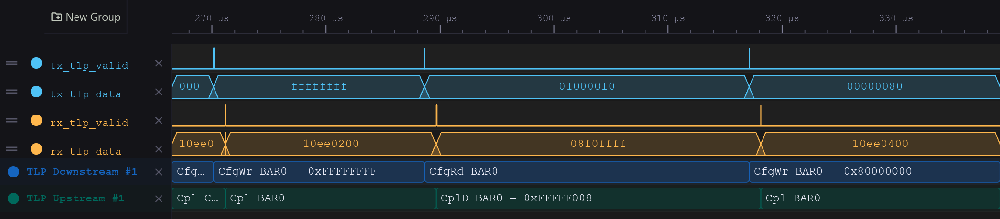

# PCIe TLP decoder for WaveCrux

A protocol-decoder plugin for the [WaveCrux](https://wavecrux.app) waveform
viewer that shows the openPCIE co-simulation at **TLP level**: every Transaction
Layer Packet named, and every completion paired with the request it answers.

<p align="center">

</p>

WaveCrux has a PCIe TLP decoder of its own in its paid tier. This one uses the
decoder-plugin interface of WaveCrux's free Open Core instead, so it works on
every edition. It needs **WaveCrux 1.0.1 or later**: older releases misplace
plugin results in time and leave the rows empty
([wavecrux#22](https://github.com/Ferrite-Engineering/wavecrux/issues/22)). How it fits into the simulation -- the VCD dump, the ready-made
session, more pictures -- is in
[5.sim/README.md](../../README.md#viewing-the-tlps-in-wavecrux).

## Files

| File | |
|---|---|
| `pcie_tlp_decoder.c` | the decoder |
| `pcie_tlp_decoder.dll` | prebuilt for Windows x64; needs only `KERNEL32` and `msvcrt` |
| `wavecrux_decoder.h` | the plugin C ABI, vendored unchanged from the [WaveCrux open core](https://github.com/Ferrite-Engineering/wavecrux/blob/main/include/wavecrux_decoder.h) (Apache-2.0) |

## Install

1. WaveCrux: **Settings -> Extensions -> Decoder Plugins**.
2. Accept the safety notice -- plugins are native code.
3. **Add directory...** and pick this directory, then **Reload plugins**. The
   card reads *openPCIE PCIe TLP decoder*.

WaveCrux keeps the library loaded while it runs: close it before replacing
the `.dll`.

## Use

The plugin registers the same decoder twice, so the two rows of a link are told
apart -- a decoder row is labelled with its decoder's name and cannot be
renamed:

| Decoder | Direction | Bind to (test bench) |
|---|---|---|
| **TLP Downstream** | Root Complex -> Endpoint | `tb.tlp_view.tx_*` |
| **TLP Upstream** | Endpoint -> Root Complex | `tb.tlp_view.rx_*` |

Add one with **Ctrl+Shift+D**. Auto-bind finds both signal sets and offers
`tx_` / `rx_` in its prefix drop-down.

**Inputs** -- one TLP DW per clock, as
[`tlp_dw_monitor.sv`](../../models/tlp_dw_monitor.sv) produces it:

| Signal | Width | |
|---|---|---|
| `clk` | 1 | the rising edge samples the stream |
| `tlp_data` | 32 | one DW, byte 0 (Fmt/Type) in bits [31:24] |
| `tlp_sop`, `tlp_eop` | 1 | first and last DW of a TLP |
| `tlp_valid` | 1 | `tlp_data` carries a DW this cycle |
| `peer_data`, `peer_sop`, `peer_eop`, `peer_valid` | 32, 1, 1, 1 | *optional:* the opposite direction. Nothing is decoded from it; the decoder only remembers its requests by tag, so a completion reads `CplD BAR0 = 0xFFFFF008` instead of a bare payload |

**Parameters:**

| Parameter | Default | |
|---|---|---|
| Labels | Compact | *Compact* drops what a link with one endpoint does not need -- bus/device/function `01:00.0`, the tag, a Successful status. *Full* shows them all. Either way, every field is in the transaction's details. |
| Box width | Packet duration | *Stretch to next TLP* widens each box up to the next packet, so labels stay readable when zoomed out |

**Decoded:** Memory (32/64-bit address), I/O, Configuration Type 0/1 with the
Type 0 header registers named, Completions with status, and Messages.
Configuration payloads are shown as the register value the spec prints
(little-endian); memory payloads as the DW itself. Framing errors (data without
SOP, SOP before EOP, x/z), length mismatches and UR / CA completions are
flagged as errors.

## Build

Windows (MSYS2 MinGW64):

```
gcc -O2 -Wall -Wextra -std=c11 -shared -static-libgcc -o pcie_tlp_decoder.dll pcie_tlp_decoder.c
```

Linux:

```
gcc -O2 -Wall -Wextra -std=c11 -shared -fPIC -o libpcie_tlp_decoder.so pcie_tlp_decoder.c
```

Rebuild and commit the `.dll` whenever `pcie_tlp_decoder.c` changes.
