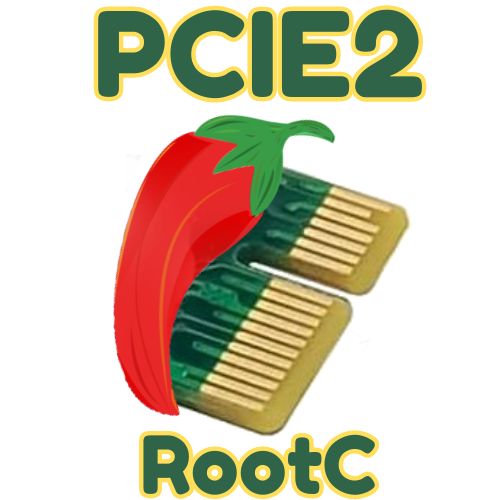
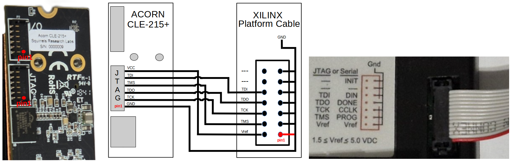
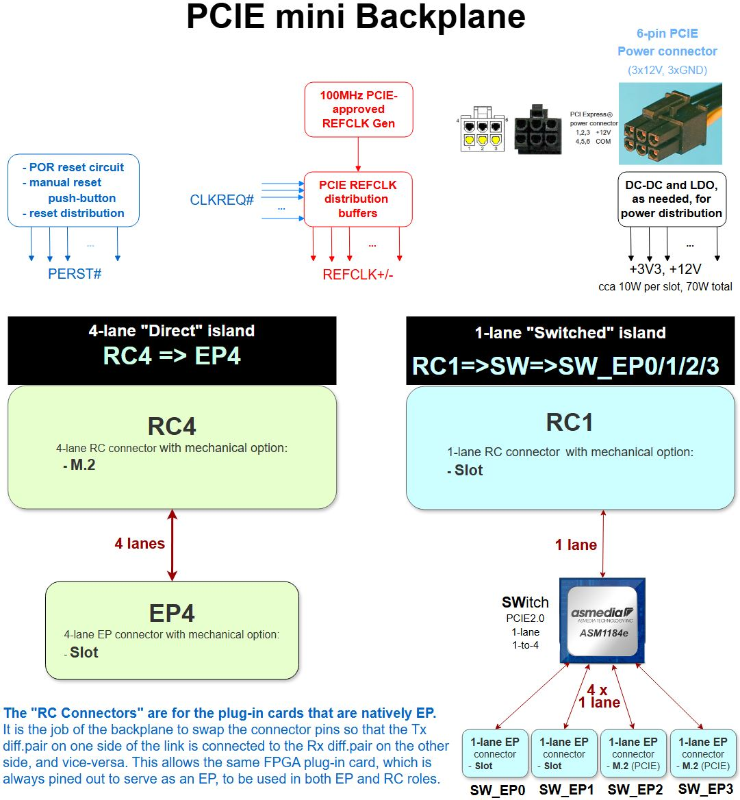
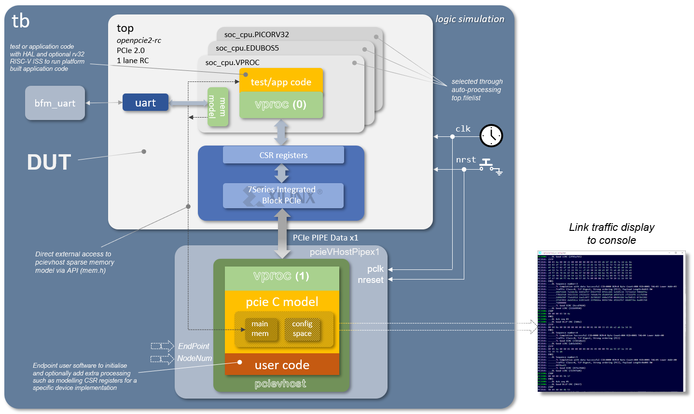

Computing is about communicating. Some would also say about networking. Digital independence tags along on the wave of _"Recommendations and Roadmap for European Sovereignty in open source HW, SW and RISC-V Technologies (2021)"_, calling for the development of critical open source IP blocks, such as **`PCIE Root Complex (RC)`**. This is the first step in that direction. And, if you are looking for an opensource, soft PCIE EndPoint (EP) core, please check our [other](https://github.com/chili-chips-ba/openCologne-PCIE) repo.

  

This project looks to open Artix7 PCIe Gen2 RC IP blocks for use outside of proprietary tool flows. While still reliant on Xilinx Series7 Hard Macros (HMs), it will surround them with open-source soft logic for PIO accesses — The **`RTL`** and, even more importantly, the layered **`sofware Driver with Demo App`**. 

All that with **`full HW/SW opensource co-sim`**. Augmented with a rock-solid **`openBackplane`** in the basement of our hardware solution, the geek community will thus get all it takes for building their own, end-to-end _openCompute_ systems.

> The project‘s immediate goal is to empower the makers with ability to drive PCIE-based peripherals from their own soft RISC-V SOCs.

Given that the PCIE End-Point (EP) with DMA is already available in opensource, the opensource PCIE peripherals do exist for Artix7. Except that they are always, without exception, controlled by the proprietary RC on the motherboard side, typically in the form of RaspberryPi ASIC, or x86 PC. This project intends to change that status quo.

Our long-term goal is to set the stage for the development of full opensource PCIE stack, gradually phasing out Xilinx HMs from the solution. That’s a long, ambitious track, esp. when it comes to mixed-signal SerDes and high-quality PLLs. We therefore anticipate a series of follow on projects that would build on the foundations we hereby set.

This first phase is about implementing an open source PCIE Root Complex (RC) for Artix7 FPGA, utilizing Xilinx Series7 PCIE HM and GTP IP blocks, along with their low-jitter PLL.

#### References
- [PCIE Primer](https://drive.google.com/file/d/1CECftcznLwcKDADtjpHhW13-IBHTZVXx/view) by Simon Southwell ✔

--------------------

# Project Status

#### `PART 1. Mini PCIE Backplane PCB`

Almost all consumer PCIE installations have the RC chip soldered down on the motherboard, typically embodied in the CPU or "North Bridge" ASIC, where PCIE connectors are used solely for the EP cards. Similarly, all FPGA boards on the market are designed for EP applications. As such, they expect clock, reset and a few other signals from the infrastructure. It is only the professional and military-grade electronics that may have both RC and EP functions on add-on cards, with a backplane or mid-plane connecting them (see VPX chassis, or VITA 46.4).

This dev activity is about creating the minimal PCIE infrastructure necessary for using a plethora of ready-made FPGA EP cards as a Root Complex. This infrastructure takes the physical form of a mini backplane that provides the necessary PCIE context similarly to what a typical motherboard would give, but without a soldered-down RC chip that would be conflicting with our own FPGA RC node.

Such approach is less work and less risk than to design our own PCIE motherboard, with a large FPGA on it. But, it is also a task that we did not appreciate from the get-go. In a bit of a surprise, half-way through planning, we've realized that a suitable, ready-made backplane was not available on the market. This initial disappointment then turned into excitement knowing that this new outcome would make the project even more attractive / more valuable for the community... esp. when **[Envox.eu](https://www.envox.eu)** has agreed to step in and help. They will take on the PCIE backplane PCB development activity.

 - [x] ✔ Create requirements document.
 - [x] ✔ Select components. Schematic and PCB layout design.
 - [ ] Review and iterate design to ensure robust operation at 5GHz, possibly using openEMS for simulation of high-speed traces.
 - [ ] Manufacture prototype. Debug and bringup, using AMD-proprietary on-chip IBERT IP core to assess Signal Integrity.
 - [ ] Produce second batch that includes all improvements. Distribute it, and release design files with full documentation.

#### `PART 2. Project setup and preparatory activities`
 - [x] ✔ Procure FPGA development boards and PCIE accessories.
 - [ ] Put together a prototype system. Bring it up using proprietary RTL IP, proprietary SW Driver, TestApp and Vivado toolchain.
 
#### `PART 3. Initial HW/SW implementation`
 - [ ] HW development of opensource RTL that mimics the functionality of PCIE RC proprietary solution.
 - [ ] SW development of opensource driver for the PCIE RC HW function. This may, or may not be done within Linux framework. 
 - [ ] Design SOC based on RISC-V CPU with PCIE RC as its main peripheral.

#### `PART 4. HW/SW co-simulation using full PCIE EP model`

This dev activity is significantly beefed up compared to our original plan, which was to use a much simpler PCIE EP BFM, and non-SOC sim framework. While that would have reduced the time and effort spent on the sim, prompted by NLnet astute questions, we're happy to announce that **[wyvernSemi](https://github.com/wyvernSemi/pcievhost)** is now also onboard!

Their VProc can be used not only to faithfully model the RISC-V CPU and SW interactions with HW, but it also comes with an implementation of the PCIE model. The PCIE model has some EP capabilities with a configurtable configurations space, which can be paired in sim with our RC RTL design. Moreover, the existence of both RC and EP models paves the way for future plug-and-play, pick-and-choose opensource sims of the entire PCIE subsystem.

With the full end-to-end simulation thus in place, we hope that the need for hardware debugging, using ChipScope, expensive test equipment and PCIE protocol analyzers would be alleviated.

 - [x] ✔ Extension of the existing PCIE RC model for some additional configurability of the EP capabilities.
 - [ ] Testbench development and build up. Execution and debug of sim testcases.
 - [ ] Documentation of EP model, TB and sim environment, with objectives to make it all simple enough to pickup, adapt and deploy in other projects.
 
#### `PART 5. Integration, testing and iterative design refinements`
 - [ ] One-by-one replace proprietary design elements from PART2.b with our opensource versions (except for Vivado and TestApp). Test it along the way, fixing problems as they occur.
 
#### `PART 6. Prepare Demo and port it to openXC7`

 - [ ] Develop our opensource PIO TestApp software and representative Demo.
 - [ ] Build design with _openXC7_, reporting issues and working with developers to fix them, possibly also trying _ScalePNR_ flow.

Given that PCIE is an advanced, high-speed design, and our accute awareness of _nextpnr-xilinx_ and openXC7 shortcomings, we expect to run into showstoppers on the timing closure front. We therefore hope that the upcoming _ScalePNR_ flow will be ready for heavy-duty testing within this project.

--------------------

# HW Architecture

#### References:
- [Basic PCIE EP for LiteFury](https://github.com/hdlguy/litefury_pcie)
- [Regymm PCIE](https://github.com/regymm/pcie_7x)
- [LiteX PCIE EP](https://github.com/enjoy-digital/litepcie)
- [PCIE EP DMA - Wupper](https://gitlab.nikhef.nl/franss/wupper)
- [Xilinx UG477 - 7Series Integrated Block PCIe](https://docs.xilinx.com/v/u/en-US/ug477_7Series_IntBlock_PCIe)
- [XIlinx DS821 - 7series_PCIE Datasheet](https://docs.xilinx.com/v/u/en-US/ds821_7series_pcie)
- [Xapp1052 - BusMaster DMA for EP](https://docs.xilinx.com/v/u/en-US/xapp1052)

## FPGA hardware platform

#### References:
- [Acorn-CLE215+ QuickStart](https://github.com/SMB784/SQRL_quickstart)
- [NightFury](https://github.com/RHSResearchLLC/NiteFury-and-LiteFury/tree/master)
  
The hardware platform for this project is the **SQRL Acorn CLE-215+**, a versatile FPGA development board. Although originally designed as a crypto-accelerator, its powerful Artix-7 FPGA and modular design make it an excellent choice for general-purpose PCIe development.

The system consists of two main components:

*  **M.2 FPGA Module (Acorn CLE-215+):** This is the core of the system, a compact board in an M.2 form factor. It houses the **Xilinx Artix-7 XC7A200T FPGA** and is designed to be plugged into a standard M.2 M-key slot.

<table align="center">
  <tr>
    <td align="center">
      <b>(a) M.2 FPGA Module (Top View)</b> 
      
    </td>
    <td align="center">
      <b>(b) M.2 FPGA Module (Bottom View)</b> 
      
    </td>
  </tr>
</table>

*  **PCIe Adapter Board (Acorn Baseboard Mini):** A carrier board that holds the M.2 FPGA module. Its primary function is to adapt the M.2 interface to a standard **PCIe x4 edge connector**, allowing the entire assembly to be installed and tested in a regular PC motherboard slot.

<table align="center">
  <tr>
    <td align="center">
      <b>(a) PCIe Adapter Board (Top View)</b> 
      
    </td>
    <td align="center">
      <b>(b) PCIe Adapter Board (Bottom View)</b> 
      
    </td>
  </tr>
</table>

<table align="center">
  <tr>
    <td align="center">
      <b> The fully assembled Acorn CLE-215+ development board, ready for use in a PCIe slot.</b> 
      
    </td>
  </tr>
</table>

It is important to note that the Acorn CLE-215+ is functionally identical to the more widely known NiteFury board, with the primary difference being the amount of onboard memory. The Acorn model features 1 GB of DDR3 RAM, while the standard NiteFury has 512 MB. Therefore, the [NiteFury schematic](https://github.com/chili-chips-ba/openPCIE/blob/main/0.doc/Reference-SCH/Schematic.FPGA-NiteFury.pdf) serves as a direct and accurate reference for the board's hardware layout.

The central component of the SQRL Acorn CLE-215+ system is the **Xilinx Artix-7 XC7A200T-FBG484** chip. This FPGA is crucial for implementing the PCIe Endpoint functionality, possessing a range of features that make it highly suitable for this purpose.

The key specifications are summarized below:

  <table>
    <thead>
      <tr>
        <th>Specification</th>
        <th>Value</th>
      </tr>
    </thead>
    <tbody>
      <tr>
        <td>Family</td>
        <td>Xilinx Artix-7</td>
      </tr>
      <tr>
        <td>Speed Grade</td>
        <td>-3</td>
      </tr>
      <tr>
        <td>Logic Cells (LUT4-Equivalent)¹</td>
        <td>215,360</td>
      </tr>
      <tr>
        <td>LUT6</td>
        <td>134,600</td>
      </tr>
      <tr>
        <td>Flip-Flops</td>
        <td>269,200</td>
      </tr>
      <tr>
        <td>Block RAM</td>
        <td>13 Mbit</td>
      </tr>
      <tr>
        <td>DSP Slices</td>
        <td>740</td>
      </tr>
      <tr>
        <td>GTP Transceivers</td>
        <td>4 (up to 6.6 Gbit/s)</td>
      </tr>
      <tr>
        <td>DDR3 SDRAM (Board)</td>
        <td>1 GB, 16-bit</td>
      </tr>
      <tr>
        <td>QSPI Flash (Board)</td>
        <td>32 MB</td>
      </tr>
    </tbody>
  </table>
  
<small>¹ The 'Logic Cells' count is a Xilinx metric derived from the physical 6-input LUTs to provide an estimated equivalent in simpler 4-input LUTs for comparison purposes. The number of physical LUTs and other resources are the exact counts for the XC7A200T chip.</small>

### FPGA Board Setup

Properly programming and operating the Artix-7 FPGA on the SQRL board required two key hardware modifications.

#### 1. Custom JTAG Cable

The JTAG connector on the Acorn CLE-215+ is non-standard and not directly compatible with the standard 14-pin connector on the Xilinx Platform Cable. A custom adapter cable is therefore required.

<table align="center" width="100%">
  <tr>
    <td align="center" width="60%">
      <b>Custom JTAG Cable connecting the Xilinx Programmer to the board</b> 
      
    </td>
    <td align="center" width="30%">
      <b>JTAG Connector Pinout on the Board</b> 
      
    </td>
  </tr>
</table>

The connector on the board is a **Molex Pico-Lock 1.50mm pitch male header**. This is not a standard 2.54mm or 2.00mm header, so standard DuPont-style cables will not fit.

To simplify making the cable, we highly recommend purchasing a pre-assembled cable with the correct female connector.

*   **Recommended Part:** **[Molex 0369200603 on Digi-Key](https://www.digikey.com/en/products/detail/molex/0369200603/10233020)**

This cable has the correct female connector on both ends. The easiest method is to **cut the cable in half**, which gives you two connector cables with open ends. You can then splice one of these cable ends onto the wires of your Xilinx programmer cable, matching the signals according to the following wiring diagram.

  
   <em>JTAG Connection Guide: Physical Pinout and Wiring Diagram.</em>

#### 2. External 12V Power Supply

The board cannot be programmed or operated solely from the PCIe/M.2 slot power. It requires an external 12V supply to function correctly, especially when complex designs and high-speed transceivers are active. Power is provided via a standard 6-pin PCIe power connector from an ATX power supply.

  
   <em>External 12V power connection.</em>

#### 3. Final Assembly

The complete system, including the custom cabling, is mounted in a test PC chassis for verification.

  
   <em>The complete FPGA system mounted in a PCIe slot.</em>

#### 4. Connection Verification

After the hardware was prepared, the connection was verified using the **Vivado Hardware Manager**. As shown below, the tool successfully detected the JTAG programmer and identified the `xc7a200t_0` FPGA chip. This confirms that the physical connections are correct and the board is ready for programming.

  
   <em>Successful device detection in Vivado Hardware Manager.</em>

--------------------
### openBackplane PCB

    

Please, refer to [1.pcb](1.pcb) for additional detail.

--------------------

# TB/Sim Architecture

## Simulation Test Bench

The [openpcue2-rc test bench](5.sim/README.md) aims to have a flexible approach to simulation which allows a common test environment to be used whilst selecting between alternative CPU components, one of which uses the [_VProc_ virtual processor](https://github.com/wyvernSemi/vproc) co-simulation element. This allows simulations to be fully HDL, with a RISC-V processor RTL implementation such as picoRV32, IBEX or EDUBOS5, or to co-simulate software using the virtual processor, with a significant speed up in simulation times. The test bench has the following features:

* A [_VProc_](https://github.com/wyvernSemi/vproc) virtual processor based [`soc_cpu.VPROC`](5.sim/models/README.md#soc-cpu-vproc) component
  * [Selectable](5.sim/README.md#auto-selection-of-soc_cpu-component) between this or an RTL softcore
  * Can run natively compiled test code
  * Can run the application compiled natively with the [auto-generated co-sim HAL](4.build/README.md#co-simulation-hal)
  * Can run RISC-V compiled code using the [rv32 RISC-V ISS model](5.sim/models/rv32/README.md)
* The [_pcieVHost VIP_](https://github.com/wyvernSemi/pcievhost) is used to drive the logic's PCIe link
* Uses a C [sparse memory model](https://github.com/wyvernSemi/mem_model)
  * An [HDL component](5.sim/models/cosim/README.md) instantiated in logic gives logic access to this memory
  * An API is provided to _VProc_ running code for direct access from the _pcieVHost_ software, which implements this sparse memory C model.

The figure below shows an oveview block diagram of the test bench HDL.

More details on the architecture and usage of the Wireguard test bench can be found in the [README.md](5.sim/README.md) in the `5.sim` directory.

## Co-simulation HAL

The Wireguard control and status register harware abstraction layer (HAL) software is [auto-generated](4.build/README.md#co-simulation-hal), as is the CSR RTL, using [`peakrdl`](https://peakrdl-cheader.readthedocs.io/en/latest/). For co-simulation purposes an additional layer is auto-generated from the same SystemRDL specification using [`systemrdl-compiler`](https://systemrdl-compiler.readthedocs.io/en/stable/) that accompanies the `peakrdl` tools. This produces two header files that define a common API to the application layer for both the RISC-V platform and the *VProc* based co-simulation verification environment. The details of the HAL generation can be found in the [README.md](./4.build/README.md#co-simulation-hal) in the `4.build/` directory.

More details of the test bench, the _pcievhost_ component and its usage can be found in the [5.sim/README.md](5.sim/README.md) file.
  
#### References
- [pcieVHost](https://github.com/wyvernSemi/pcievhost/blob/master/doc/pcieVHost.pdf)

--------------------

# SW Architecture
- WIP

--------------------
# Implementation Workflow

The design was implemented using the **Xilinx Vivado Design Suite**. The process follows a standard but critical workflow to ensure a functional PCIe Endpoint.

**1. PCIe IP Core Generation**

The foundation of the design is the PCIe Endpoint core, created using the Vivado **IP Generator**. This powerful tool abstracts the immense complexity of the PCIe protocol. Within the generator, all fundamental parameters are configured:
*   Link settings (e.g., Lane Width, Max Speed).
*   Device identifiers (Vendor ID, Device ID, Class Code).
*   Base Address Register (BAR) memory space requirements.

**2. Custom RTL Application Logic (Wrapper)**

The generated IP core functions as a "black box" with a standard AXI4-Stream interface. To bring it to life, a custom RTL module (Verilog wrapper) was developed. This application logic is responsible for:
*   Parsing incoming TLP packets from the host (e.g., Memory Read/Write requests).
*   Handling the actual data access to the FPGA's internal Block RAM.
*   Constructing and sending `Completion` TLP packets back to the host in response to read requests.

**3. Physical Constraints (XDC File)**

To map the logical design onto the physical FPGA chip, a manual **XDC (Xilinx Design Constraints) file** is crucial. This file is not automatically generated and serves as the bridge between RTL and the physical world. It must define:
*   The precise pin locations on the FPGA for the PCIe differential pairs (TX/RX lanes).
*   The pin location and timing characteristics of the reference clock.
*   The location of the system reset signal.

--------------------

# Debug, Bringup, Testing

After programming the FPGA with the generated bitstream, the system was tested in a real-world environment to verify its functionality. The verification process was conducted in three main stages.

### 1. Device Enumeration

The first and most fundamental test was to confirm that the host operating system could correctly detect and enumerate the FPGA as a PCIe device. This was successfully verified on both Windows and Linux.

*   On **Windows**, the device appeared in the Device Manager, confirming that the system recognized the new hardware.
*   On **Linux**, the `lspci` command was used to list all devices on the PCIe bus. The output clearly showed the Xilinx card with the correct Vendor and Device IDs, classified as a "Memory controller".

<table align="center" width="100%">
  <tr>
    <td align="center" width="50%">
      <b>Device detected in Windows Device Manager</b> 
      
    </td>
    <td align="center" width="50%">
      <b>`lspci` output on Linux, identifying the device.</b> 
      
    </td>
  </tr>
</table>

### 2. Advanced Setup for Low-Level Testing: PCI Passthrough

While enumeration confirms device presence, directly testing read/write functionality required an isolated environment to prevent conflicts with the host OS. A Virtual Machine (VM) with **PCI Passthrough** was configured for this purpose.

This step was non-trivial due to a common hardware issue: **IOMMU grouping**. The standard Linux kernel grouped our FPGA card with other critical system devices (like USB and SATA controllers), making it unsafe to pass it through directly.

The solution involved a multi-step configuration of the host system:

**1. BIOS/UEFI Configuration**

The first step was to enable hardware virtualization support in the system's BIOS/UEFI:
*   **AMD-V (SVM - Secure Virtual Machine Mode):** This option enables the core CPU virtualization extensions necessary for KVM.
*   **IOMMU (Input-Output Memory Management Unit):** This is critical for securely isolating device memory. Enabling it is a prerequisite for VFIO and safe PCI passthrough.

**2. Host OS Kernel and Boot Configuration**

A standard Linux kernel was not sufficient due to the IOMMU grouping issue. To resolve this, the following steps were taken:
*   **Install XanMod Kernel:** A custom kernel, **XanMod**, was installed because it includes the necessary **ACS Override patch**. This patch forces the kernel to break up problematic IOMMU groups.
*   **Modify GRUB Boot Parameters:** The kernel's bootloader (GRUB) was configured to activate all required features on startup. The following parameters were added to the `GRUB_CMDLINE_LINUX_DEFAULT` line:
    *   `amd_iommu=on`: Explicitly enables the IOMMU on AMD systems.
    *   `pcie_acs_override=downstream,multifunction`: Activates the ACS patch to resolve the grouping problem.
    *   `vfio-pci.ids=10ee:7014`: This crucial parameter instructs the VFIO driver to automatically claim our Xilinx device (Vendor ID `10ee`, Device ID `7014`) at boot, effectively hiding it from the host OS.

**3. KVM Virtual Machine Setup**

With the host system properly prepared, the final step was to assign the device to a KVM virtual machine using `virt-manager`. Thanks to the correct VFIO configuration, the Xilinx card appeared as an available "PCI Host Device" and was successfully passed through.

This setup created a safe and controlled environment to perform direct, low-level memory operations on the FPGA without risking host system instability.

### 3. Functional Verification: Direct Memory Read/Write

With the FPGA passed through to the VM, the final test was to verify the end-to-end communication path. This was done using the `devmem2` utility to perform direct PIO (Programmed I/O) on the memory space mapped by the card's BAR0 register.

The process was simple and effective:
1.  The base physical address of BAR0 (e.g., `fc500000`) was identified using `lspci -v`.
2.  A test value (`0xB`) was **written** to this base address.
3.  The same address was immediately **read back**.

  <table width="100%">
    <tr>
      <td align="center" width="50%">
        <b>1. Writing a value (0xB) to the BAR0 address</b> 
        
      </td>
      <td align="center" width="50%">
        <b>2. Reading back the value from the same address</b> 
        
      </td>
    </tr>
  </table>

The successful readback of the value `0xB` confirms that the entire communication chain is functional: from the user-space application, through the OS kernel and PCIe fabric, to the FPGA's internal memory and back.

#### References
- [PCIE Utils](https://mj.ucw.cz/sw/pciutils)
- [Debug PCIE issues using 'lspci' and 'setpci'](https://adaptivesupport.amd.com/s/article/1148199?language=en_US)
- Using [bysybox (devmem)](0.doc/using-busybox-devmem-for-reg-access.txt) for register access 

--------------------

# PCIE Protocol Analyzer

#### References
- [PCIE Sniffing](https://ctf.re/pcie/experiment/linux/keysight/protocol-analyzer/2024/03/26/pcie-experiment-1)
- [Stark 75T Card](https://www.ebay.com/itm/396313189094?var=664969332633)
- [ngpscope](http://www.ngscopeclient.org/protocol-analysis)
- [PCI Leech](https://github.com/ufrisk/pcileech)
- [PCI Leech/ZDMA](https://github.com/ufrisk/pcileech-fpga/tree/master/ZDMA)
- [LiteX PCIE Screamer](https://github.com/enjoy-digital/pcie_screamer)
- [LiteX PCIE Analyzer](https://github.com/enjoy-digital/pcie_analyzer)
- [Wireshark PCIe Dissector](https://github.com/antmicro/wireshark-pcie-dissector)
- [PCIe Tool Hunt](https://scolton.blogspot.com/2023/05/pcie-deep-dive-part-1-tool-hunt.html)
- [PCIe network simulator](https://github.com/antmicro/warp-pipe)
- [An interesting PCIE tidbit: Peer-to-Peer communicaton](https://xilinx.github.io/XRT/master/html/p2p.html). Also see [this](https://xillybus.com/tutorials/pci-express-tlp-pcie-primer-tutorial-guide-1)
- [NetTLP - An invasive method for intercepting PCIE TLPs](https://haeena.dev/nettlp)

--------------------

### Acknowledgements
We are grateful to **NLnet Foundation** for their sponsorship of this development activity.

   
   

The **wyvernSemi**'s wisdom and contribution made a great deal of difference -- Thank you, we are honored to have you on the project.

 

The **Envox**, our next-door buddy, is responsible for the birth of our backplane, which we like to call BB (not to be mistaked for their gorgeous blue beauty [BB3](https://www.envox.eu/eez-bb3) 🙂)

  

### Public posts:
- [2025-08-17](https://www.linkedin.com/pulse/pcie-model-c-simon-southwell-m2fve/?trackingId=CA4nW3if5DVRR%2BXN%2FIkQoQ%3D%3D)
- [2025-07-22](https://www.linkedin.com/posts/simon-southwell-7684482_pcie-vhdl-nvc-activity-7354160318052220929-K0Ku?utm_source=share&utm_medium=member_desktop&rcm=ACoAAAJv-TcBSi_5ff0VNMrInrT-xg44YF3jnyU)
- [2025-04-03](https://www.linkedin.com/feed/update/urn:li:activity:7313386031125303296?commentUrn=urn%3Ali%3Acomment%3A%28activity%3A7313386031125303296%2C7313594045216223236%29&dashCommentUrn=urn%3Ali%3Afsd_comment%3A%287313594045216223236%2Curn%3Ali%3Aactivity%3A7313386031125303296%29)

--------------------
#### End of Document
