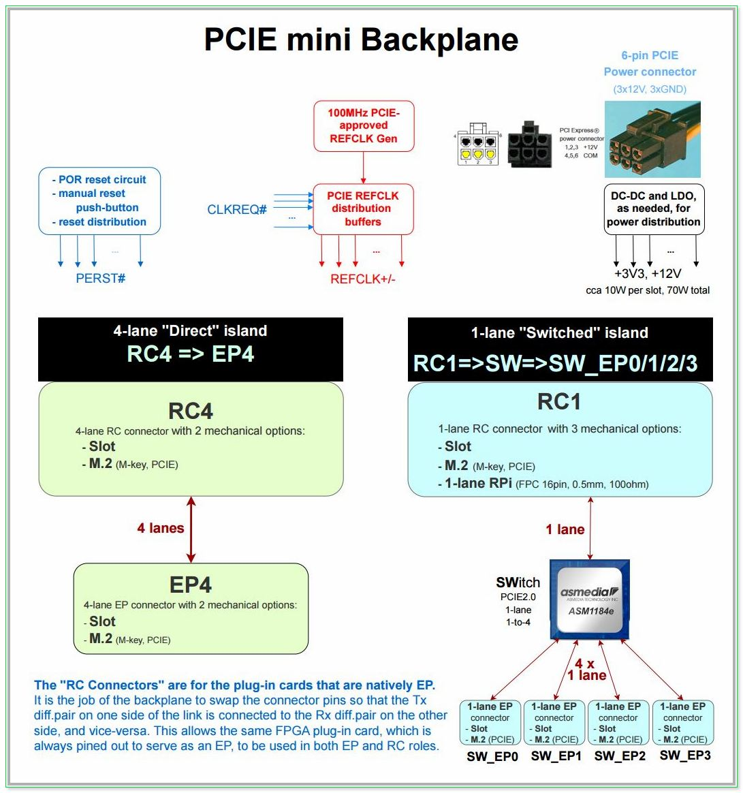

Computing is about communicating. Some would also say about networking. Digital independence tags along on the wave of _"Recommendations and Roadmap for European Sovereignty in open source HW, SW and RISC-V Technologies (2021)"_, calling for the development of critical open source IP blocks, such as **`PCIE Root Complex (RC)`**. This is the first step in that direction.

  

Our project aims to open Artix7 PCIe Gen2 RC IP blocks for use outside of proprietary tool flows. While still reliant on Xilinx Series7 Hard Macros (HMs), it will surround them with open-source soft logic for PIO accesses — The **`RTL`** and, even more importantly, the layered **`sofware Driver with Demo App`**. 

All that with **`full HW/SW opensource co-sim`**. Augmented with a rock-solid **`openBackplane`** in the basement of our hardware solution, the geek community will thus get all it takes for building their own, end-to-end _openCompute_ systems.

> The project‘s immediate goal is to empower the makers with ability to drive PCIE-based peripherals from their own soft RISC-V SOCs.

Given that the PCIE End-Point (EP) with DMA is already available in opensource, the opensource PCIE peripherals do exist for Artix7. Except that they are always, without exception, controlled by the proprietary RC on the motherboard side, typically in the form of RaspberryPi ASIC, or x86 PC. This project intends to change that status quo.

Our long-term goal is to set the stage for the development of full opensource PCIE stack, gradually phasing out Xilinx HMs from the solution. That’s a long, ambitious track, esp. when it comes to mixed-signal SerDes and high-quality PLLs. We therefore anticipate a series of follow on projects that would build on the foundations we hereby set.

This first phase is about implementing an open source PCIE Root Complex (RC) for Artix7 FPGA, utilizing Xilinx Series7 PCIE HM and GTP IP blocks, along with their low-jitter PLL.

--------------------

#### References
- [PCIE Primer](https://drive.google.com/file/d/1CECftcznLwcKDADtjpHhW13-IBHTZVXx/view) by Simon Southwell

--------------------

## Hardware platform
#### References:
- [Acorn-CLE215+ QuickStart](https://github.com/SMB784/SQRL_quickstart)
- [NightFury](https://github.com/RHSResearchLLC/NiteFury-and-LiteFury/tree/master)

#### Backplane Block Diagram

    

--------------------

# Project Status

#### `PART 1. Mini PCIE Backplane PCB`

Almost all consumer PCIE installations have the RC chip soldered down on the motherboard, typically embodied in the CPU or "North Bridge" ASIC, where PCIE connectors are used solely for the EP cards. Similarly, all FPGA boards on the market are designed for EP applications. As such, they expect clock, reset and a few other signals from the infrastructure. It is only the professional and military-grade electronics that may have both RC and EP functions on add-on cards, with a backplane or mid-plane connecting them (see VPX chassis, or VITA 46.4).

This dev activity is about creating the minimal PCIE infrastructure necessary for using a plethora of ready-made FPGA EP cards as a Root Complex. This infrastructure takes the physical form of a mini backplane that provides the necessary PCIE context similarly to what a typical motherboard would give, but without a soldered-down RC chip that would be conflicting with our own FPGA RC node.

Such approach is less work and less risk than to design our own PCIE motherboard, with a large FPGA on it. But, it is also a task that we did not appreciate from the get-go. In a bit of a surprise, half-way through planning, we've realized that a suitable, ready-made backplane was not available on the market. This initial disappointment then turned into excitement knowing that this new outcome would make the project even more attractive / more valuable for the community... esp. when **[Envox.eu](https://www.envox.eu)** has agreed to step in and help. They will take on the PCIE backplane PCB development activity.

 - [x] Create requirements document.
 - [x] Select components. Schematic and PCB layout design.
 - [ ] Review and iterate design to ensure robust operation at 5GHz, possibly using openEMS for simulation of high-speed traces.
 - [ ] Manufacture prototype. Debug and bringup, using AMD-proprietary on-chip IBERT IP core to assess Signal Integrity.
 - [ ] Produce second batch that includes all improvements. Distribute it, and release design files with full documentation.

#### `PART 2. Project setup and preparatory activities`
 - [x] Procure FPGA development boards and PCIE accessories.
 - [ ] Put together a prototype system. Bring it up using proprietary RTL IP, proprietary SW Driver, TestApp and Vivado toolchain.
 
#### `PART 3. Initial HW/SW implementation`
 - [ ] HW development of opensource RTL that mimics the functionality of PCIE RC proprietary solution.
 - [ ] SW development of opensource driver for the PCIE RC HW function. This may, or may not be done within Linux framework. 
 - [ ] Design SOC based on RISC-V CPU with PCIE RC as its main peripheral.

#### `PART 4. HW/SW co-simulation using full PCIE EP model`

This dev activity is significantly beefed up compared to our original plan, which was to use a much simpler PCIE EP BFM, and non-SOC sim framework. While that would have reduced the time and effort spent on the sim, prompted by NLnet astute questions, we're happy to announce that **[wyvernSemi](https://github.com/wyvernSemi/pcievhost)** is now also onboard!

Their VProc can be used not only to faithfully model the RISC-V CPU and SW interactions with HW, but it also comes with an implementation of the PCIE model. The PCIE model has some EP capabilities with a configurtable configurations space, which can be paired in sim with our RC RTL design. Moreover, the existence of both RC and EP models paves the way for future plug-and-play, pick-and-choose opensource sims of the entire PCIE subsystem.

With the full end-to-end simulation thus in place, we hope that the need for hardware debugging, using ChipScope, expensive test equipment and PCIE protocol analyzers would be alleviated.

 - [x] Extension of the existing PCIE RC model for some additional configurability of the EP capabilities.
 - [ ] Testbench development and build up. Execution and debug of sim testcases.
 - [ ] Documentation of EP model, TB and sim environment, with objectives to make it all simple enough to pickup, adapt and deploy in other projects.
 
#### `PART 5. Integration, testing and iterative design refinements`
 - [ ] One-by-one replace proprietary design elements from PART2.b with our opensource versions (except for Vivado and TestApp). Test it along the way, fixing problems as they occur.
 
#### `PART 6. Prepare Demo and port it to openXC7`

 - [ ] Develop our opensource PIO TestApp software and representative Demo.
 - [ ] Build design with _openXC7_, reporting issues and working with developers to fix them, possibly also trying _ScalePNR_ flow.

Given that PCIE is an advanced, high-speed design, and our accute awareness of _nextpnr-xilinx_ and openXC7 shortcomings, we expect to run into showstoppers on the timing closure front. We therefore hope that the upcoming _ScalePNR_ flow will be ready for heavy-duty testing within this project.

--------------------

# Backplane PCB Design
- WIP

--------------------

# HW Architecture

#### References:
- [Basic PCIE EP for LiteFury](https://github.com/hdlguy/litefury_pcie)
- [Regymm PCIE](https://github.com/regymm/pcie_7x)
- [LiteX PCIE EP](https://github.com/enjoy-digital/litepcie)
- [PCIE EP DMA - Wupper](https://gitlab.nikhef.nl/franss/wupper)
- [Xilinx UG477 - 7Series Integrated Block PCIe](https://docs.xilinx.com/v/u/en-US/ug477_7Series_IntBlock_PCIe)
- [XIlinx DS821 - 7series_PCIE Datasheet](https://docs.xilinx.com/v/u/en-US/ds821_7series_pcie)
- [Xapp1052 - BusMaster DMA for EP](https://docs.xilinx.com/v/u/en-US/xapp1052)

  
--------------------

# TB/Sim Architecture

## Simulation Test Bench

The [openpcue2-rc test bench](5.sim/README.md) aims to have a flexible approach to simulation which allows a common test environment to be used whilst selecting between alternative CPU components, one of which uses the [_VProc_ virtual processor](https://github.com/wyvernSemi/vproc) co-simulation element. This allows simulations to be fully HDL, with a RISC-V processor RTL implementation such as picoRV32, IBEX or EDUBOS5, or to co-simulate software using the virtual processor, with a significant speed up in simulation times. The test bench has the following features:

* A [_VProc_](https://github.com/wyvernSemi/vproc) virtual processor based [`soc_cpu.VPROC`](5.sim/models/README.md#soc-cpu-vproc) component
  * [Selectable](5.sim/README.md#auto-selection-of-soc_cpu-component) between this or an RTL softcore
  * Can run natively compiled test code
  * Can run the application compiled natively with the [auto-generated co-sim HAL](4.build/README.md#co-simulation-hal)
  * Can run RISC-V compiled code using the [rv32 RISC-V ISS model](5.sim/models/rv32/README.md)
* The [_pcieVHost VIP_](https://github.com/wyvernSemi/pcievhost) is used to drive the logic's PCIe link
* Uses a C [sparse memory model](https://github.com/wyvernSemi/mem_model)
  * An [HDL component](5.sim/models/cosim/README.md) instantiated in logic gives logic access to this memory
  * An API is provided to _VProc_ running code for direct access from the _pcieVHost_ software, which implements this sparse memory C model.

The figure below shows an oveview block diagram of the test bench HDL.

More details on the architecture and usage of the Wireguard test bench can be found in the [README.md](5.sim/README.md) in the `5.sim` directory.

## Co-simulation HAL

The Wireguard control and status register harware abstraction layer (HAL) software is [auto-generated](4.build/README.md#co-simulation-hal), as is the CSR RTL, using [`peakrdl`](https://peakrdl-cheader.readthedocs.io/en/latest/). For co-simulation purposes an additional layer is auto-generated from the same SystemRDL specification using [`systemrdl-compiler`](https://systemrdl-compiler.readthedocs.io/en/stable/) that accompanies the `peakrdl` tools. This produces two header files that define a common API to the application layer for both the RISC-V platform and the *VProc* based co-simulation verification environment. The details of the HAL generation can be found in the [README.md](./4.build/README.md#co-simulation-hal) in the `4.build/` directory.

More details of the test bench, the _pcievhost_ component and its usage can be found in the [5.sim/README.md](5.sim/README.md) file.
  

#### References
- [pcieVHost](https://github.com/wyvernSemi/pcievhost/blob/master/doc/pcieVHost.pdf)

--------------------

# SW Architecture
- WIP

--------------------

# Debug, Bringup, Testing

#### References
- [PCIE Utils](https://mj.ucw.cz/sw/pciutils)
- [Debug PCIE issues using 'lspci' and 'setpci'](https://adaptivesupport.amd.com/s/article/1148199?language=en_US)
- Using [bysybox (devmem)](0.doc/using-busybox-devmem-for-reg-access.txt) for register access 

--------------------

# PCIE Protocol Analyzer

#### References
- [PCIE Sniffing](https://ctf.re/pcie/experiment/linux/keysight/protocol-analyzer/2024/03/26/pcie-experiment-1)
- [Stark 75T Card](https://www.ebay.com/itm/396313189094?var=664969332633)
- [ngpscope](http://www.ngscopeclient.org/protocol-analysis)
- [PCI Leech](https://github.com/ufrisk/pcileech)
- [PCI Leech/ZDMA](https://github.com/ufrisk/pcileech-fpga/tree/master/ZDMA)
- [LiteX PCIE Screamer](https://github.com/enjoy-digital/pcie_screamer)
- [LiteX PCIE Analyzer](https://github.com/enjoy-digital/pcie_analyzer)
- [Wireshark PCIe Dissector](https://github.com/antmicro/wireshark-pcie-dissector)
- [PCIe Tool Hunt](https://scolton.blogspot.com/2023/05/pcie-deep-dive-part-1-tool-hunt.html)
- [PCIe network simulator](https://github.com/antmicro/warp-pipe)
- [An interesting PCIE tidbit: Peer-to-Peer communicaton](https://xilinx.github.io/XRT/master/html/p2p.html). Also see [this](https://xillybus.com/tutorials/pci-express-tlp-pcie-primer-tutorial-guide-1)
- [NetTLP - An invasive method for intercepting PCIE TLPs](https://haeena.dev/nettlp)

--------------------

### Acknowledgements
We are grateful to **NLnet Foundation** for their sponsorship of this development activity.

   
   

The **wyvernSemi**'s wisdom and contribution made a great deal of difference -- Thank you, we are honored to have you on the project.

 

The **Envox**, our next-door buddy, is responsible for the birth of our backplane, which we like to call BB (not to be mistaked for their gorgeous blue beauty [BB3](https://www.envox.eu/eez-bb3) 🙂)

  

### Public posts:
- [2025-07-22](https://www.linkedin.com/posts/simon-southwell-7684482_pcie-vhdl-nvc-activity-7354160318052220929-K0Ku?utm_source=share&utm_medium=member_desktop&rcm=ACoAAAJv-TcBSi_5ff0VNMrInrT-xg44YF3jnyU)
- [2025-04-03](https://www.linkedin.com/feed/update/urn:li:activity:7313386031125303296?commentUrn=urn%3Ali%3Acomment%3A%28activity%3A7313386031125303296%2C7313594045216223236%29&dashCommentUrn=urn%3Ali%3Afsd_comment%3A%287313594045216223236%2Curn%3Ali%3Aactivity%3A7313386031125303296%29)

--------------------
#### End of Document
