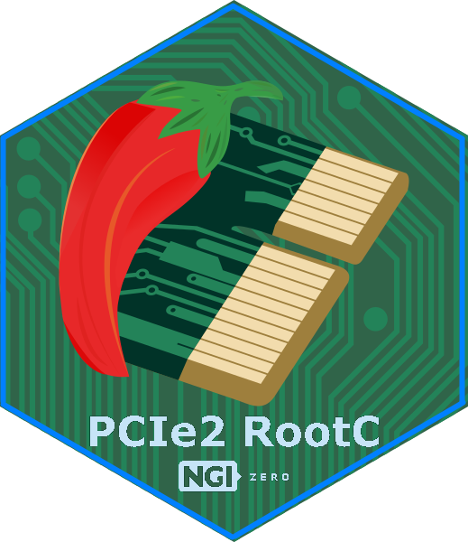
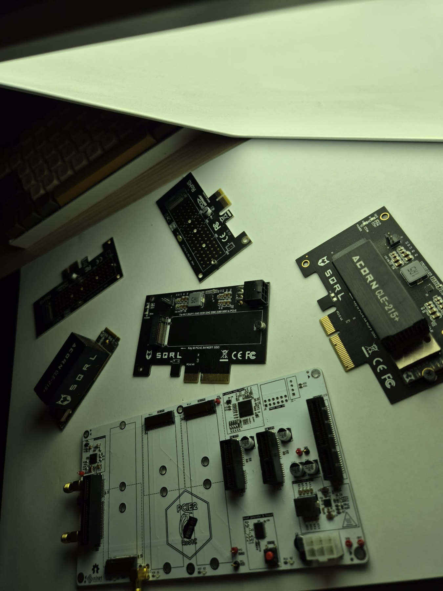
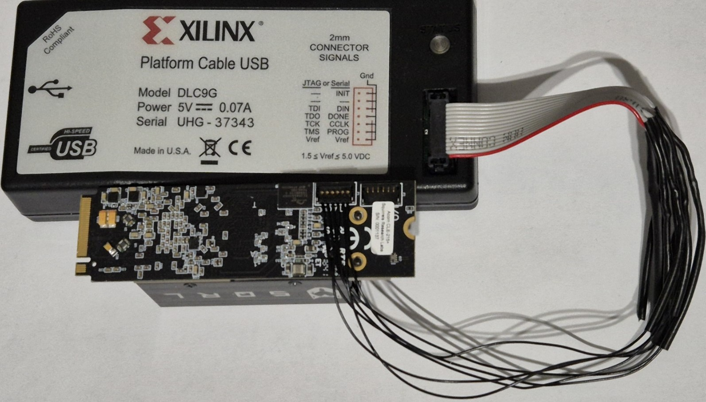
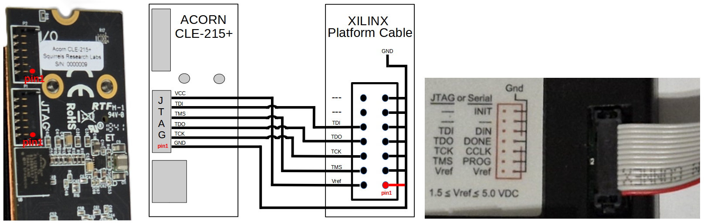
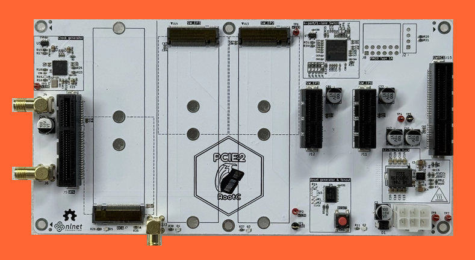
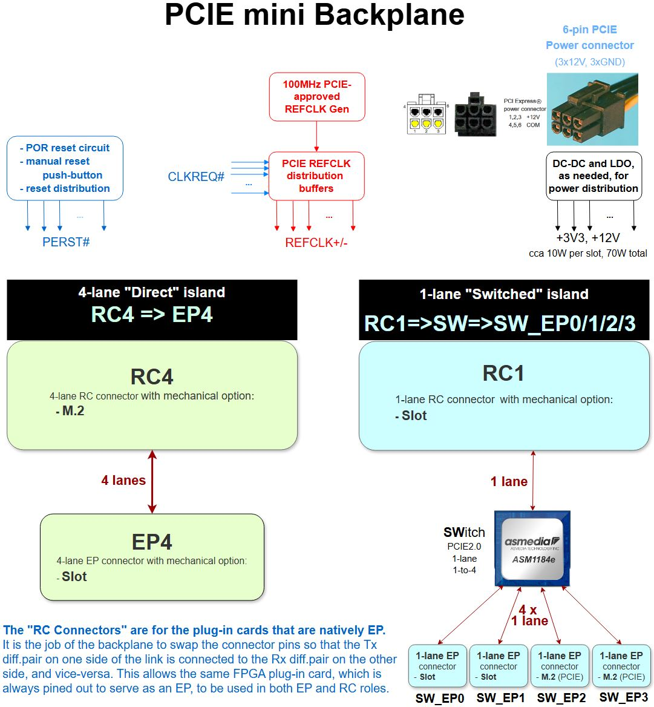
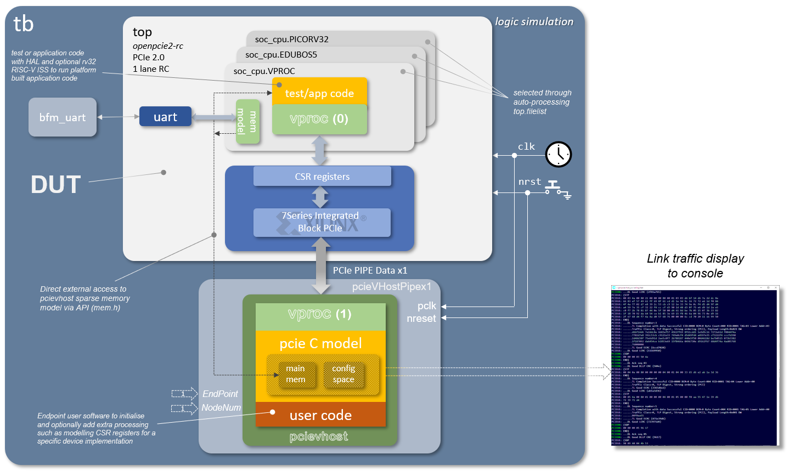
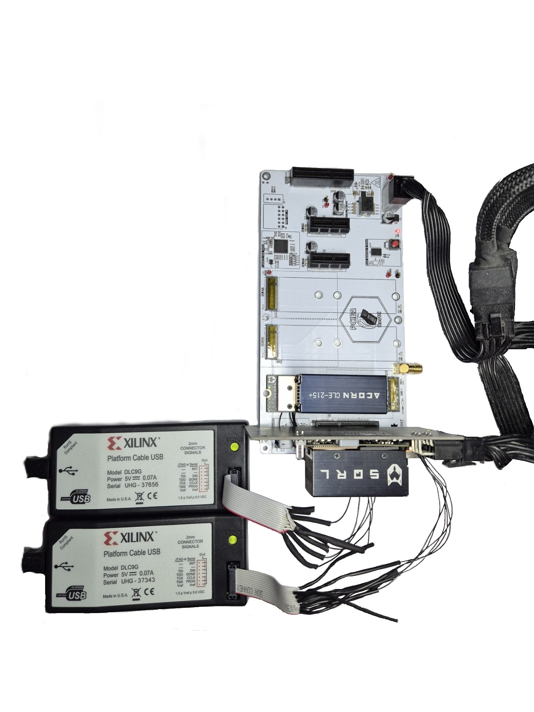
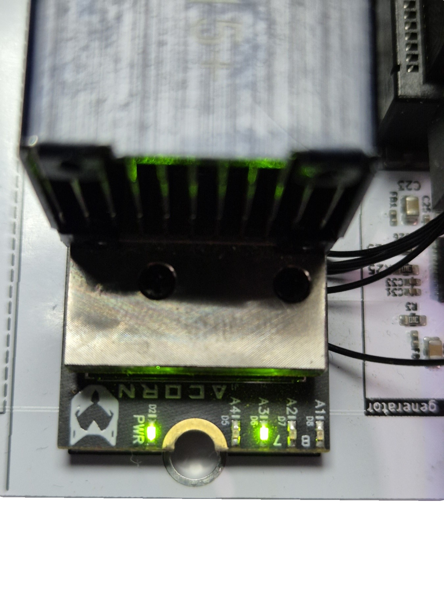
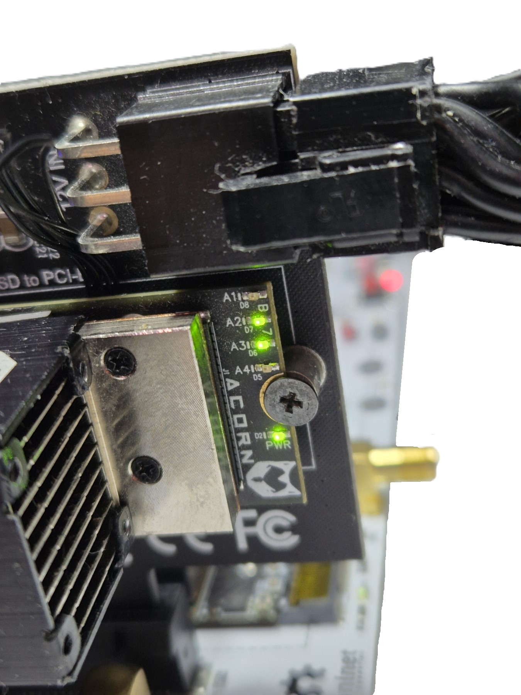

Computing is about communicating. Some would also say about networking. Digital independence tags along on the wave of _"Recommendations and Roadmap for European Sovereignty in open source HW, SW and RISC-V Technologies (2021)"_, calling for the development of critical open source IP blocks, such as **`PCIE Root Complex (RC)`**. This is the first step in that direction. And, if you are looking for an opensource, soft PCIE EndPoint (EP) core, please check our [other](https://github.com/chili-chips-ba/openCologne-PCIE) repo.

  

This project looks to open Artix7 PCIe Gen2 RC IP blocks for use outside of proprietary tool flows. While still reliant on Xilinx Series7 Hard Macros (HMs), it will surround them with open-source soft logic for PIO accesses — The **`RTL`** and, even more importantly, the layered **`sofware Driver with Demo App`**. 

All that with **`full HW/SW opensource co-sim`**. Augmented with a rock-solid **`openBackplane`** in the basement of our hardware solution, the geek community will thus get all it takes for building their own, end-to-end _openCompute_ systems.

> The project‘s immediate goal is to empower the makers with ability to drive PCIE-based peripherals from their own soft RISC-V SOCs.

Given that the PCIE End-Point (EP) with DMA is already available in opensource, the opensource PCIE peripherals do exist for Artix7. Except that they are always, without exception, controlled by the proprietary RC on the motherboard side, typically in the form of RaspberryPi ASIC, or x86 PC. This project intends to change that status quo.

Our long-term goal is to set the stage for the development of full opensource PCIE stack, gradually phasing out Xilinx HMs from the solution. That’s a long, ambitious track, esp. when it comes to mixed-signal SerDes and high-quality PLLs. We therefore anticipate a series of follow on projects that would build on the foundations we hereby set.

This first phase is about implementing an open source PCIE Root Complex (RC) for Artix7 FPGA, utilizing Xilinx Series7 PCIE HM and GTP IP blocks, along with their low-jitter PLL.

#### References
- [PCIE Primer](https://drive.google.com/file/d/1CECftcznLwcKDADtjpHhW13-IBHTZVXx/view) by Simon Southwell ✔

--------------------

# Project Status

#### `PART 1. Mini PCIE Backplane PCB`

Almost all consumer PCIE installations have the RC chip soldered down on the motherboard, typically embodied in the CPU or "North Bridge" ASIC, where PCIE connectors are used solely for the EP cards. Similarly, all FPGA boards on the market are designed for EP applications. As such, they expect clock, reset and a few other signals from the infrastructure. It is only the professional and military-grade electronics that may have both RC and EP functions on add-on cards, with a backplane or mid-plane connecting them (see VPX chassis, or VITA 46.4).

This dev activity is about creating the minimal PCIE infrastructure necessary for using a plethora of ready-made FPGA EP cards as a Root Complex. This infrastructure takes the physical form of a mini backplane that provides the necessary PCIE context similarly to what a typical motherboard would give, but without a soldered-down RC chip that would be conflicting with our own FPGA RC node.

Such approach is less work and less risk than to design our own PCIE motherboard, with a large FPGA on it. But, it is also a task that we did not appreciate from the get-go. In a bit of a surprise, half-way through planning, we've realized that a suitable, ready-made backplane was not available on the market. This initial disappointment then turned into excitement knowing that this new outcome would make the project even more attractive / more valuable for the community... esp. when **[Envox.eu](https://www.envox.eu)** has agreed to step in and help. They will take on the PCIE backplane PCB development activity.

 - [x] ✔ Create requirements document.
 - [x] ✔ Select components. Schematic and PCB layout design.
 - [x] ✔ Review and iterate design to ensure robust operation at 5GHz, possibly using openEMS for simulation of high-speed traces.
 - [x] ✔ Manufacture prototype. Debug and bringup, using AMD-proprietary on-chip IBERT IP core to assess Signal Integrity.
 - [ ] Produce second batch that includes all improvements. Distribute it, and release design files with full documentation.

#### `PART 2. Project setup and preparatory activities`
 - [x] ✔ Procure FPGA development boards and PCIE accessories.
 - [x] ✔ Put together a prototype system. Bring it up using proprietary RTL IP, proprietary SW Driver, TestApp and Vivado toolchain.
 
#### `PART 3. Initial HW/SW implementation`
 - [ ] HW development of opensource RTL that mimics the functionality of PCIE RC proprietary solution.
 - [x] ✔ SW development of opensource driver for the PCIE RC HW function. This may, or may not be done within Linux framework. 
 - [x] ✔ Design SOC based on RISC-V CPU with PCIE RC as its main peripheral.

#### `PART 4. HW/SW co-simulation using full PCIE EP model`

This dev activity is significantly beefed up compared to our original plan, which was to use a much simpler PCIE EP BFM, and non-SOC sim framework. While that would have reduced the time and effort spent on the sim, prompted by NLnet astute questions, we're happy to announce that **[wyvernSemi](https://github.com/wyvernSemi/pcievhost)** is now also onboard!

Their VProc can be used not only to faithfully model the RISC-V CPU and SW interactions with HW, but it also comes with an implementation of the PCIE model. The PCIE model has some EP capabilities with a configurtable configurations space, which can be paired in sim with our RC RTL design. Moreover, the existence of both RC and EP models paves the way for future plug-and-play, pick-and-choose opensource sims of the entire PCIE subsystem.

With the full end-to-end simulation thus in place, we hope that the need for hardware debugging, using ChipScope, expensive test equipment and PCIE protocol analyzers would be alleviated.

 - [x] ✔ Extension of the existing PCIE RC model for some additional configurability of the EP capabilities.
 - [x] ✔ Testbench development and build up. Execution and debug of sim testcases.
 - [ ] Documentation of EP model, TB and sim environment, with objectives to make it all simple enough to pickup, adapt and deploy in other projects.
 
#### `PART 5. Integration, testing and iterative design refinements`
 - [ ] One-by-one replace proprietary design elements from PART2.b with our opensource versions (except for Vivado and TestApp). Test it along the way, fixing problems as they occur.
 
#### `PART 6. Prepare Demo and port it to openXC7`

 - [x] ✔ Develop our opensource PIO TestApp software and representative Demo.
 - [ ] Build design with _openXC7_, reporting issues and working with developers to fix them, possibly also trying _ScalePNR_ flow.

Given that PCIE is an advanced, high-speed design, and our accute awareness of _nextpnr-xilinx_ and openXC7 shortcomings, we expect to run into showstoppers on the timing closure front. We therefore hope that the upcoming _ScalePNR_ flow will be ready for heavy-duty testing within this project.

--------------------

# HW Architecture

The project relies on a modular hardware ecosystem that combines our custom-designed openPCIE Backplane with SQRL Acorn CLE-215+ FPGA modules and various PCIe adapters to create a flexible testing platform.

 

#### References:
- [Basic PCIE EP for LiteFury](https://github.com/hdlguy/litefury_pcie)
- [Regymm PCIE](https://github.com/regymm/pcie_7x)
- [LiteX PCIE EP](https://github.com/enjoy-digital/litepcie)
- [PCIE EP DMA - Wupper](https://gitlab.nikhef.nl/franss/wupper)
- [Xilinx UG477 - 7Series Integrated Block PCIe](https://docs.xilinx.com/v/u/en-US/ug477_7Series_IntBlock_PCIe)
- [XIlinx DS821 - 7series_PCIE Datasheet](https://docs.xilinx.com/v/u/en-US/ds821_7series_pcie)
- [Xapp1052 - BusMaster DMA for EP](https://docs.xilinx.com/v/u/en-US/xapp1052)

## FPGA hardware platform

#### References:
- [Acorn-CLE215+ QuickStart](https://github.com/SMB784/SQRL_quickstart)
- [NightFury](https://github.com/RHSResearchLLC/NiteFury-and-LiteFury/tree/master)
- [fpgas.online-test-designs](https://github.com/fpgas-online/fpgas.online-test-designs/tree/main/designs/pcie-enumeration) PCIE ENUMERATION by RPI, for Acorn-CLE215+ EP
  
The hardware platform for this project is the **SQRL Acorn CLE-215+**, a versatile FPGA development board. Although originally designed as a crypto-accelerator, its powerful Artix-7 FPGA and modular design make it an excellent choice for general-purpose PCIe development.

The system consists of two main components:

*  **M.2 FPGA Module (Acorn CLE-215+):** This is the core of the system, a compact board in an M.2 form factor. It houses the **Xilinx Artix-7 XC7A200T FPGA** and is designed to be plugged into a standard M.2 M-key slot.

<table align="center" style="border: none; border-collapse: collapse;">
  <tr style="border: none;">
    <td align="center" style="border: none;">
      
    </td>
    <td align="center" style="border: none;">
      
    </td>
  </tr>
  <tr style="border: none;">
    <td align="center" style="border: none;"><b>M.2 FPGA Module (Top View)</b></td>
    <td align="center" style="border: none;"><b>M.2 FPGA Module (Bottom View)</b></td>
  </tr>
</table>

*  **PCIe Adapter Board (Acorn Baseboard Mini):** A carrier board that holds the M.2 FPGA module. Its primary function is to adapt the M.2 interface to a standard **PCIe x4 edge connector**, allowing the entire assembly to be installed and tested in a regular PC motherboard slot.

<table align="center" style="border: none; border-collapse: collapse;">
  <tr style="border: none;">
    <td align="center" style="border: none;">
      
    </td>
    <td align="center" style="border: none;">
      
    </td>
  </tr>
  <tr style="border: none;">
    <td align="center" style="border: none;"><b>PCIe Adapter Board (Top View)</b></td>
    <td align="center" style="border: none;"><b>PCIe Adapter Board (Bottom View)</b></td>
  </tr>
</table>

  
   
  <b>The fully assembled Acorn CLE-215+ development board, ready for use in a PCIe slot.</b>

It is important to note that the Acorn CLE-215+ is functionally identical to the more widely known NiteFury board, with the primary difference being the amount of onboard memory. The Acorn model features 1 GB of DDR3 RAM, while the standard NiteFury has 512 MB. Therefore, the [NiteFury schematic](https://github.com/chili-chips-ba/openPCIE/blob/main/0.doc/Reference-SCH/Schematic.FPGA-NiteFury.pdf) serves as a direct and accurate reference for the board's hardware layout.

The central component of the SQRL Acorn CLE-215+ system is the **Xilinx Artix-7 XC7A200T-FBG484** chip. This FPGA is crucial for implementing the PCIe Endpoint functionality, possessing a range of features that make it highly suitable for this purpose.

The key specifications are summarized below:

<table>
<thead>
<tr>
<th>Specification</th>
<th>Value</th>
</tr>
</thead>
<tbody>
<tr>
<td>Family</td>
<td>Xilinx Artix-7</td>
</tr>
<tr>
<td>Speed Grade</td>
<td>-3</td>
</tr>
<tr>
<td>Logic Cells (LUT4-Equivalent)¹</td>
<td>215,360</td>
</tr>
<tr>
<td>LUT6</td>
<td>134,600</td>
</tr>
<tr>
<td>Flip-Flops</td>
<td>269,200</td>
</tr>
<tr>
<td>Block RAM</td>
<td>13 Mbit</td>
</tr>
<tr>
<td>DSP Slices</td>
<td>740</td>
</tr>
<tr>
<td>GTP Transceivers</td>
<td>4 (up to 6.6 Gbit/s)</td>
</tr>
<tr>
<td>DDR3 SDRAM (Board)</td>
<td>1 GB, 16-bit</td>
</tr>
<tr>
<td>QSPI Flash (Board)</td>
<td>32 MB</td>
</tr>
<tr>
<td>User LEDs</td>
<td>4</td>
</tr>
<tr>
<td>General Purpose IOs</td>
<td>4</td>
</tr>
<tr>
<td>LVDS Pairs</td>
<td>4</td>
</tr>
</tbody>
</table>

<small>¹ The 'Logic Cells' count is a Xilinx metric derived from the physical 6-input LUTs to provide an estimated equivalent in simpler 4-input LUTs for comparison purposes. The number of physical LUTs and other resources are the exact counts for the XC7A200T chip.</small>

### FPGA Board Setup

Properly programming and operating the Artix-7 FPGA on the SQRL board required two key hardware modifications.

#### 1. Custom JTAG Cable

The JTAG connector on the Acorn CLE-215+ is non-standard and not directly compatible with the standard 14-pin connector on the Xilinx Platform Cable. A custom adapter cable is therefore required.

<<table align="center" style="border: none; border-collapse: collapse; width: 100%;">
  <tr style="border: none;">
    <td align="center" style="border: none;" width="70%">
      
    </td>
    <td align="center" style="border: none;" width="30%">
      
    </td>
  </tr>
  <tr style="border: none;">
    <td align="center" style="border: none;"><b>Custom JTAG Cable connecting the Xilinx Programmer to the board</b></td>
    <td align="center" style="border: none;"><b>JTAG Connector Pinout on the Board</b></td>
  </tr>
</table>

The connector on the board is a **Molex Pico-Lock 1.50mm pitch male header**. This is not a standard 2.54mm or 2.00mm header, so standard DuPont-style cables will not fit.

To simplify making the cable, we highly recommend purchasing a pre-assembled cable with the correct female connector.

*   **Recommended Part:** **[Molex 0369200603 on Digi-Key](https://www.digikey.com/en/products/detail/molex/0369200603/10233020)**

This cable has the correct female connector on both ends. The easiest method is to **cut the cable in half**, which gives you two connector cables with open ends. You can then splice one of these cable ends onto the wires of your Xilinx programmer cable, matching the signals according to the following wiring diagram.

  
   <em>JTAG Connection Guide: Physical Pinout and Wiring Diagram.</em>

#### 2. External 12V Power Supply

The board cannot be programmed or operated solely from the PCIe/M.2 slot power. It requires an external 12V supply to function correctly, especially when complex designs and high-speed transceivers are active. Power is provided via a standard 6-pin PCIe power connector from an ATX power supply.

  
   <em>External 12V power connection.</em>

#### 3. Final Assembly

The complete system, including the custom cabling, is mounted in a test PC chassis for verification.

  
   <em>The complete FPGA system mounted in a PCIe slot.</em>

#### 4. Connection Verification

After the hardware was prepared, the connection was verified using the **Vivado Hardware Manager**. As shown below, the tool successfully detected the JTAG programmer and identified the `xc7a200t_0` FPGA chip. This confirms that the physical connections are correct and the board is ready for programming.

  
   <em>Successful device detection in Vivado Hardware Manager.</em>

--------------------
### openBackplane PCB

    
    

Please, refer to [1.pcb](1.pcb) for additional detail.

--------------------

# TB/Sim Architecture

## Simulation Test Bench

The [openpcue2-rc test bench](5.sim/README.md) aims to have a flexible approach to simulation which allows a common test environment to be used whilst selecting between alternative CPU components, one of which uses the [_VProc_ virtual processor](https://github.com/wyvernSemi/vproc) co-simulation element. This allows simulations to be fully HDL, with a RISC-V processor RTL implementation such as picoRV32, IBEX or EDUBOS5, or to co-simulate software using the virtual processor, with a significant speed up in simulation times. The test bench has the following features:

* A [_VProc_](https://github.com/wyvernSemi/vproc) virtual processor based [`soc_cpu.VPROC`](5.sim/models/README.md#soc-cpu-vproc) component
  * [Selectable](5.sim/README.md#auto-selection-of-soc_cpu-component) between this or an RTL softcore
  * Can run natively compiled test code
  * Can run the application compiled natively with the [auto-generated co-sim HAL](4.build/README.md#co-simulation-hal)
  * Can run RISC-V compiled code using the [rv32 RISC-V ISS model](5.sim/models/rv32/README.md)
* The [_pcieVHost VIP_](https://github.com/wyvernSemi/pcievhost) is used to drive the logic's PCIe link
* Uses a C [sparse memory model](https://github.com/wyvernSemi/mem_model)
  * An [HDL component](5.sim/models/cosim/README.md) instantiated in logic gives logic access to this memory
  * An API is provided to _VProc_ running code for direct access from the _pcieVHost_ software, which implements this sparse memory C model.

The figure below shows an oveview block diagram of the test bench HDL.

More details on the architecture and usage of the Wireguard test bench can be found in the [README.md](5.sim/README.md) in the `5.sim` directory.

## Co-simulation HAL

The Wireguard control and status register harware abstraction layer (HAL) software is [auto-generated](4.build/README.md#co-simulation-hal), as is the CSR RTL, using [`peakrdl`](https://peakrdl-cheader.readthedocs.io/en/latest/). For co-simulation purposes an additional layer is auto-generated from the same SystemRDL specification using [`systemrdl-compiler`](https://systemrdl-compiler.readthedocs.io/en/stable/) that accompanies the `peakrdl` tools. This produces two header files that define a common API to the application layer for both the RISC-V platform and the *VProc* based co-simulation verification environment. The details of the HAL generation can be found in the [README.md](./4.build/README.md#co-simulation-hal) in the `4.build/` directory.

More details of the test bench, the _pcievhost_ component and its usage can be found in the [5.sim/README.md](5.sim/README.md) file.
  
#### References
- [pcieVHost](https://github.com/wyvernSemi/pcievhost/blob/master/doc/pcieVHost.pdf)

--------------------

# SW Architecture

The software stack is designed to run **bare-metal** on the soft RISC-V SoC embedded within the FPGA. In a standard PC, the Operating System (Linux/Windows) manages PCIe enumeration automatically in the background, hiding the complexity from the developer. In this project, our **open-source driver** takes full control, manually performing every step of the enumeration process to act as the PCIe Host.

The architecture follows a layered approach:

1.  **Application Layer (The "User" Logic)**: 
    - The final stage of the program that executes the high-level task.
    - It performs **Memory Write** operations to send a data payload to the Endpoint and uses **Memory Read** to verify the integrity of the data path.

2.  **PCIe Driver (Enumeration & Setup)**:
    - Responsible for the **initialization sequence** required to perform enumeration and establish a functional connection (link).
    - It manually performs device discovery, probes BAR sizes, assigns memory addresses, and configures the **Command Register** to enable the device for communication.
      
3.  **HAL (Hardware Abstraction Layer)**:
    - Low-level helper functions that interact with the hardware by reading and writing data to **specific memory addresses**.

> **Note:** This structure allows developers to treat PCIe devices just like any other local peripheral, abstracting away the complexities of the physical link.

--------------------

# Implementation Workflow

- WIP

--------------------

# Debug, Bringup, Testing

### Hardware Infrastructure
- **PCB:** **openPCIE Backplane** (see [1.pcb](1.pcb/))  which provides slots for the RC, EP, and the Switch.
- **FPGA Boards:** Two **SQRL Acorn CLE-215+** (Artix-7) boards.
- **JTAG Programmers:** Two **Xilinx Platform Cable USB** units are used, each equipped with a **custom adapter cable**.
    
### The "Dual-PC" Debugging Approach 
We used a **two-PC** setup to streamline development:
-  **PC 1:** Connected to the **Root Complex (RC)** FPGA via JTAG.
-  **PC 2:** Connected to the **EndPoint (EP)** FPGA via JTAG.
   
**Why this setup?**
- **Speed and Efficiency:** This setup avoids the repetitive task of manually swapping the JTAG cable between boards and eliminates the time-consuming process of flashing onboard memory for every test iteration.
- **Simultaneous Debugging:** This allows us to run two instances of **Vivado Hardware Manager** (ILA - Integrated Logic Analyzer) at the same time. We can trigger on the RC and EP simultaneously to view the transaction from both sides of the link.

### Testing Procedure

To bring up the system and verify the PCIe link, follow these steps:

*   **Hardware Assembly:** Insert the FPGA cards into their designated slots on the **openPCIE Backplane** (RC and EP) and connect the external **12V power supply**.
*   **Bitstream Programming:** Program both FPGAs using Vivado Hardware Manager. **PC 1** is used to program the Root Complex, while **PC 2** programs the EndPoint.
*   **Manual Reset:** Once both devices are programmed, press the **manual reset button** on the backplane.
*   **Enumeration:** Upon releasing the reset button, the Root Complex initiates the **enumeration process** and establishes the link with the EndPoint.
*   **Re-Initialization:** Every subsequent press of the reset button triggers a full re-initialization of the PCIe connection, allowing for repeated testing and debugging without the need to re-program the FPGAs.

### Objective
The goal of this test is to verify that the Root Complex can successfully enumerate the link and perform both **Memory Write** and **Memory Read** transactions.
1. **Write:** The RC sends a data payload to the EP.
2. **Transfer:** The EP receives the TLP and writes it into its internal Block RAM (BRAM).
3. **Read:** The RC requests to read the data back from the EP memory.

---

# Functional Verification: 

### Verification Environment

Before diving into the results, here is the complete hardware validation setup used for the Direct (Point-to-Point) connection scenario. It features the **openPCIE Backplane** powered by an external 12V supply, populated with two **Acorn CLE-215+** FPGA modules (one configured as RC, the other as EP).

Dual **Xilinx Platform Cable USB** units are connected via custom adapters to allow simultaneous debugging and bitstream loading from two separate host workstations.

  
   
  <em>The complete hardware validation environment for the Direct connection test.</em>

### Verification Methods

**1. Visual Verification (LEDs)**
Visual feedback is provided via the **4 user LEDs** on both FPGA boards:
- **RC Board:** The LEDs indicate the **Link Status**, confirming that the physical connection is established and the devices are ready to communicate.
- **EP Board:** The LEDs display the data received by the EP.

**2. Internal Signal Monitoring (ILA)**
Using the Vivado Integrated Logic Analyzer (ILA) on both PCs enables detailed monitoring of internal signals to see exactly what data was sent and received, its precise timing, and the low-level transaction details.

### Verification Results

- WIP

<table align="center" style="border: none; border-collapse: collapse;">
  <tr style="border: none;">
    <td align="center" style="border: none;">
       
    </td>
    <td align="center" style="border: none;">
       
    </td>
  </tr>
  <tr style="border: none;">
    <td align="center" style="border: none;"><b>RC-LED-Link-Up</b></td>
    <td align="center" style="border: none;"><b>EP-LED-Data-Payload</b></td>
  </tr>
</table>

#### References
- [PCIE Utils](https://mj.ucw.cz/sw/pciutils)
- [Debug PCIE issues using 'lspci' and 'setpci'](https://adaptivesupport.amd.com/s/article/1148199?language=en_US)
- Using [bysybox (devmem)](0.doc/using-busybox-devmem-for-reg-access.txt) for register access 

--------------------

# PCIE Protocol Analyzer

#### References
- [PCIE Sniffing](https://ctf.re/pcie/experiment/linux/keysight/protocol-analyzer/2024/03/26/pcie-experiment-1)
- [Stark 75T Card](https://www.ebay.com/itm/396313189094?var=664969332633)
- [ngpscope](http://www.ngscopeclient.org/protocol-analysis)
- [PCI Leech](https://github.com/ufrisk/pcileech)
- [PCI Leech/ZDMA](https://github.com/ufrisk/pcileech-fpga/tree/master/ZDMA)
- [LiteX PCIE Screamer](https://github.com/enjoy-digital/pcie_screamer)
- [LiteX PCIE Analyzer](https://github.com/enjoy-digital/pcie_analyzer)
- [Wireshark PCIe Dissector](https://github.com/antmicro/wireshark-pcie-dissector)
- [PCIe Tool Hunt](https://scolton.blogspot.com/2023/05/pcie-deep-dive-part-1-tool-hunt.html)
- [PCIe network simulator](https://github.com/antmicro/warp-pipe)
- [An interesting PCIE tidbit: Peer-to-Peer communicaton](https://xilinx.github.io/XRT/master/html/p2p.html). Also see [this](https://xillybus.com/tutorials/pci-express-tlp-pcie-primer-tutorial-guide-1)
- [NetTLP - An invasive method for intercepting PCIE TLPs](https://haeena.dev/nettlp)
- [PCIe on STM32MP257 with ngscopeclient](https://www.youtube.com/watch?v=qxdK3mjHNBM)

--------------------

### Acknowledgements
We are grateful to **NLnet Foundation** for their sponsorship of this development activity.

   
   

This project was funded through the NGI0 Core Fund, a fund established by NLnet with financial support from the European Commission's Next Generation Internet programme, under the aegis of DG Communications Networks, Content and Technology under grant agreement No 101092990.

The **wyvernSemi**'s wisdom and contribution made a great deal of difference -- Thank you, we are honored to have you on the project.

 

The **Envox**, our next-door buddy, is responsible for the birth of our backplane, which we like to call BB (not to be mistaked for their gorgeous blue beauty [BB3](https://www.envox.eu/eez-bb3))

  

### Public posts:
- [2026-01-26](https://www.linkedin.com/posts/chili-chips_fpga-pcie-riscv-activity-7421756737285734400-Lzlv?utm_source=share&utm_medium=member_desktop&rcm=ACoAAAJv-TcBSi_5ff0VNMrInrT-xg44YF3jnyU)
- [2025-12-19](https://www.linkedin.com/posts/chili-chips_opensource-fpga-gatemate-activity-7407180369269223424-laCE?utm_source=share&utm_medium=member_desktop&rcm=ACoAAAJv-TcBSi_5ff0VNMrInrT-xg44YF3jnyU)
- [2025-08-17](https://www.linkedin.com/pulse/pcie-model-c-simon-southwell-m2fve/?trackingId=CA4nW3if5DVRR%2BXN%2FIkQoQ%3D%3D)
- [2025-07-22](https://www.linkedin.com/posts/simon-southwell-7684482_pcie-vhdl-nvc-activity-7354160318052220929-K0Ku?utm_source=share&utm_medium=member_desktop&rcm=ACoAAAJv-TcBSi_5ff0VNMrInrT-xg44YF3jnyU)
- [2025-04-03](https://www.linkedin.com/feed/update/urn:li:activity:7313386031125303296?commentUrn=urn%3Ali%3Acomment%3A%28activity%3A7313386031125303296%2C7313594045216223236%29&dashCommentUrn=urn%3Ali%3Afsd_comment%3A%287313594045216223236%2Curn%3Ali%3Aactivity%3A7313386031125303296%29)

--------------------
#### End of Document
